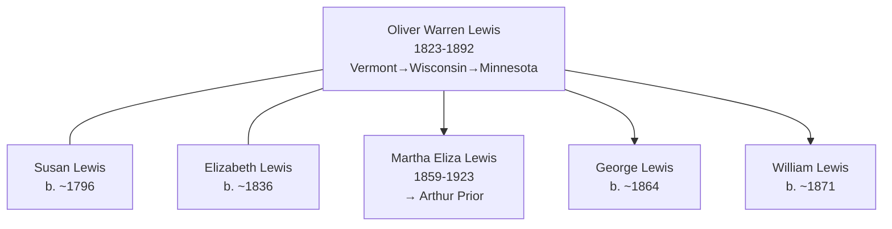

# Oliver Warren Lewis

## Biographical Profile

- **Name:** Oliver Warren Lewis
- **Role in this project:** Lewis-line patriarch spanning Vermont origin through Wisconsin and Minnesota (1850-1880s) with multi-generational household progression.

## Source-Cited Facts

- **Birth/Death:** Born 13 Aug 1823; died 3 Jul 1892 (age 68 years, 10 months, 20 days).
- **Birthplace:** Vermont
- **Occupation:** Farmer

## Census Records and Household Context

### 1850 Wisconsin Census — Racine County, Town of Burlington
- **Head:** `Wynat LEWIS` (possibly William?), male, age 68, occupation farmer, born Vermont
- **Susan LEWIS** (wife), female, age 54, born Vermont
- **Children/relatives in household:**
  - `Eliza LEWIS`, female, age 37, born Vermont
  - `Alonzo LEWIS`, male, age 33, occupation farmer, born Vermont
  - `Oliver LEWIS`, male, age 25, occupation farmer, born Vermont
  - `Marth LEWIS`, female, age 19, born Vermont
  - `Erastus DARLING`, male, age 15, born Vermont
  - `Sarah DARLING`, female, age 12, born Vermont
- **Source:** Series M432, Roll 1004, Page 150; GSU microfilm available

### 1860 Wisconsin Census — Fond du Lac County, Ripon 1st Ward
- **Head:** `W.W. LEWIS`, male, age 79, occupation farmer, born Massachusetts, property $50
- **Susan LEWIS** (wife), female, age 58, born New York
- **Oliver LEWIS** (son), male, age 35, born Vermont
- **Marshal LEWIS**, male, age 25, born Vermont
- **Elizabeth LEWIS**, female, age 24, born New York
- **Martha E. LEWIS** (daughter), female, age 7/12 (infant), born Wisconsin
- **Source:** Series M653, Roll 1408, Page 829; GSU microfilm available

### 1880 Minnesota Census — Mower County, Grand Meadow Township
- **Head:** `Oliver LEWIS`, male, self, married, age 57, born Vermont, occupation farmer
- **Elizabeth LEWIS** (wife), female, married, age 44, born New York, occupation keeping house
- **Children:**
  - `George LEWIS`, male, single, age 16, born Wisconsin, occupation working on farm
  - `William LEWIS`, male, single, age 9, born Minnesota, occupation at school
- **Source:** Fam Hist Lib Film 1254626; GSU microfilm available

## Family Connections

- **Wife:** Susan Lewis (b. ~1796 Vermont/New York) in 1850; Elizabeth Lewis (b. ~1836 New York) in 1880
- **Children identified:** Eliza (b. ~1813), Alonzo (b. ~1817), Oliver (b. 1823), Martha/Marth (b. ~1831); later children George (b. ~1864), William (b. ~1871)
- **Daughter:** [[People/Martha Eliza Lewis|Martha Eliza Lewis]] (1859-1923), who married Arthur Prior
- **Pedigree significance:** Vermont-origin farmer establishing Lewis line in Wisconsin (1850) and expanding to Minnesota (1880)

## Family Diagram

Oliver Warren Lewis represents the Vermont-origin farmer patriarch, expanding the Lewis family across Wisconsin and Minnesota with documented multi-generational household presence (1850-1880).

## Research Gaps

1. Clarify relationship between Oliver Warren Lewis (b. 1823) and Wynat/William Lewis (b. 1768, head of 1850 household). Possible father-son relationship.
2. Validate all children names and relationships from original 1850-1880 census images.
3. Determine reason for dual wife names (Susan vs. Elizabeth) across decades—possible remarriage or OCR error.
4. Trace children Eliza, Alonzo, and Martha beyond 1850 records.
5. Confirm death date and burial location.

## Sources

1. [[References/Shared Intake 2026-04-22 Census Summary Individuals p37-p48|Shared Intake 2026-04-22 Census Summary Individuals p37-p48]]
2. [[References/Shared Intake 2026-04-22 Burial Sites Summary|Shared Intake 2026-04-22 Burial Sites Summary]]
3. `References/raw/inbox/2026-04-22-intake/BurialSites/BurialSites.txt`
4. `References/raw/inbox/2026-04-22-intake/Census/CensusSummaryIndividual.pdf`
