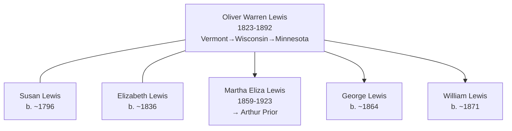
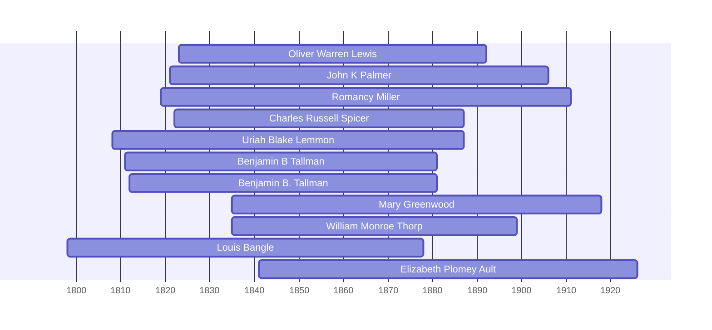

# Oliver Warren Lewis

## Biographical Profile

- **Name:** Oliver Warren Lewis
- **Role in this project:** Lewis-line patriarch spanning Vermont origin through Wisconsin and Minnesota (1850-1880s) with multi-generational household progression.

## Source-Cited Facts

- **Birth/Death:** Born 13 Aug 1823; died 3 Jul 1892 (age 68 years, 10 months, 20 days).
- **Birthplace:** Vermont
- **Occupation:** Farmer

## Census Records and Household Context

### 1850 Wisconsin Census — Racine County, Town of Burlington
- **Head:** `Wynat LEWIS` (possibly William?), male, age 68, occupation farmer, born Vermont
- **Susan LEWIS** (wife), female, age 54, born Vermont
- **Children/relatives in household:**
  - `Eliza LEWIS`, female, age 37, born Vermont
  - `Alonzo LEWIS`, male, age 33, occupation farmer, born Vermont
  - `Oliver LEWIS`, male, age 25, occupation farmer, born Vermont
  - `Marth LEWIS`, female, age 19, born Vermont
  - `Erastus DARLING`, male, age 15, born Vermont
  - `Sarah DARLING`, female, age 12, born Vermont
- **Source:** Series M432, Roll 1004, Page 150; GSU microfilm available

### 1860 Wisconsin Census — Fond du Lac County, Ripon 1st Ward
- **Head:** `W.W. LEWIS`, male, age 79, occupation farmer, born Massachusetts, property $50
- **Susan LEWIS** (wife), female, age 58, born New York
- **Oliver LEWIS** (son), male, age 35, born Vermont
- **Marshal LEWIS**, male, age 25, born Vermont
- **Elizabeth LEWIS**, female, age 24, born New York
- **Martha E. LEWIS** (daughter), female, age 7/12 (infant), born Wisconsin
- **Source:** Series M653, Roll 1408, Page 829; GSU microfilm available

### 1880 Minnesota Census — Mower County, Grand Meadow Township
- **Head:** `Oliver LEWIS`, male, self, married, age 57, born Vermont, occupation farmer
- **Elizabeth LEWIS** (wife), female, married, age 44, born New York, occupation keeping house
- **Children:**
  - `George LEWIS`, male, single, age 16, born Wisconsin, occupation working on farm
  - `William LEWIS`, male, single, age 9, born Minnesota, occupation at school
- **Source:** Fam Hist Lib Film 1254626; GSU microfilm available

## Family Connections

- **Wife:** Susan Lewis (b. ~1796 Vermont/New York) in 1850; Elizabeth Lewis (b. ~1836 New York) in 1880
- **Children identified:** Eliza (b. ~1813), Alonzo (b. ~1817), Oliver (b. 1823), Martha/Marth (b. ~1831); later children George (b. ~1864), William (b. ~1871)
- **Daughter:** [[People/Martha Eliza Lewis|Martha Eliza Lewis]] (1859-1923), who married Arthur Prior
- **Pedigree significance:** Vermont-origin farmer establishing Lewis line in Wisconsin (1850) and expanding to Minnesota (1880)

## Family Diagram



Oliver Warren Lewis represents the Vermont-origin farmer patriarch, expanding the Lewis family across Wisconsin and Minnesota with documented multi-generational household presence (1850-1880).

## Research Gaps

1. Clarify relationship between Oliver Warren Lewis (b. 1823) and Wynat/William Lewis (b. 1768, head of 1850 household). Possible father-son relationship.
2. Validate all children names and relationships from original 1850-1880 census images.
3. Determine reason for dual wife names (Susan vs. Elizabeth) across decades—possible remarriage or OCR error.
4. Trace children Eliza, Alonzo, and Martha beyond 1850 records.
5. Confirm death date and burial location.


## Census Records

> [!info] Extract from References/raw/extracted/CensusSummaryIndividual.txt

```text
LEWIS, Oliver Warren (13 Aug 1823 - 3 Jul 1892)
1850 Wisconsin, Racine County, Town of Burlington
R/F
6/6

Name
Wynat LEWIS
Susan LEWIS
Lousa LEWIS
Eliza LEWIS
Alonzo LEWIS
Oliver LEWIS
Marth LEWIS
Marsh LEWIS
Erastus DARLING
Sarah DARLING
Series: M432, Roll: 1004, Page: 150

Sex
M
F
F
F
M
M
F
F
M
F

Age
68
54
37
37
33
25
19
17
15
12

Occupation
Farmer

Farmer
Farmer

Born
Vermont
Vermont
Vermont
Vermont
Vermont
Vermont
Vermont
Vermont
Vermont
Vermont

Comments

1860 Wisconsin, Fond du Lac, Ripon 1st Ward
D/F
1078/1072

Name
W.W. LEWIS
Susan LEWIS
Oliver LEWIS
Marshal LEWIS
Elizabeth LEWIS
Martha E LEWIS
Series: M653, Roll: 1408, Page: 829

Age Sex
79
M
58
F
35
M
25
M
24
F
7/12
F

Color

Occupation
Farmer

Property
50
300

Nativity
Ma??
NY
Vermont
Vermont
NY
Wis

Comments

1880 Minnesota, Mower County, Grand Meadow Township
D/F
193/193

Name
Oliver LEWIS
Elizabeth LEWIS
George LEWIS
William LEWIS
Fam Hist Lib Film
1254626

Rel
Self
Wife
Son
Son

CENSUS SUMMARY - INDIVIDUALS

Married Gender Race Age
BP
Married
Male
White 57
VT
Married
Female White 44
NY
Single
Male
White 16
WI
Single
Male
White 9
MI
NA Film No. T9-0626
Page 492D

Robert Archer John Thorpe

Occupation
Farmer
Keeping House
Working On Farm
At School

FBP
VT
NY
VT
VT

MBP
MA
NY
NY
NY

40
```


## Overlapping Lifespans

> [!info] Visualizing contemporaries in the vault during the life of Oliver Warren Lewis (1823-1892).



## Sources

1. [[References/Shared Intake 2026-04-22 Census Summary Individuals p37-p48|Shared Intake 2026-04-22 Census Summary Individuals p37-p48]]
2. [[References/Shared Intake 2026-04-22 Burial Sites Summary|Shared Intake 2026-04-22 Burial Sites Summary]]
3. `References/raw/inbox/2026-04-22-intake/BurialSites/BurialSites.txt`
4. `References/raw/inbox/2026-04-22-intake/Census/CensusSummaryIndividual.pdf`
