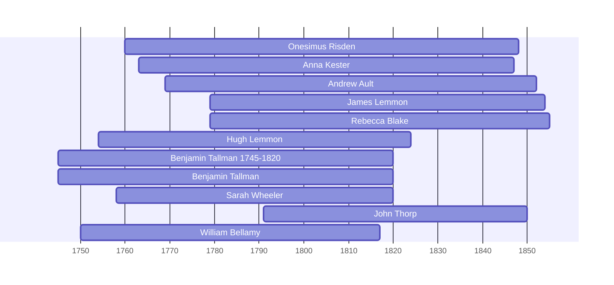

![[assets/snippets/Onesimus Risden.svg]]

# Onesimus Risden

## Biographical Profile

- **Name:** Onesimus Risden
- **Dates:** 1760-1848

## Source-Cited Facts

- Identified in pedigree timeline source.

## Research Notes

- Initial stub created from pedigree timeline extraction.

## Overlapping Lifespans

> [!info] Visualizing contemporaries in the vault during the life of Onesimus Risden (1760-1848).

## Source Indicators

> [!info] Indicators from Pedigree Timeline Diagrams
>
> - **Census Records**: Found in 1850
> - **Official Records**: Ref #224

## Sources

1. [[References/raw/extracted/PedigreeTimelines2025Spicer.txt|PedigreeTimelines2025Spicer.txt]]
