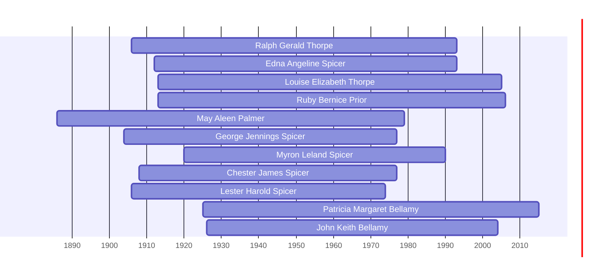

![[assets/snippets/Ralph Gerald Thorpe.svg]]

# Ralph Gerald Thorpe

## Biographical Profile

- **Name:** Ralph Gerald Thorpe
- **Dates:** 1906 -1993

## Source-Cited Facts

- Identified in pedigree timeline source.

## Research Notes

- Initial stub created from pedigree timeline extraction.

## Overlapping Lifespans

> [!info] Visualizing contemporaries in the vault during the life of Ralph Gerald Thorpe (1906-1993).

## Source Indicators

> [!info] Indicators from Pedigree Timeline Diagrams
>
> - **Official Records**: Ref #015, 017, 052, 250
> - **Burial**: Verified (RIP marker)
> - **Obituary**: Available (Obit marker)

## Sources

1. [[References/raw/extracted/PedigreeTimelines2025Thorpe.txt|PedigreeTimelines2025Thorpe.txt]]
