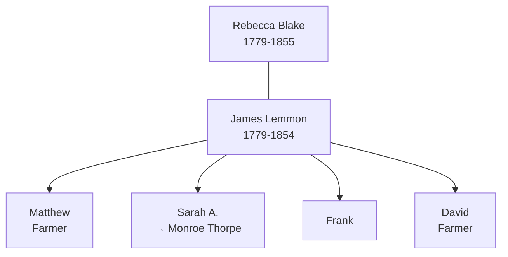

# Rebecca Blake

## Biographical Profile

- **Name:** Rebecca Blake
- **Role in this project:** Lemmon-linked ancestor represented in 1850 Ohio census-summary household extract.

## Source-Cited Facts

- **Birth/Death:** Born 26 Oct 1779; died 29 Mar 1855 (age 75 years, 5 months, 3 days per burial record).
- **Burial:** Tew Cemetery, Townsend Township, Sandusky County, Ohio; Section 25-17-5, Coordinates 412203N 0825125W; inscription reads `REBECCA / wife of / JAMES LEMMON / DIED / Mar. 29, 1855 / Aged / 75 Yrs. 5.M. 3d`; Burial Sites book, page 9.
- **Spouse:** [[People/James Lemmon|James Lemmon]] (1779-1854); married name: Lemmon

## Census Records and Household Context

### 1850 Ohio Census — Sandusky County, Townsend Township
- **Head:** `James Lemmon`, male, age 71, farmer, born Pennsylvania
- **Rebecca Lemmon** (spouse), female, age 71, born Pennsylvania
- **Household composition:**
  - `Mathew? Lemmon`, male, age 38, farmer, born New York (son)
  - `Sarah Lemmon`, female, age 21, born New York (daughter) — later [[People/Sarah Annett Lemmon|Sarah Annett Lemmon]]
  - `Frank Lemmon`, male, age 1, born Ohio (grandson or younger son)
  - `Nathan Harkins`, male, age 12, born New York (boarder/relative)
  - `David Lemmon`, male, age 21, farmer, born New York (son or relative)
- **Source:** Series M432, Roll 726, Page 476, R/F 1173/1198; GSU microfilm available

## Family Connections

- **Husband:** [[People/James Lemmon|James Lemmon]] (b. 1779 Pennsylvania) — farmer, patriarch of Ohio Lemmon line
- **Children identified:** Matthew, Sarah (later Annett), Frank, David (likely sons)
- **Age at 1850 census:** 71 years old (born 1779)
- **Pedigree significance:** Links the Blake surname to Lemmon family; appears on same timeline chart as [[People/Uriah Blake Lemmon|Uriah Blake Lemmon]] and [[People/Uriah Blake Thorpe|Uriah Blake Thorpe]]
- **Burial location:** Same cemetery (Tew) as husband James Lemmon, adjacent plots in same section

## Family Diagram

Rebecca Blake married James Lemmon and anchors the Blake-Lemmon connection; their daughter Sarah Annett carried the Lemmon line forward into the Thorpe branch.

## Research Gaps

1. Confirm maiden-name linkage Blake-to-Lemmon from marriage/parish records.
2. Validate household relationships in the 1850 entry from source images.
3. Extend profile with pre-1850 and post-1850 record coverage.

## Sources

1. [[References/Shared Intake 2026-04-22 Census Summary Individuals p11-p20|Shared Intake 2026-04-22 Census Summary Individuals p11-p20]]
2. [[References/Shared Intake 2026-04-22 Burial Sites Summary|Shared Intake 2026-04-22 Burial Sites Summary]]
3. `References/raw/inbox/2026-04-22-intake/BurialSites/BurialSites.txt`
4. `References/raw/inbox/2026-04-22-intake/Census/CensusSummaryIndividual.pdf`

1. `References/raw/inbox/2026-04-24-census-indesign/CensusSummary-BlakeRebecca.txt`
