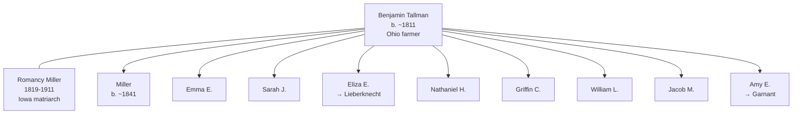

# Romancy Miller

## Biographical Profile

- **Name:** Romancy Miller (later Romancy Tallman)
- **Role in this project:** Tallman-line matriarch spanning Iowa (1850-1910) with six-decade household documentation.

## Source-Cited Facts

- **Birth/Death:** Born 10 Apr 1819; died 31 Jan 1911 (age 91 years, 8 months, 21 days).
- **Maiden surname:** Miller; married name: Tallman (married Benjamin Tallman c. 1840s)

## Census Records and Life Progression

### 1850 Iowa Census — Jones County, Rome Township
- **Head:** `Benjamin TOLLMAN`, male, age 39, occupation farmer, born Ohio
- **Romancy TOLLMAN** (wife), female, age 32, born Ohio
- **Children in household:**
  - `Miller TOLLMAN`, male, age 9, born Ohio
  - `Emma E TOLLMAN`, female, age 5, born Ohio
  - `Sarah J TOLLMAN`, female, age 14, born Ohio
  - `Eliza E TOLLMAN`, female, age 3, born Ohio
  - `Nathaniel H TOLLMAN`, male, age 2, born Iowa
- **Household also includes:**
  - `John VANOISDELL?`, male, age 20, occupation farm hand
  - `Elizabeth McVETE?`, female, age 33, occupation domestic
  - `Matthew BOWER`, male, age 60
- **Source:** Series M432, Roll 185, Page 192; GSU microfilm available

### 1860 Iowa Census — Linn County, College Township, Western
- **Head:** `Benjamin TALMON`, male, age 47, occupation farmer, born Ohio, property $5,000
- **Romcy TALMON** (wife), female, age 40, born Ohio
- **Children:**
  - `Miller TALMON`, male, age 19, born Ohio, occupation farmer
  - `Ama TALMON`, female, age 16, born Ohio
  - `Eliza E TALMON`, female, age 13, born Ohio
  - `Nathaniel TALMON`, male, age 11, born Iowa
  - `Ama E TALMON`, female, age 6, born Iowa
  - `Griffin C TALMON`, male, age 7, born Iowa
  - `William L TALMON`, male, age 2, born Iowa
- **Source:** Series 653, Roll 532, Page 387; GSU microfilm available

### 1870 Iowa Census — Linn County, College Township, Page 180
- **Head:** `Benj TALLMAN`, male, age 59, occupation farmer, born Ohio
- **Romancee TALLMAN** (wife), female, age 56, born Ohio
- **Children:**
  - `Matt H TALLMAN`, male, age 28, born Ohio, occupation farmer
  - `Nathan H TALLMAN`, male, age 21, born Iowa, occupation farm laborer
  - `Griffin C TALLMAN`, male, age 18, born Iowa, occupation farm laborer
  - `Romancee TALLMAN`, female, age 14, born Iowa
  - `Wm L TALLMAN`, male, age 8, born Iowa
  - `Jacob M TALLMAN`, male, age 5, born Iowa
- **Note:** Mathias notation possibly indicating additional children at top of page
- **Source:** Series M593, Roll 405, Page 180; GSU microfilm available

### 1880 Iowa Census — Linn County, College Township, Western
- **Head:** `B. TALLMAN` (Benjamin), male, self, married, age 69, born Ohio, occupation farming
- **Romancy TALLMAN** (wife), female, married, age 62, born Ohio, occupation keeping house
- **Child:**
  - `Romancy TALLMAN` (daughter), female, single, age 23, born Iowa
- **Note:** Household significantly reduced; older children moved out or deceased
- **Source:** Fam Hist Lib Film 1254351; GSU microfilm available

### 1900 Iowa Census — Greene County, Washington Township
- **Head:** `Amy E GARNANT`, female, race White, birthdate July 1844, age 35, occupation (head)
- **Romancy TALLMAN** (mother), female, race White, birthdate April 1819, age 81, occupation none
- **Note:** Romancy living with daughter Amy's household; widowed status suggests Benjamin deceased
- **Source:** Series T623, Roll 741, Pages 175-176; GSU microfilm available

### 1910 Iowa Census — Greene County, Washington Township, Rippey
- **Head:** `Eliza LIEBERKNECHT`, female, race White, age 64, widowed, occupation (own income)
- **Romancy TALLMAN** (mother), female, race White, age 91, widowed, occupation none
- **Note:** Romancy now 91 years old, living with daughter Eliza; still in Iowa
- **Source:** Series T624, Roll 403, Page 179; GSU microfilm available

## Family Connections

- **Husband:** Benjamin Tallman (b. ~1811 Ohio, married c. 1840s)
- **Children identified:** Miller, Emma E., Sarah J., Eliza E., Nathaniel H., Ama E., Griffin C., William L., Jacob M., Romancy (10+ children across 60-year span)
- **Son:** [[People/Miller Mathias Tallman|Miller Mathias Tallman]] (possible relationship to household members)
- **Daughters:** Amy E. Garnant, Eliza Lieberknecht (living with them in later years)
- **Pedigree significance:** Iowa-based Tallman matriarch, preserving family across six decades of agricultural and family transitions

## Family Diagram

Romancy Miller represents the Iowa-based Tallman family matriarch, maintaining household through 60+ years of agricultural settlement and family expansion (1850-1910).

## Research Gaps

1. Verify exact maiden surname (Miller vs. other variants) from marriage records.
2. Clarify Benjamin Tallman's birthplace and parentage (Ohio origin).
3. Resolve name spelling variants (Tallman, Talmon, Tollman) across census years.
4. Trace all children's adult lives and marriages, especially Miller, Matt H., and daughters.
5. Locate Benjamin Tallman's death record and confirm widowhood timeline for Romancy.
6. Identify Romancy's later years with daughters Amy and Eliza.

## Sources

1. [[References/Shared Intake 2026-04-22 Census Summary Individuals p41-p50|Shared Intake 2026-04-22 Census Summary Individuals p41-p50]]
2. [[References/Shared Intake 2026-04-22 Burial Sites Summary|Shared Intake 2026-04-22 Burial Sites Summary]]
3. `References/raw/inbox/2026-04-22-intake/BurialSites/BurialSites.txt`
4. `References/raw/inbox/2026-04-22-intake/Census/CensusSummaryIndividual.pdf`