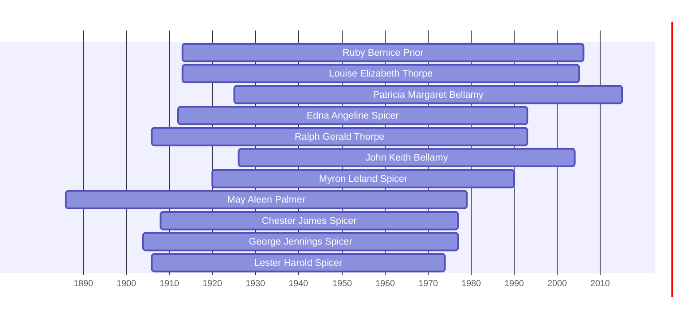

![[assets/snippets/Ruby Bernice Prior.svg]]

# Ruby Bernice Prior

## Biographical Profile

- **Name:** Ruby Bernice Prior
- **Role in this project:** Direct-line ancestor in staged Spicer/Prior linkage notes.

## Source-Cited Facts

- The staged lineage chain records Ruby Bernice Prior paired with Lester Harold Spicer.
- The same chain places Ruby Bernice Prior in the parent generation of Karen Lu Spicer.
- The census-summary contents index lists `PRIOR, Ruby Bernice` with dates 24 Apr 1913 to 1 Aug 2006.
- Census-summary profile pages include Ruby Prior in 1920 and 1930 Cedar Rapids households of Oliver and May Prior, where Ruby appears as a daughter.
- The Prior pedigree timeline places `Ruby Bernice Prior` (1913-2006) in the Oliver and May Prior household line.
- The processed Prior timeline review confirms Ruby as the next direct generation after Oliver Warren Prior and May Aleen Palmer.
- The Burial Sites book places Ruby Bernice Prior at Cedar Memorial Cemetery in Cedar Rapids, Iowa (page 27), `64K Last Supper, Space 4`, with GPS coordinates `42°1’24.2”N 91°38’17.4”W` and date of death 1 August 2006. Map: [Google Maps](https://www.google.com/maps/search/?api=1&query=Cedar+Memorial+Cemetery+Cedar+Rapids+IA).

## Research Gaps

1. Confirm dates from timeline and census-summary PDFs before adding them here.
2. Correlate with Prior branch records to confirm parentage.
3. Add location data from direct sources.
4. Keep the later Spicer linkage grounded in the combined Prior, Spicer, census, and burial context rather than a single compiled chart.


## Census Records

> [!info] Extract from References/raw/extracted/CensusSummaryIndividual.txt

```text
PRIOR, Ruby Bernice (24 Apr 1913 - 1 Aug 2006)
1920 Iowa, Linn County, Cedar Rapids, 275 12th Ave E
D/F
62

Name
Rel
Sex Race Age
Oliver PRIOR
Head
M
W
39
May PRIOR
Wife
F
W
33
Martha PRIOR
Dau
F
W
15
Everett PRIOR
Son
F
W
12
Viola PRIOR
Dau
F
W
9
Voila PRIOR
Dau
F
W
9
Ruby PRIOR
Dau
F
W
6
Ronald PRIOR
Son
M
W
4+
Vergil PRIOR
Son
F
W
1+
Maxine PRIOR
Dau
F
W 11mo
Series: T625, Roll: 500, Page: 3B, ED 131

MS
M
M
S
S
S
S
S
S
S
S

?

?

?

BP
Minn
Wisc
Iowa
Iowa
Iowa
Iowa
Iowa
Iowa
Iowa
Iowa

FBP
Mich
Penn
Minn
Minn
Minn
Minn
Minn
Minn
Minn
Minn

MBP
Mich
Wisc
Wisc
Wisc
Wisc
Wisc
Wisc
Wisc
Wisc
Wisc

Occupation
Moulder
None
None
None
None
None
None
None
None
None

1930 Iowa, Linn County, Cedar Rapids, 14th Precinct, RFD #4 Memorial Drive
D/F
627

Name
Rel
Oliver W PRIOR
Head
May A PRIOR
Wife
Martha E CASHMAN
Dau
Warren A CASHMAN
GSon
Beverly M CASHMAN
GDau
Bruce F CASHMAN
GSon
Everett ? PRIOR
Son
Voila D PRIOR
Dau
Viola D PRIOR
Dau
Ruby B PRIOR
Dau
Ronald WPRIOR
Son
Vergil V PRIOR
Son
Maxine M PRIOR
Son
La Verne O PRIOR
Son
Oliver W PRIOR Jr
Son
Clint R PRIOR
Son
Series: T626, Roll: 665, Page: 26B, ED 57

CENSUS SUMMARY - INDIVIDUALS

Sex Race Age
M
W
50
F
W
43
F
W
25
M
W 3+
F
W
2
M
W 8mo
M
W
22
F
W
19
F
W
19
F
W
16
M
W
14
M
W
12
M
W
10
M
W
6
M
W 3+
M
W
2

MS
M
M
M
S
S
S
S
S
S
S
S
S
S
S
S
S

BP
Minn
Wisc
Iowa
Iowa
Iowa
Iowa
Iowa
Iowa
Iowa
Iowa
Iowa
Iowa
Iowa
Iowa
Iowa
Iowa

FBP
Mich
Penn
Minn
NY
NY
NY
Minn
Minn
Minn
Minn
Minn
Minn
Minn
Minn
Minn
Minn

Robert Archer John Thorpe

MBP
Mich
Wisc
Wisc
Iowa
Iowa
Iowa
Wisc
Wisc
Wisc
Wisc
Wisc
Wisc
Wisc
Wisc
Wisc
Wisc

Occupation
Moulder, foundary
None
Operator, telephone
None
None
None
Core Maker, foundary
Mangle Operator, laundry
Mangle Operator, laundry
Mangle Operator, laundry
None
None
None
None
None
None

56
```


## Overlapping Lifespans

> [!info] Visualizing contemporaries in the vault during the life of Ruby Bernice Prior (1913-2006).



## Source Indicators

> [!info] Indicators from Pedigree Timeline Diagrams
>
> - **Burial**: Verified (RIP marker)
> - **Obituary**: Available (Obit marker)

## Sources

1. [[References/Shared Intake 2026-04-22 Spicer Lineage Note|Shared Intake 2026-04-22 Spicer Lineage Note]]
2. [[References/Shared Intake 2026-04-22 Census Summary Individuals p1-p10|Shared Intake 2026-04-22 Census Summary Individuals p1-p10]]
3. [[References/Shared Intake 2026-04-22 Census Summary Individuals p51-p60|Shared Intake 2026-04-22 Census Summary Individuals p51-p60]]
4. [[References/Shared Intake 2026-04-22 Pedigree Timeline Prior|Shared Intake 2026-04-22 Pedigree Timeline Prior]]
5. [[References/raw/processed/2026-04-22-intake/pedigree-timeline/prior-pedigree-timeline-index|Prior Pedigree Timeline Extraction Index]]
6. [[References/Shared Intake 2026-04-22 Burial Sites Summary|Shared Intake 2026-04-22 Burial Sites Summary]]
7. `References/raw/extracted/PedigreeTimeline2025Prior.txt`
8. `References/raw/inbox/2026-04-22-intake/BurialSites/BurialSites.txt`
9. `References/raw/inbox/2026-04-22-intake/Pedigree Timeline/SPICLINE.txt`
10. `References/raw/inbox/2026-04-22-intake/Census/CensusSummaryIndividual.pdf`
