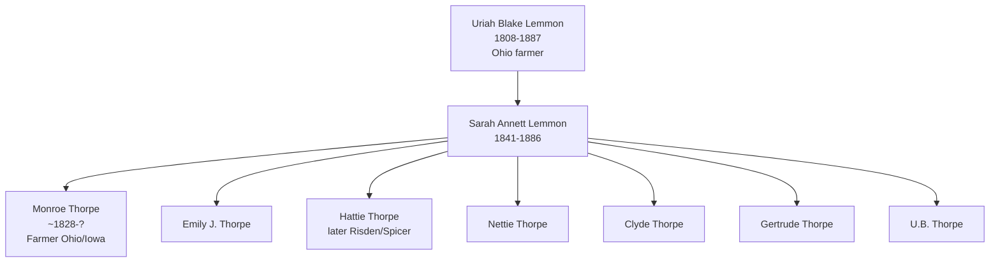
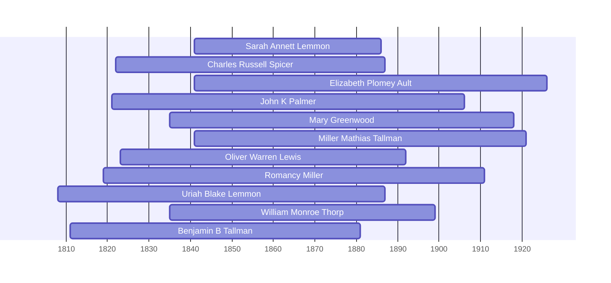

![[assets/snippets/Sarah Annett Lemmon.svg]]

# Sarah Annett Lemmon

## Biographical Profile

- **Name:** Sarah Annett Lemmon
- **Role in this project:** Lemmon-to-Thorp/Thorpe branch ancestor represented across 1850-1880 census-summary entries.

## Source-Cited Facts

- **Birth/Death:** Born 21 Mar 1841; died 6 Aug 1886 (age 45 years, 7 months, 7 days per burial record).
- **Burial:** Oakland Cemetery, Beaman, Iowa; Lot 21; inscription reads `SARAH ANNETT THORP / DIED AUG. 6, 1886 / AGED 45 YRS. 7M. 7D.`; Burial Sites book, page 15.
- **Maiden surname:** Lemmon; married name: Thorp/Thorpe (Monroe/Munroe Thorpe)

## Census Records and Life Progression

### 1850 Ohio Census — Sandusky County, Townsend Township (as child)
- **Head:** `Euriah B. Lemmon`, male, farmer
- **Sarah A. Lemmon** appears in [[People/Uriah Blake Lemmon|Uriah Blake Lemmon]]'s household as a daughter
- **Age:** ~9 years old
- **Source:** Series M432, Roll 726, Pages 476-477; GSU microfilm available

### 1860 Ohio Census — Sandusky County, Townsend Township (as wife)
- **Head:** `Munroe Thorp`, male (spelling variant of Monroe)
- **Sarah Thorp**, female, married
- **Children:** Emily J. Thorp
- **Other household member:** Omar Tanner, farm laborer
- **Source:** Series M653, Roll 1032, Page 54; GSU microfilm available

### 1870 Iowa Census — Marshall County, Marshall Township, Ward 5
- **Head:** `Monore Thorp`, male, age ~40, retired farmer, born New York
- **Sarah Thorp**, female, age ~29, keeping house, born Ohio
- **Children:**
  - Hattie Thorp, female, at home
  - Nettie Thorp, female, at home
  - Clyde Thorp, male, age ~5 (born September in Iowa)
- **Other household member:** Omar Tanner, farm laborer
- **Source:** Series M593, Roll 410, Page 486; GSU microfilm available

### 1880 Iowa Census — Grundy County, Clay Township
- **Head:** `M. Thorpe` (Monroe), male, age ~52, farmer, born New York
- **Sarah Thorpe**, female, age ~39, keeping house, born Ohio
- **Children in household:**
  - Hattie Thorpe, daughter, age ~23, at home
  - Nettie Thorpe, daughter, age ~21, school teacher
  - Clyde Thorpe, son, age ~17, at home
  - Gertrude Thorpe, daughter, age ~15, at home
  - U.B. Thorpe, son, age ~13, at home
- **Boarder:** Ch. Richards, male, laborer
- **Source:** Series T9, Roll 341, Page 388C, Fam Hist Lib Film 1254341

## Family Connections

- **Father:** [[People/Uriah Blake Lemmon|Uriah Blake Lemmon]] (1808-1887) — Ohio patriarch
- **Husband:** Monroe (Munroe) Thorpe (b. ~1828 New York) — farmer in Ohio and Iowa
- **Children identified:** Emily J., Hattie, Nettie, Clyde, Gertrude, U.B. (Uriah Blake?)
- **Lemmon branch:** Direct child of Uriah Blake Lemmon; carries Lemmon name forward as "Annett" to Thorpe line
- **Pedigree connection:** [[Topics/Lemmon Blake Thorpe Branch Summary|Links the Lemmon and Thorpe family branches]] through marriage

## Family Diagram



Sarah Annett bridges Lemmon family of Ohio with Thorpe family expansion into Iowa (1850s-1880s).

## Research Gaps

1. Reconcile Lemmon-to-Thorp/Thorpe surname transition chronology.
2. Validate all child entries and ages across 1860-1880 households from image-level pages.
3. Confirm death date from independent record sets.


## Census Records

> [!info] Extract from References/raw/extracted/CensusSummaryIndividual.txt

```text
LEMMON, Sarah Annett (21 Mar 1841 - 6 Aug 1886)
1850 Ohio, Sandusky County, Townsend Township, Page 476 B and 477
R/F
1189/1205

Name
Euriah B LEMMON
Emily A LEMMON
Wm H LEMMON
John M LEMMON
Sarah A LEMMON
Rebecca A LEMMON
Cyrus A LEMMON
M Burton LEMMON
Series: M432, Roll: 726, Page: 476, 477

Sex
M
F
M
M
F
F
M
M

Age
42
34
13
11
9
7
5
4

Occupation
Farmer

Born
New York
New York
Ohio
Ohio
Ohio
Ohio
Ohio
Ohio

Comments

1860 Ohio, Sandusky County, Townsend Township, Page 54 B
D/F
813/784

Name
Munroe THORP
Sarah THORP
Emily J THORP
Omar? TANNER
Series: M653, Roll: 1032, Page: 54

Age Sex
24
M
19
F
2/12
F
21
M

Color

Occupation

Property
300

Nativity
New York
Ohio
Ohio
Ohio

Real Pers
2500 300

Nativity Comments
New York
Ohio
Ohio
Ohio
Iowa
born in Sept

Farm Laborer

Comments

1870 Iowa, Marshall County, Marshalltown, 4th Ward, p. 11
D/F
79/83

Name
Monroe THORP
Sarah THORP
Hattie THORP
Nettie THORP
Clide THORP
Series: M593, Roll: 410, Page: 486

Age Sex
34
M
28
F
8
F
7
F
11/12 M

Color
W
W
W
W
W

Occupation
Retired Farmer
Keeping house
At Home
At Home
At Home

1880 Iowa, Grundy County, Clay Township
D/F
124/124

Name
M. THORPE
Sarah THORPE
Hata THORPE
Netie THORPE
Clyde THORPE
Gertrude THORPE
U.B. THORPE
Ch RICHARDS
Fam Hist Lib Film
1254341

Rel
Self
Wife
Dau
Dau
Son
Dau
Son
Other

CENSUS SUMMARY - INDIVIDUALS

Married Gender Race Age
BP
Married
Male
White 45
NY
Married
Female White 28
OH
Single
Female White 18
OH
Single
Female White 17
OH
Single
Male
White 10
IA
Single
Female White 3
IA
Single
Male
White 1
IA
Single
Male
White 23
IA
NA Film No. T9-0341
Page 388C

Robert Archer John Thorpe

Occupation
Farmer
Keeping House
At Home
School Teacher
At Home
At Home
At Home
Laborer

FBP
NY
NY
NY
NY
NY
NY
NY
—

MBP
NY
NY
NY
NY
NY
NY
NY
—

37
```


## Name Variations

> [!info] Known aliases or census misspellings from Butch Thorpe's cross-reference table.
>
> - **THORP, Sarah**

## Overlapping Lifespans

> [!info] Visualizing contemporaries in the vault during the life of Sarah Annett Lemmon (1841-1886).



## Source Indicators

> [!info] Indicators from Pedigree Timeline Diagrams
>
> - **Official Records**: Ref #213, 214, 215, 216
> - **Burial**: Verified (RIP marker)
> - **Obituary**: Available (Obit marker)

## Sources

1. [[References/Shared Intake 2026-04-22 Census Summary Individuals p31-p40|Shared Intake 2026-04-22 Census Summary Individuals p31-p40]]
2. [[References/Shared Intake 2026-04-22 Burial Sites Summary|Shared Intake 2026-04-22 Burial Sites Summary]]
3. `References/raw/inbox/2026-04-22-intake/BurialSites/BurialSites.txt`
4. `References/raw/inbox/2026-04-22-intake/Census/CensusSummaryIndividual.pdf`
5. [[References/Shared Intake 2026-04-22 Pedigree Timeline Thorpe|Shared Intake 2026-04-22 Pedigree Timeline Thorpe]]
6. [[thorpe-pedigree-timeline-index|Thorpe Pedigree Timeline Extraction Index]]
