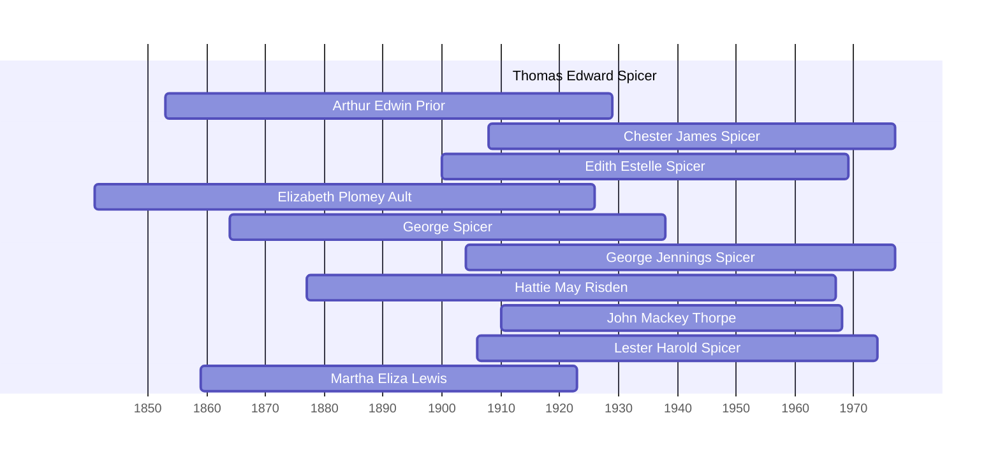

![[assets/snippets/Thomas Edward Spicer.svg]]

# Thomas Edward Spicer

## Biographical Profile

- **Name:** Thomas Edward Spicer
- **Dates:** 1911 - 1911

## Source-Cited Facts

- Identified in pedigree timeline source.

## Research Notes

- Initial stub created from pedigree timeline extraction.

## Overlapping Lifespans

> [!info] Visualizing contemporaries in the vault during the life of Thomas Edward Spicer (1911-1911).

## Source Indicators

> [!info] Indicators from Pedigree Timeline Diagrams
>
> - **Burial**: Verified (RIP marker)
> - **Obituary**: Available (Obit marker)

## Sources

1. [[References/raw/extracted/PedigreeTimelines2025Spicer.txt|PedigreeTimelines2025Spicer.txt]]
