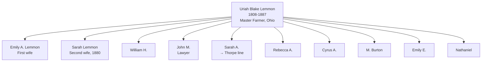

# Uriah Blake Lemmon

## Biographical Profile

- **Name:** Uriah Blake Lemmon
- **Role in this project:** Lemmon-line ancestor represented in Ohio census-summary household entries from 1850-1880.

## Source-Cited Facts

- **Birth/Death:** Born 16 Mar 1808; died 15 Feb 1887 (age 78).
- **Burial:** McPherson Cemetery, Clyde, Ohio (inscription: `LEMMON`); Burial Sites book, page 16.

## Census Records and Household Context

### 1850 Ohio Census — Sandusky County, Townsend Township
- **Head:** `Euriah B. Lemmon`, male, farmer, born New York
- **Household:** Emily A. Lemmon (wife), Wm H. Lemmon (son), John M. Lemmon (son), Sarah A. Lemmon (daughter), Rebecca A. Lemmon (daughter), Cyrus A. Lemmon (son), M. Burton Lemmon (son)
- **Source:** Series M432, Roll 726, Pages 476-477; GSU microfilm available

### 1860 Ohio Census — Sandusky County, Townsend Township
- **Head:** `Uriah B. Lemmon`, male, age ~52, master farmer, born New York
- **Household:** Emily A. Lemmon (wife, age ~54), Rebecca A. Lemmon (age ~60, daughter), Cyrus A. Lemmon (son), Emily E. Lemmon (daughter), Nathaniel Lemmon (son)
- **Source:** Series M653, Roll 1032, Page 54; GSU microfilm available

### 1870 Ohio Census — Sandusky County, Green Creek Township, Clyde
- **Position:** Living in household of son John M. Lemmon (lawyer, age ~40)
- **Head:** `Jno M. Lemmon`, male, lawyer, born Ohio
- **Household:** Uriah B. Lemmon (age ~62, father, retired farmer), John M. Lemmon (son), Annie Lemmon, Mack Lemmon, Annie Havice (housekeeper, Pennsylvania)
- **Source:** Series M593, Roll 1264, Page 125; GSU microfilm available

### 1880 Ohio Census — Sandusky County, Clyde
- **Head:** `Uriah B. Lemmon`, male, age ~72, retired farmer, born New York
- **Household:** Sarah Lemmon (wife, age ~60, keeping house, born New York)
- **Source:** Series T9, Roll 1063, Page 63A; Fam Hist Lib Film 1255063

## Family Connections

- **Wife:** Emily A. Lemmon (first wife, 1850-1860s), then Sarah Lemmon (1880)
- **Children identified in census:** William H., John M., Sarah A., Rebecca A., Cyrus A., M. Burton, Emily E., Nathaniel
- **Son John M. Lemmon** became a lawyer in Ohio; his household included Uriah in 1870
- Related to [[People/James Lemmon|James Lemmon]] (likely father or brother); pedigree timeline links to Rebecca Blake line

## Family Diagram

Uriah Blake Lemmon was patriarch of the Ohio Lemmon line, with 8+ documented children across 1850-1880 censuses.

## Identity Note

**Separate from [[People/Uriah Blake Thorpe|Uriah Blake Thorpe]]** (1878-1959, Iowa). These are different individuals:
- Birth year difference: 70 years (1808 vs 1878)
- Different locations: Ohio vs Iowa
- Death dates: 1887 vs 1959
- Different burial sites: McPherson Cemetery, Clyde vs Evergreen Cemetery, Grand Mound
- Likely related through Blake family or Lemmon/Thorpe connection based on pedigree timeline grouping, but definitely different generations.

## Research Gaps

1. Resolve Lemmon/Lemon spelling differences across decades.
2. Validate apparent OCR ambiguity for sex markers in 1860 entries.
3. Confirm the 1880 spouse identity against other Lemmon profile records.
4. Clarify relationship to [[People/Uriah Blake Thorpe|Uriah Blake Thorpe]] via pedigree timeline or family records (possible uncle/nephew or cousin).

## Sources

1. [[References/Shared Intake 2026-04-22 Census Summary Individuals p31-p40|Shared Intake 2026-04-22 Census Summary Individuals p31-p40]]
2. [[References/Shared Intake 2026-04-22 Burial Sites Summary|Shared Intake 2026-04-22 Burial Sites Summary]]
3. `References/raw/inbox/2026-04-22-intake/BurialSites/BurialSites.txt`
4. `References/raw/inbox/2026-04-22-intake/Census/CensusSummaryIndividual.pdf`
