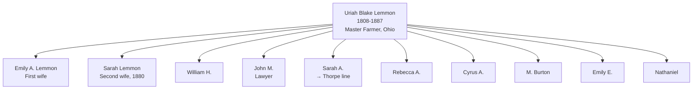
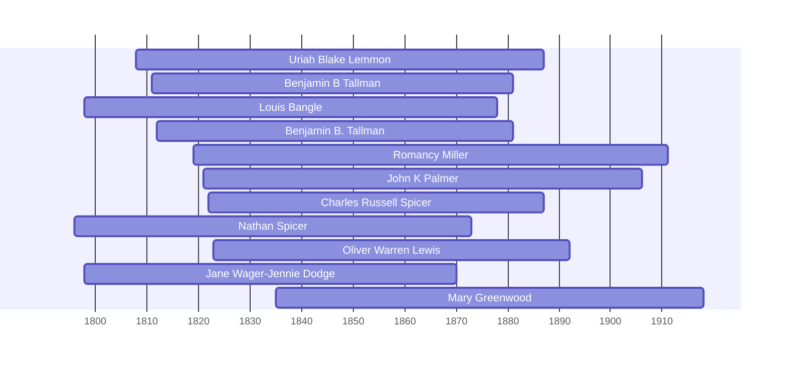

![[assets/snippets/Uriah Blake Lemmon.svg]]

# Uriah Blake Lemmon

## Biographical Profile

![[assets/sandusky-ottawa-1896-titlepage.gif]]

- **Name:** Uriah Blake Lemmon
- **Role in this project:** Lemmon-line ancestor represented in Ohio census-summary household entries from 1850-1880.

## Source-Cited Facts

- **Dates:** 16 Mar 1808 - 15 Feb 1887
- **Burial:** McPherson Cemetery, Clyde, Ohio (inscription: `LEMMON`); Burial Sites book, page 16.
- The Sandusky-Beers biographical sketch for [[People/John McIntyre Lemmon|John McIntyre Lemmon]] identifies Uriah Blake Lemmon and [[People/Emily Amanda MacIntyre|Emily Amanda MacIntyre]] Lemmon as John McIntyre Lemmon's parents.

## Census Records and Household Context

### 1850 Ohio Census — Sandusky County, Townsend Township
- **Head:** `Euriah B. Lemmon`, male, farmer, born New York
- **Household:** Emily A. Lemmon (wife), Wm H. Lemmon (son), John M. Lemmon (son), Sarah A. Lemmon (daughter), Rebecca A. Lemmon (daughter), Cyrus A. Lemmon (son), M. Burton Lemmon (son)
- **Source:** Series M432, Roll 726, Pages 476-477; GSU microfilm available

### 1860 Ohio Census — Sandusky County, Townsend Township
- **Head:** `Uriah B. Lemmon`, male, age ~52, master farmer, born New York
- **Household:** Emily A. Lemmon (wife, age ~54), Rebecca A. Lemmon (age ~60, daughter), Cyrus A. Lemmon (son), Emily E. Lemmon (daughter), Nathaniel Lemmon (son)
- **Source:** Series M653, Roll 1032, Page 54; GSU microfilm available

### 1870 Ohio Census — Sandusky County, Green Creek Township, Clyde
- **Position:** Living in household of son John M. Lemmon (lawyer, age ~40)
- **Head:** `Jno M. Lemmon`, male, lawyer, born Ohio
- **Household:** Uriah B. Lemmon (age ~62, father, retired farmer), John M. Lemmon (son), Annie Lemmon, Mack Lemmon, Annie Havice (housekeeper, Pennsylvania)
- **Source:** Series M593, Roll 1264, Page 125; GSU microfilm available

### 1880 Ohio Census — Sandusky County, Clyde
- **Head:** `Uriah B. Lemmon`, male, age ~72, retired farmer, born New York
- **Household:** Sarah Lemmon (wife, age ~60, keeping house, born New York)
- **Source:** Series T9, Roll 1063, Page 63A; Fam Hist Lib Film 1255063

## Family Connections

- **Wife:** Emily A. Lemmon (first wife, 1850-1860s), then Sarah Lemmon (1880)
- **Children identified in census:** William H., John M., Sarah A., Rebecca A., Cyrus A., M. Burton, Emily E., Nathaniel
- **Son:** [[People/John McIntyre Lemmon|John McIntyre Lemmon]], lawyer, Civil War veteran, mayor of Clyde, and common pleas judge; his 1870 household included Uriah.
- **Parents:** [[People/James Lemmon|James Lemmon]] and [[People/Rebecca Blake|Rebecca Blake]], based on the Sandusky-Beers sketch's statement that James and Rebecca were John McIntyre Lemmon's grandparents.

## Family Diagram



Uriah Blake Lemmon was patriarch of the Ohio Lemmon line, with 8+ documented children across 1850-1880 censuses.

## Identity Note

**Separate from [[People/Uriah Blake Thorpe|Uriah Blake Thorpe]]** (1878-1959, Iowa). These are different individuals:
- Birth year difference: 70 years (1808 vs 1878)
- Different locations: Ohio vs Iowa
- Death dates: 1887 vs 1959
- Different burial sites: McPherson Cemetery, Clyde vs Evergreen Cemetery, Grand Mound
- Likely related through Blake family or Lemmon/Thorpe connection based on pedigree timeline grouping, but definitely different generations.


## Research Gaps

> [!warning] Priority Research Leads
> The following census records are indicated in the pedigree diagrams but matching transcripts are missing from the vault:
> - **1840 Census**: Transcript needed to verify household context.

## Census Records

> [!info] Extract from References/raw/extracted/CensusSummaryIndividual.txt

```text
LEMMON, Uriah Blake (16 Mar 1808 - 15 Feb 1887)
1850 Ohio, Sandusky County, Townsend Township, Page 476 B and 477
R/F
1189/1205

Name
Euriah B LEMMON
Emily A LEMMON
Wm H LEMMON
John M LEMMON
Sarah A LEMMON
Rebecca A LEMMON
Cyrus A LEMMON
M Burton LEMMON
Series: M432, Roll: 726, Page: 476, 477

Sex
M
F
M
M
F
F
M
M

Age
42
34
13
11
9
7
5
4

Occupation
Farmer

Born
New York
New York
Ohio
Ohio
Ohio
Ohio
Ohio
Ohio

Comments

1860 Ohio, Sandusky County, Townsend Township, Page 54 A
D/F
800/773

Name
Uriah B LEMON
Emily A LEMON
Rebecca A LEMON
Cyrus A LEMON
Morris B LEMON
Emily E LEMON
Nathaniel LEMON
Series: M653, Roll: 1032, Page: 54

Age Sex
53
M
44
F
17 M (F)
15
M
13
M
7
F
2/12F (M)

Color

Occupation
Master? Farmer

Property
Nativity
7000 1600 New York
New York
Ohio
Ohio
Ohio
Ohio
Ohio

Comments

1870 Ohio, Sandusky County, Green CreekTownship, Clyde
D/F
525/527

Name
Jno M LEMMON
Annie LEMMON
Mack LEMMON
Annie HAVICE
Uriah B LEMMON
Series: M593, Roll: 1264, Page: 125

Age Sex
30
M
26
F
2/12 M
22
F
62
M

Color
W
W
W
W
W

Occupation
Lawyer
Keeping House
Housekeeper
Retired Farmer

Real Pers Nativity Comments
17000 1500 Ohio
son of UB
Ohio
Ohio
Penn
2000 8000 New York

1880 Ohio, Sandusky County, Clyde
D/F
360/385

Name
Rel
Uriah B. LEMMON
Self
Sarah LEMMON
Wife
Fam Hist Lib Film
1255063

CENSUS SUMMARY - INDIVIDUALS

Married Gender Race Age
BP
Married
Male
White 72
NY
Married
Female White 52
NY
NA Film No. T9-1063
Page 63A

Robert Archer John Thorpe

Occupation
Retired Farmer
Keeping House

FBP
PA
CT

MBP
CT
CT

38
```


## Name Variations

> [!info] Known aliases or census misspellings from Butch Thorpe's cross-reference table.
>
> - **LEMMON, Euriah B**
> - **LEMON, Uriah B**


## Overlapping Lifespans

> [!info] Visualizing contemporaries in the vault during the life of Uriah Blake Lemmon (1808-1887).



## Source Indicators

> [!info] Indicators from Pedigree Timeline Diagrams
>
> - **Census Records**: Found in 1840, 1850, 1860, 1870
> - **Official Records**: Ref #121, 202, 203, 204
> - **Burial**: Verified (RIP marker)
> - **Obituary**: Available (Obit marker)

## Sources

1. [[References/Shared Intake 2026-04-22 Census Summary Individuals p31-p40|Shared Intake 2026-04-22 Census Summary Individuals p31-p40]]
2. [[References/Shared Intake 2026-04-22 Burial Sites Summary|Shared Intake 2026-04-22 Burial Sites Summary]]
3. `References/raw/inbox/2026-04-22-intake/BurialSites/BurialSites.txt`
4. `References/raw/inbox/2026-04-22-intake/Census/CensusSummaryIndividual.pdf`
5. [[References/Shared Intake 2026-04-22 Pedigree Timeline Thorpe|Shared Intake 2026-04-22 Pedigree Timeline Thorpe]]
6. [[References/Book Outprints — Sandusky-Beers Lemmon John M|Book Outprints — Sandusky-Beers Lemmon John M]]
