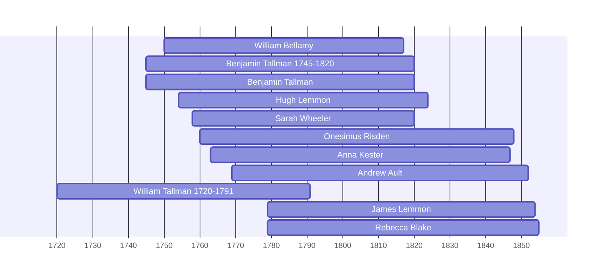

![[assets/snippets/William Bellamy.svg]]

# William Bellamy

## Biographical Profile

- **Name:** William Bellamy
- **Dates:** 1750?-1817?

## Source-Cited Facts

- Identified in pedigree timeline source.

## Research Notes

- Initial stub created from pedigree timeline extraction.

## Overlapping Lifespans

> [!info] Visualizing contemporaries in the vault during the life of William Bellamy (1750-1817).

## Source Indicators

> [!info] Indicators from Pedigree Timeline Diagrams
>
> - **Official Records**: Ref #152, 155, 158
> - **Burial**: Verified (RIP marker)

## Sources

1. [[References/raw/extracted/PedigreeTimelines2025Bellamy.txt|PedigreeTimelines2025Bellamy.txt]]
