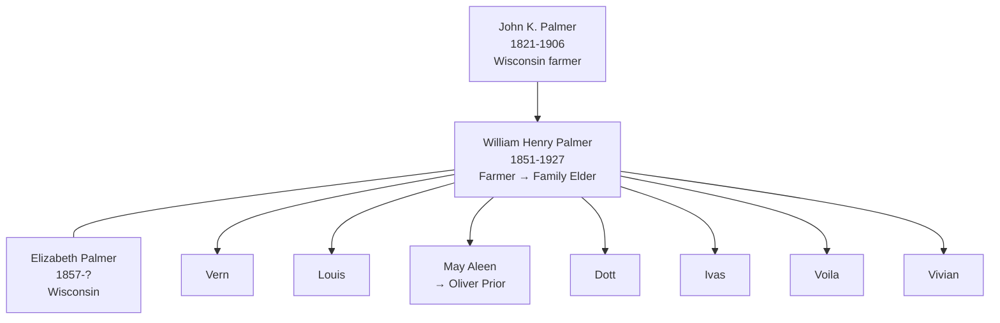
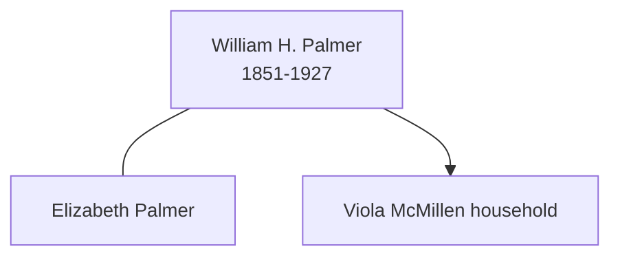

# William Henry Palmer

## Biographical Profile

- **Name:** William Henry Palmer
- **Role in this project:** Palmer-line patriarch bridging Wisconsin (childhood), Minnesota (farming), and Iowa (final decades); son of [[People/John K Palmer|John K Palmer]]; father of [[People/May Aleen Palmer|May Aleen Palmer]].

## Source-Cited Facts

- **Birth/Death:** Born 12 Jun 1851 (inscribed on headstone); died 8 May 1927, age 75, in Waterloo, Iowa.
- **Cause of Death:** Acute bronchial pneumonia (death-index entry).
- **Burial:** Fairview Cemetery, Waterloo, Iowa; section M, Row 3, Grave 67; inscription `WILLIAM H. / JUNE 12, 1851 / MAY 8, 1927 / FATHER`.

## Census Records and Life Progression

### 1860 Wisconsin Census — Sauk County, Baraboo (as child)
- **Head:** `J PALMER` ([[People/John K Palmer|John K Palmer]]), male, age 38, farmer
- **William H. Palmer** (son), male, age 9, born Pennsylvania
- **Source:** Series M653, Roll 1429, Page 450; GSU microfilm available

### 1900 Minnesota Census — Mower County, Frankford Township
- **Head:** `William PALMER`, male, race White, birthdate Jan 1851, age 49, born Pennsylvania, occupation farmer
- **Wife:** `Elizabeth PALMER`, female, race White, birthdate Sep 1857, age 42, born Wisconsin, occupation none
- **Children:**
  - `Vern PALMER`, male, race White, birthdate Oct 1882, age 18, born Wisconsin, occupation farm laborer
  - `Louis PALMER`, female, race White, birthdate Oct 1884, age 16, born Wisconsin
  - `May PALMER`, female, race White, birthdate May 1887, age 13, born Wisconsin (later [[People/May Aleen Palmer|May Aleen Palmer]])
  - `Dott PALMER`, female, race White, birthdate Aug 1889, age 11, born Wisconsin
  - `Ivas PALMER`, female, race White, birthdate Sep 1891, age 8, born Wisconsin
  - `Voila PALMER`, female, race White, birthdate May 1896, age 4, born Wisconsin
  - `Vivian PALMER`, female, race White, birthdate MAY 1898, age 2, born Minnesota
- **Source:** Series T623, Roll 777, Page 3A; GSU microfilm available

### 1920 Iowa Census — Blackhawk County, Waterloo, Summer Street
- **Head:** `Viola McMillLEN`, female, age 28, widow, seamstress/garment factory worker
- **Household members:**
  - `Bernice McMillLEN`, female, age 25 (stepdaughter)
  - `William PALMER`, male, age 68, father, no occupation
  - `Elizabeth PALMER`, female, age 65, mother, no occupation
  - `Maxine WALTON`, female, age 6 (stepdaughter)
- **Note:** William and Elizabeth Palmer living with daughter Viola's household in Iowa by 1920
- **Source:** Series T625, Roll 478, Pages 24B, ED 33; GSU microfilm available

## Family Connections

- **Father:** [[People/John K Palmer|John K Palmer]] (1821-1906), Wisconsin farmer
- **Wife:** Elizabeth Palmer (b. Sep 1857 Wisconsin)
- **Children identified:** Vern (b. ~1882), Louis (b. ~1884), May/May Aleen (b. 1887, married Oliver Prior), Dott (b. ~1889), Ivas (b. ~1891), Voila (b. ~1896), Vivian (b. ~1898)
- **Daughter Viola** married, and William and Elizabeth moved to Waterloo to be near family in 1910s-1920s
- **Pedigree significance:** Bridges Wisconsin Palmer (father's line) to Minnesota farming expansion and Iowa family consolidation

## Family Diagram

William Henry Palmer's trajectory follows the family's movement from Wisconsin (childhood) to Minnesota (farming years, 1900) to Iowa (family consolidation, 1920).

## Research Gaps

1. Locate William H. Palmer in 1880 census records to trace progression between 1860 Wisconsin and 1900 Minnesota.
2. Confirm Elizabeth Palmer's maiden surname and full parentage.
3. Trace all children's lives in later records, especially the sons (Vern) and daughters.
4. Identify Viola's husband and clarify family consolidation in Iowa.

## Sources

1. [[References/Shared Intake 2026-04-22 Census Summary Individuals p41-p50|Shared Intake 2026-04-22 Census Summary Individuals p41-p50]]
2. [[References/Shared Intake 2026-04-22 Burial Sites Summary|Shared Intake 2026-04-22 Burial Sites Summary]]
3. `References/raw/inbox/2026-04-22-intake/BurialSites/BurialSites.txt`
4. `References/raw/inbox/2026-04-22-intake/Certificates/CERT0058PalmerWilliaHenry-Death Record.txt`
5. `References/raw/inbox/2026-04-22-intake/Census/CensusSummaryIndividual.pdf`

## Family Diagram

This is a minimal household sketch from the census-summary and burial-book material on the page.

## Research Gaps

1. Obtain the full death certificate image and confirm all transcribed fields.
2. Correlate this death-index entry with census-summary page references before asserting household relationships.
3. Confirm birth details and parentage from additional records.

## Sources

1. [[References/Shared Intake 2026-04-22 Certificates and Parish Extracts|Shared Intake 2026-04-22 Certificates and Parish Extracts]]
2. [[References/Shared Intake 2026-04-22 Census Summary Individuals p51-p60|Shared Intake 2026-04-22 Census Summary Individuals p51-p60]]
3. [[References/Shared Intake 2026-04-22 Burial Sites Summary|Shared Intake 2026-04-22 Burial Sites Summary]]
4. `References/raw/inbox/2026-04-22-intake/BurialSites/BurialSites.txt`
5. `References/raw/inbox/2026-04-22-intake/Certificates/CERT0058PalmerWilliaHenry-Death Record.txt`
6. `References/raw/inbox/2026-04-22-intake/Census/CensusSummaryIndividual.pdf`
