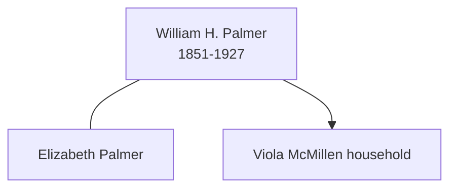

# William Henry Palmer

## Biographical Profile

- **Name:** William Henry Palmer
- **Role in this project:** Ancestor represented in death-index extract and census-summary materials.

## Source-Cited Facts

- Intake death-record text notes a death-index entry (not a full certificate image) for William H. Palmer in Waterloo, Iowa, dated 8 May 1927, age 75, male, white, married, with cause listed as acute bronchial pneumonia.
- Repository contact in the source note identifies Blackhawk County Recorder, Vital Records, Waterloo, Iowa.
- Census-summary extraction pages include William H. Palmer in 1860 Baraboo, Wisconsin and in a 1900 Frankford Township, Minnesota household as head with spouse Elizabeth.
- A 1920 Waterloo, Iowa entry lists William and Elizabeth Palmer as parents in the Viola McMillen household.
- The Burial Sites book places William Henry Palmer at Fairview Cemetery in Waterloo, Iowa (page 24), section M, Row 3, Grave 67, with date of death 8 May 1927 and inscription `WILLIAM H. / JUNE 12, 1851 / MAY 8, 1927 / FATHER`. Map: [Google Maps](https://www.google.com/maps/search/?api=1&query=Fairview+Cemetery+Waterloo+IA).

## Family Diagram

This is a minimal household sketch from the census-summary and burial-book material on the page.

## Research Gaps

1. Obtain the full death certificate image and confirm all transcribed fields.
2. Correlate this death-index entry with census-summary page references before asserting household relationships.
3. Confirm birth details and parentage from additional records.

## Sources

1. [[References/Shared Intake 2026-04-22 Certificates and Parish Extracts|Shared Intake 2026-04-22 Certificates and Parish Extracts]]
2. [[References/Shared Intake 2026-04-22 Census Summary Individuals p51-p60|Shared Intake 2026-04-22 Census Summary Individuals p51-p60]]
3. [[References/Shared Intake 2026-04-22 Burial Sites Summary|Shared Intake 2026-04-22 Burial Sites Summary]]
4. `References/raw/inbox/2026-04-22-intake/BurialSites/BurialSites.txt`
5. `References/raw/inbox/2026-04-22-intake/Certificates/CERT0058PalmerWilliaHenry-Death Record.txt`
6. `References/raw/inbox/2026-04-22-intake/Census/CensusSummaryIndividual.pdf`
