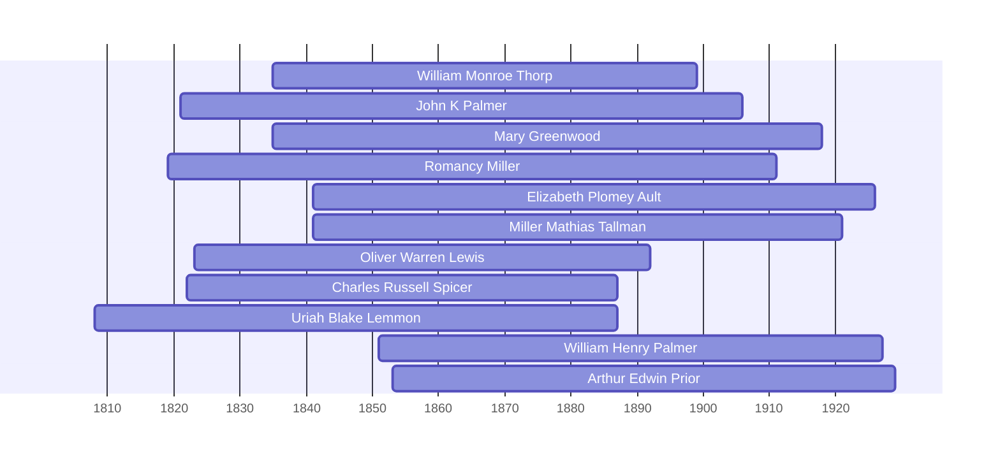

![[assets/snippets/William Monroe Thorp.svg]]

# William Monroe Thorp

## Biographical Profile

- **Name:** William Monroe Thorp
- **Dates:** 1835-1899
- **Role in this project:** Bridge generation Thorpe patriarch; son of John Thorp, father of Uriah Blake Thorpe and Ralph Gerald Thorpe.

## Pedigree Timeline Context

This person is documented in the Thorpe pedigree timeline as part of the direct Thorpe ancestral chain. The chart places William Monroe between John Thorp and Uriah Blake Thorpe and shows Sarah Annett Lemmon in the same branch context.

## Research Notes

- Specific census records, occupations, and household details require further extraction from available sources.
- Birth/death dates and locations are from pedigree timeline documentation and require verification against primary records.


## Census Records

> [!info] Extract from References/raw/extracted/CensusSummaryIndividual.txt

```text
THORP, William Monroe (18 Jan 1835 - 8 Nov 1899)
1850 Ohio, Sandusky County, Townsend Township, Page 478
R/F
1196/1221

Name
Alonzo THORP
Sarah J. THORP
John THORP
Alma THORP

Sex
M
F
M
F

1222

Jane THORP
Philo THORP
Monroe THORP
Elijah JOHNSON
Series: M432, Roll: 726, Page: 478

Age
32
18
7
6

F
M
M
M

54
20
15
22

Occupation
Farmer

Born
New York
New York
Ohio
Ohio
New York
New York
New York
Unknown

Farmer
Laborer

Comments
Jane's son

Jane's son
Jane's son

1860 Ohio, Sandusky County, Townsend Township, Page 54 B
D/F
813/784

Name
Munroe THORP
Sarah THORP
Emily J THORP
Omar? TANNER
Series: M653, Roll: 1032, Page: 54

Age Sex
24
M
19
F
2/12
F
21
M

Color

Occupation

Property
300

Nativity
New York
Ohio
Ohio
Ohio

Real Pers
2500 300

Nativity Comments
New York
Ohio
Ohio
Ohio
Iowa
born in Sept

Farm Laborer

Comments

1870 Iowa, Marshall County, Marshalltown, 4th Ward, p. 11
D/F
79/83

Name
Monroe THORP
Sarah THORP
Hattie THORP
Nettie THORP
Clide THORP
Series: M593, Roll: 410, Page: 486

Age Sex
34
M
28
F
8
F
7
F
11/12 M

Color
W
W
W
W
W

Occupation
Retired Farmer
Keeping house
At Home
At Home
At Home

1880 Iowa, Grundy County, Clay Township
D/F
124/124

Name
M. THORPE
Sarah THORPE
Hata THORPE
Netie THORPE
Clyde THORPE
Gertrude THORPE
U.B. THORPE
Ch RICHARDS
Fam Hist Lib Film
1254341

Rel
Self
Wife
Dau
Dau
Son
Dau
Son
Other

CENSUS SUMMARY - INDIVIDUALS

Married Gender Race Age
BP
Married
Male
White 45
NY
Married
Female White 28
OH
Single
Female White 18
OH
Single
Female White 17
OH
Single
Male
White 10
IA
Single
Female White 3
IA
Single
Male
White 1
IA
Single
Male
White 23
IA
NA Film No. T9-0341
Page 388C

Robert Archer John Thorpe

Occupation
Farmer
Keeping House
At Home
School Teacher
At Home
At Home
At Home
Laborer

FBP
NY
NY
NY
NY
NY
NY
NY
—

MBP
NY
NY
NY
NY
NY
NY
NY
—

81
```


## Name Variations

> [!info] Known aliases or census misspellings from Butch Thorpe's cross-reference table.
>
> - **THORP, Monroe**
> - **THORP, Munroe**
> - **THORPE, M**

## Overlapping Lifespans

> [!info] Visualizing contemporaries in the vault during the life of William Monroe Thorp (1835-1899).



## Source Indicators

> [!info] Indicators from Pedigree Timeline Diagrams
>
> - **Census Records**: Found in 1870, 1880, 1890, 1900
> - **Official Records**: Ref #017, 052, 250, 123
> - **Burial**: Verified (RIP marker)
> - **Obituary**: Available (Obit marker)

## Sources

1. [[References/Shared Intake 2026-04-22 Pedigree Timeline Thorpe|Shared Intake 2026-04-22 Pedigree Timeline Thorpe]]
2. [[References/raw/processed/2026-04-22-intake/pedigree-timeline/thorpe-pedigree-timeline-index|Thorpe Pedigree Timeline Extraction Index]]
