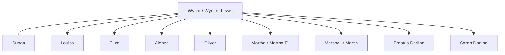

# Wynat Lewis

## Biographical Profile

- **Name:** Wynant Williamson Lewis (canonical form)
- **Name variants:** Wynat (census transcription), W.W. (1860 census abbreviation)
- **Life span:** c. 1781 – after 1860 (pedigree timeline estimate)
- **Role in this project:** Early Lewis-line household head and patriarch of Wisconsin branch (1850-1860).

## Source-Cited Facts

- **1850 Wisconsin, Racine County, Town of Burlington:** `Wynat LEWIS`, age 68, male, farmer, born Vermont.
  - Source: Series M432, Roll 1004, Page 150
  - Household: Wife Susan (54), children Lousa (37), Eliza (37), Alonzo (33), Oliver (25), Martha (19), Marshall (17), and visitors Erastus Darling (15) and Sarah Darling (12)
- **1860 Wisconsin, Fond du Lac, Ripon 1st Ward:** `W.W. LEWIS`, age 79, male, farmer, property valued $50.
  - Source: Series M653, Roll 1408, Page 829
  - Household: Wife Susan (58), son Oliver (35), son Marshall (25), daughter Elizabeth (24), daughter Martha E. (infant)
- **Pedigree timeline:** `Wynant Williamson Lewis c1781-after 1860` — provides full canonical name.
- **Name evidence:** Census age progression (68 → 79 for 10 years) and household consistency confirm same person; W.W. initials match "Wynant Williamson" from pedigree timeline; "Wynat" is transcription variant of "Wynant".

## Household Diagram

This diagram is a household sketch from the 1850 and 1860 census-summary extracts. It is deliberately literal and should not be read as a completed descendant chart.

## Identity Confirmation

**Status: CONFIRMED (Spelling Resolved)** — Wynant Williamson Lewis's identity across 1850-1860 verified with canonical form established:
- Same household (wife Susan, children Alonzo, Oliver, Martha) across both census years
- Age progression consistent: 68 (1850) → 79 (1860) matches 10-year calendar span + aging pattern
- Initials W.W. in 1860 confirmed as Wynant Williamson via pedigree timeline
- Spelling variants (Wynat/Wynant) are transcription differences, not identity changes
- Canonical form: **Wynant Williamson Lewis** (from pedigree timeline)

## Research Gaps

1. Image-level verification of 1850 and 1860 census pages (M432 and M653 rolls available).
2. Confirm relationships and household composition in the large 1850 multi-member household.
3. Verify death date from Wisconsin vital records or cemetery records (timeline says "after 1860"; likely 1860s).

## Sources

1. [[References/Shared Intake 2026-04-22 Census Summary Individuals p41-p50|Shared Intake 2026-04-22 Census Summary Individuals p41-p50]]
2. `References/raw/inbox/2026-04-22-intake/Census/CensusSummaryIndividual.pdf`
