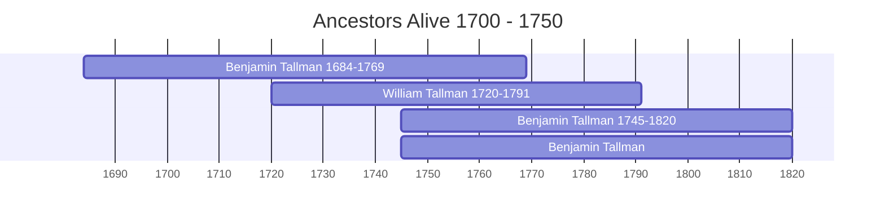

# Ancestors of the 1700-1750 Era

This page visualizes the ancestors who were alive during the years 1700 to 1750. This helps identify which family members from different branches (Thorpe, Bellamy, Spicer, Prior) were contemporaries.

## Timeline of Contemporaries

## Individual Profiles

- [[People/Benjamin Tallman 1684-1769.md|Benjamin Tallman 1684-1769]] (1684 - 1769)
- [[People/William Tallman 1720-1791.md|William Tallman 1720-1791]] (1720 - 1791)
- [[People/Benjamin Tallman 1745-1820.md|Benjamin Tallman 1745-1820]] (1745 - 1820)
- [[People/Benjamin Tallman.md|Benjamin Tallman]] (1745 - 1820)
