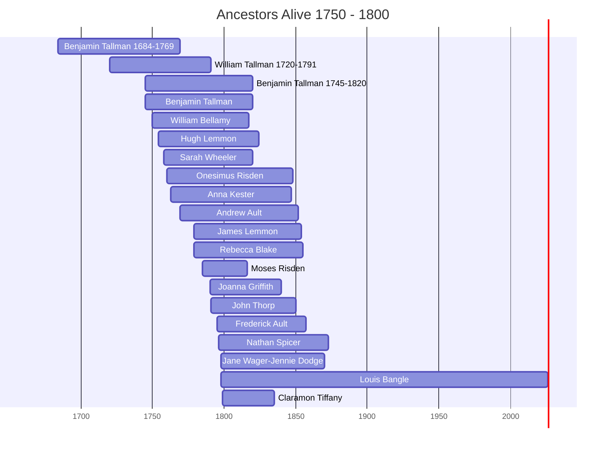

# Ancestors of the 1750-1800 Era

This page visualizes the ancestors who were alive during the years 1750 to 1800. This helps identify which family members from different branches (Thorpe, Bellamy, Spicer, Prior) were contemporaries.

## Timeline of Contemporaries

## Individual Profiles

- [[People/Benjamin Tallman 1684-1769.md|Benjamin Tallman 1684-1769]] (1684 - 1769)
- [[People/William Tallman 1720-1791.md|William Tallman 1720-1791]] (1720 - 1791)
- [[People/Benjamin Tallman 1745-1820.md|Benjamin Tallman 1745-1820]] (1745 - 1820)
- [[People/Benjamin Tallman.md|Benjamin Tallman]] (1745 - 1820)
- [[People/William Bellamy.md|William Bellamy]] (1750 - 1817)
- [[People/Hugh Lemmon.md|Hugh Lemmon]] (1754 - 1824)
- [[People/Sarah Wheeler.md|Sarah Wheeler]] (1758 - 1820)
- [[People/Onesimus Risden.md|Onesimus Risden]] (1760 - 1848)
- [[People/Anna Kester.md|Anna Kester]] (1763 - 1847)
- [[People/Andrew Ault.md|Andrew Ault]] (1769 - 1852)
- [[People/James Lemmon.md|James Lemmon]] (1779 - 1854)
- [[People/Rebecca Blake.md|Rebecca Blake]] (1779 - 1855)
- [[People/Moses Risden.md|Moses Risden]] (1785 - 1816)
- [[People/Joanna Griffith.md|Joanna Griffith]] (1790 - 1840)
- [[People/John Thorp.md|John Thorp]] (1791 - 1850)
- [[People/Frederick Ault.md|Frederick Ault]] (1795 - 1857)
- [[People/Nathan Spicer.md|Nathan Spicer]] (1796 - 1873)
- [[People/Jane Wager-Jennie Dodge.md|Jane Wager-Jennie Dodge]] (1798 - 1870)
- [[People/Louis Bangle.md|Louis Bangle]] (1798 - 2026)
- [[People/Claramon Tiffany.md|Claramon Tiffany]] (1799 - 1835)
