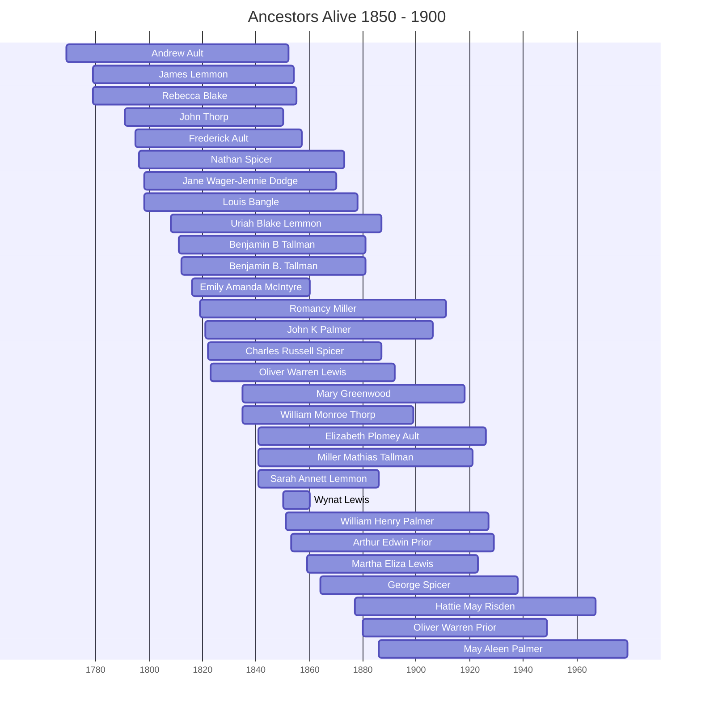

# Ancestors of the 1850-1900 Era

This page visualizes the ancestors who were alive during the years 1850 to 1900. This helps identify which family members from different branches (Thorpe, Bellamy, Spicer, Prior) were contemporaries.

## Timeline of Contemporaries

## Individual Profiles

- [[People/Andrew Ault.md|Andrew Ault]] (1769 - 1852)
- [[People/James Lemmon.md|James Lemmon]] (1779 - 1854)
- [[People/Rebecca Blake.md|Rebecca Blake]] (1779 - 1855)
- [[People/John Thorp.md|John Thorp]] (1791 - 1850)
- [[People/Frederick Ault.md|Frederick Ault]] (1795 - 1857)
- [[People/Nathan Spicer.md|Nathan Spicer]] (1796 - 1873)
- [[People/Jane Wager-Jennie Dodge.md|Jane Wager-Jennie Dodge]] (1798 - 1870)
- [[People/Louis Bangle.md|Louis Bangle]] (1798 - 1878)
- [[People/Uriah Blake Lemmon.md|Uriah Blake Lemmon]] (1808 - 1887)
- [[People/Benjamin B Tallman.md|Benjamin B Tallman]] (1811 - 1881)
- [[People/Benjamin B. Tallman.md|Benjamin B. Tallman]] (1812 - 1881)
- [[People/Emily Amanda McIntyre.md|Emily Amanda McIntyre]] (1816 - 1860)
- [[People/Romancy Miller.md|Romancy Miller]] (1819 - 1911)
- [[People/John K Palmer.md|John K Palmer]] (1821 - 1906)
- [[People/Charles Russell Spicer.md|Charles Russell Spicer]] (1822 - 1887)
- [[People/Oliver Warren Lewis.md|Oliver Warren Lewis]] (1823 - 1892)
- [[People/Mary Greenwood.md|Mary Greenwood]] (1835 - 1918)
- [[People/William Monroe Thorp.md|William Monroe Thorp]] (1835 - 1899)
- [[People/Elizabeth Plomey Ault.md|Elizabeth Plomey Ault]] (1841 - 1926)
- [[People/Miller Mathias Tallman.md|Miller Mathias Tallman]] (1841 - 1921)
- [[People/Sarah Annett Lemmon.md|Sarah Annett Lemmon]] (1841 - 1886)
- [[People/Wynat Lewis.md|Wynat Lewis]] (1850 - 1860)
- [[People/William Henry Palmer.md|William Henry Palmer]] (1851 - 1927)
- [[People/Arthur Edwin Prior.md|Arthur Edwin Prior]] (1853 - 1929)
- [[People/Martha Eliza Lewis.md|Martha Eliza Lewis]] (1859 - 1923)
- [[People/George B Spicer.md|George Spicer]] (1864 - 1938)
- [[People/Hattie May Risden.md|Hattie May Risden]] (1877 - 1967)
- [[People/Oliver Warren Prior.md|Oliver Warren Prior]] (1880 - 1949)
- [[People/May Aleen Palmer.md|May Aleen Palmer]] (1886 - 1979)
