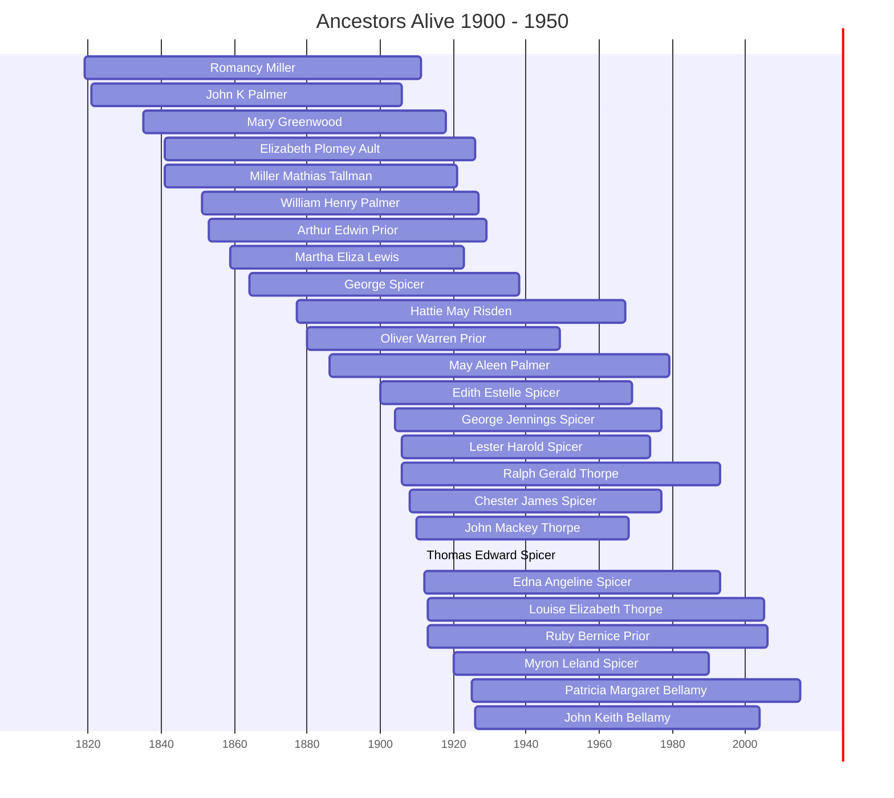

# Ancestors of the 1900-1950 Era

This page visualizes the ancestors who were alive during the years 1900 to 1950. This helps identify which family members from different branches (Thorpe, Bellamy, Spicer, Prior) were contemporaries.

## Timeline of Contemporaries

## Individual Profiles

- [[People/Romancy Miller|Romancy Miller]] (1819 - 1911)
- [[People/John K Palmer|John K Palmer]] (1821 - 1906)
- [[People/Mary Greenwood|Mary Greenwood]] (1835 - 1918)
- [[People/Elizabeth Plomey Ault|Elizabeth Plomey Ault]] (1841 - 1926)
- [[People/Miller Mathias Tallman|Miller Mathias Tallman]] (1841 - 1921)
- [[People/William Henry Palmer|William Henry Palmer]] (1851 - 1927)
- [[People/Arthur Edwin Prior|Arthur Edwin Prior]] (1853 - 1929)
- [[People/Martha Eliza Lewis|Martha Eliza Lewis]] (1859 - 1923)
- [[People/George B Spicer|George Spicer]] (1864 - 1938)
- [[People/Hattie May Risden|Hattie May Risden]] (1877 - 1967)
- [[People/Oliver Warren Prior|Oliver Warren Prior]] (1880 - 1949)
- [[People/May Aleen Palmer|May Aleen Palmer]] (1886 - 1979)
- [[People/Edith Estelle Spicer|Edith Estelle Spicer]] (1900 - 1969)
- [[People/George Jennings Spicer|George Jennings Spicer]] (1904 - 1977)
- [[People/Lester Harold Spicer|Lester Harold Spicer]] (1906 - 1974)
- [[People/Ralph Gerald Thorpe|Ralph Gerald Thorpe]] (1906 - 1993)
- [[People/Chester James Spicer|Chester James Spicer]] (1908 - 1977)
- [[People/John Mackey Thorpe|John Mackey Thorpe]] (1910 - 1968)
- [[People/Thomas Edward Spicer|Thomas Edward Spicer]] (1911 - 1911)
- [[People/Edna Angeline Spicer|Edna Angeline Spicer]] (1912 - 1993)
- [[People/Louise Elizabeth Thorpe|Louise Elizabeth Thorpe]] (1913 - 2005)
- [[People/Ruby Bernice Prior|Ruby Bernice Prior]] (1913 - 2006)
- [[People/Myron Leland Spicer|Myron Leland Spicer]] (1920 - 1990)
- [[People/Patricia Margaret Bellamy|Patricia Margaret Bellamy]] (1925 - 2015)
- [[People/John Keith Bellamy|John Keith Bellamy]] (1926 - 2004)
