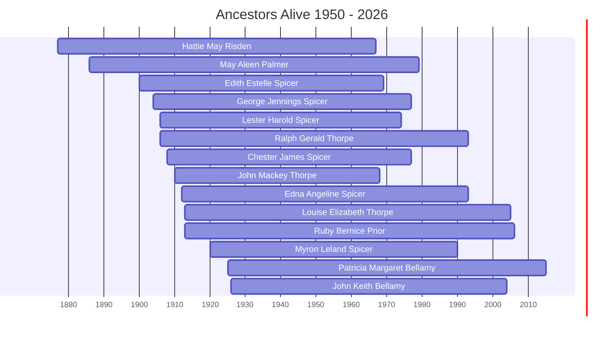

# Ancestors of the 1950-2026 Era

This page visualizes the ancestors who were alive during the years 1950 to 2026. This helps identify which family members from different branches (Thorpe, Bellamy, Spicer, Prior) were contemporaries.

## Timeline of Contemporaries

## Individual Profiles

- [[People/Hattie May Risden.md|Hattie May Risden]] (1877 - 1967)
- [[People/May Aleen Palmer.md|May Aleen Palmer]] (1886 - 1979)
- [[People/Edith Estelle Spicer.md|Edith Estelle Spicer]] (1900 - 1969)
- [[People/George Jennings Spicer.md|George Jennings Spicer]] (1904 - 1977)
- [[People/Lester Harold Spicer.md|Lester Harold Spicer]] (1906 - 1974)
- [[People/Ralph Gerald Thorpe.md|Ralph Gerald Thorpe]] (1906 - 1993)
- [[People/Chester James Spicer.md|Chester James Spicer]] (1908 - 1977)
- [[People/John Mackey Thorpe.md|John Mackey Thorpe]] (1910 - 1968)
- [[People/Edna Angeline Spicer.md|Edna Angeline Spicer]] (1912 - 1993)
- [[People/Louise Elizabeth Thorpe.md|Louise Elizabeth Thorpe]] (1913 - 2005)
- [[People/Ruby Bernice Prior.md|Ruby Bernice Prior]] (1913 - 2006)
- [[People/Myron Leland Spicer.md|Myron Leland Spicer]] (1920 - 1990)
- [[People/Patricia Margaret Bellamy.md|Patricia Margaret Bellamy]] (1925 - 2015)
- [[People/John Keith Bellamy.md|John Keith Bellamy]] (1926 - 2004)
