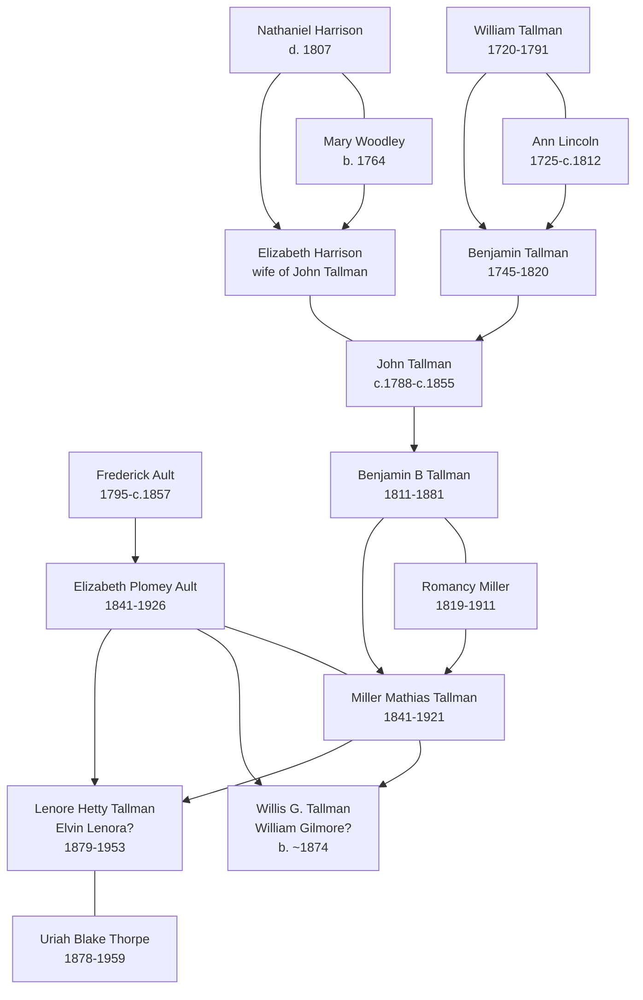

# Ault and Tallman Branch Summary

This branch is a strong visitor path because it has a clear household story: Ohio Ault records, Iowa Tallman farming households, and later Soldiers' Home and cemetery evidence. It also connects to the landing-page Tallman monument image.

## Branch Diagram

The solid family group around Elizabeth Plomey Ault and Miller Mathias Tallman is documented in census summaries. The Benjamin/Romancy-to-Miller Mathias link is now supported by the Miller genealogy page image and the Thorpe pedigree timeline, but still needs primary-record confirmation.

## Start With These People

- [[People/Elizabeth Plomey Ault|Elizabeth Plomey Ault]] - Ohio-to-Iowa life progression from 1850 through 1920.
- [[People/Miller Mathias Tallman|Miller Mathias Tallman]] - Elizabeth's husband, Iowa farmer/teamster and later Soldiers' Home resident.
- [[People/Frederick Ault|Frederick Ault]] - Ohio Ault household head and father of Elizabeth Plomey Ault.
- [[People/Benjamin B Tallman|Benjamin B Tallman]] - Iowa Tallman farming patriarch with 1850-1880 household coverage.
- [[People/Romancy Miller|Romancy Miller]] - Tallman matriarch tracked across six decades of household records.
- [[People/Benjamin Tallman 1745-1820|Benjamin Tallman 1745-1820]] - Older Tallman ancestor linked by burial, pedigree, and pioneer-book evidence.
- [[People/William Tallman 1720-1791|William Tallman]] and [[People/Ann Lincoln Tallman|Ann Lincoln Tallman]] - Older Tallman generation identified in the Durfee genealogy as Benjamin's parents.
- [[People/John Tallman|John Tallman]] and [[People/Elizabeth Harrison|Elizabeth Harrison]] - Older Ohio Tallman couple now tied to Harrison/Woodley compiled-book evidence from Rockingham County, Virginia.
- A Western College history names a `Benjamin Tallman` as farm agent and executive-committee member, but the page does not identify which Benjamin Tallman this was.
- [[People/Samuel Tallman|Samuel Tallman]] and [[People/Sarah Wells Tallman|Sarah Wells Tallman]] - Fairfield County pioneer context for the Tallman settlement cluster.

## What We Know

- [[People/Elizabeth Plomey Ault|Elizabeth Plomey Ault]] appears as a child and young woman in Ohio Ault households, then as Elizabeth Tallman in Iowa census records.
- [[People/Miller Mathias Tallman|Miller Mathias Tallman]] and Elizabeth are documented in 1880, 1900, 1910, and 1920 census summaries, including Iowa Soldiers' Home records.
- [[People/Benjamin B Tallman|Benjamin B Tallman]] and [[People/Romancy Miller|Romancy Miller]] are documented across Iowa household records from 1850 through 1880, with Romancy continuing into later widowhood records.
- The Miller genealogy page image identifies [[People/Miller Mathias Tallman|Miller Mathias Tallman]] as a child of [[People/Romancy Miller|Romancy Miller]] and Benjamin Tallman, reducing the earlier uncertainty about whether he belonged to that household.
- Later Miller genealogy pages strengthen the Tallman-to-Thorpe bridge: page 250 says Elvin Lenora Tallman married U. B. Thorpe and had Ralph Thorpe, while the census summaries and Thorpe pedigree timeline identify the same branch as [[People/Lenore Hetty Tallman|Lenore Hetty Tallman]] and [[People/Uriah Blake Thorpe|Uriah Blake Thorpe]].
- *Pioneer People of Fairfield County, Ohio* adds an older Tallman settlement context around [[People/Benjamin Tallman 1745-1820|Benjamin Tallman]], [[People/Dinah Boone|Dinah Boone]], [[People/Samuel Tallman|Samuel Tallman]], and [[People/Sarah Wells Tallman|Sarah Wells Tallman]].
- *Settlers by the Long Grey Trail* says [[People/Elizabeth Harrison|Elizabeth Harrison]], wife of [[People/John Tallman|John Tallman]], was a child of [[People/Nathaniel Harrison|Nathaniel Harrison]] and [[People/Mary Woodley|Mary Woodley]], and cites an 1817 deed involving John Tallman and wife Elizabeth of Fairfield County, Ohio.
- *The Descendants of Thomas Durfee* identifies [[People/Benjamin Tallman 1745-1820|Benjamin Tallman]] as a child of [[People/William Tallman 1720-1791|William Tallman]] and [[People/Ann Lincoln Tallman|Ann Lincoln Tallman]], and gives additional migration and military context for Benjamin and [[People/Dinah Boone|Dinah Boone]].
- The Western College history gives a plausible institutional-context hit for a Benjamin Tallman in Iowa, but the page does not prove whether it is [[People/Benjamin B Tallman|Benjamin B Tallman]].
- Burial-site evidence supports several dates and cemetery placements in this family cluster.

## What Remains Uncertain

- The relationship between the Benjamin/Romancy Tallman household and [[People/Miller Mathias Tallman|Miller Mathias Tallman]] is now supported by compiled sources, but still needs primary-record confirmation.
- The Miller genealogy's `Lizzie Wimmer`, `William Gilmore Tallman`, and `Elvin Lenora Tallman` names likely correspond to the census-linked Elizabeth/Willis/Lena family group, but this should remain a reconciliation issue until marriage, death, or probate records confirm it.
- The older Tallman chain from [[People/Benjamin Tallman 1745-1820|Benjamin Tallman]] through [[People/John Tallman|John Tallman]] to [[People/Benjamin B Tallman|Benjamin B Tallman]] needs probate, land, church, or cemetery verification.
- The Harrison/Woodley evidence for [[People/Elizabeth Harrison|Elizabeth Harrison]] is compiled-book evidence pointing to probate, litigation, and deed records; the underlying originals should be checked before treating the parentage as fully proven.
- The Durfee/Tallman evidence cites a family Bible, military records, and Boone manuscripts, but those underlying sources have not yet been independently reviewed.
- The Western College history is a useful institutional clue, but the Tallman identity remains unresolved and should not be collapsed onto [[People/Benjamin B Tallman|Benjamin B Tallman]] without a local record.
- Some children in the Tallman households need later-life tracing, especially Willis G. Tallman and Lena P. Tallman.
- Original census images should be reviewed to validate OCR-sensitive spellings such as Tallman, Talmon, and Tollman.

## Sources

1. [[People/Elizabeth Plomey Ault|Elizabeth Plomey Ault]]
2. [[People/Miller Mathias Tallman|Miller Mathias Tallman]]
3. [[People/Frederick Ault|Frederick Ault]]
4. [[People/Benjamin B Tallman|Benjamin B Tallman]]
5. [[People/Romancy Miller|Romancy Miller]]
6. [[References/Shared Intake 2026-04-22 Census Summary Individuals p1-p10|Shared Intake 2026-04-22 Census Summary Individuals p1-p10]]
7. [[References/Shared Intake 2026-04-22 Census Summary Individuals p41-p50|Shared Intake 2026-04-22 Census Summary Individuals p41-p50]]
8. [[References/Shared Intake 2026-04-22 Burial Sites Summary|Burial Sites Summary]]
9. [[References/Book Outprints — Genealogy and History of Samuel Miller|Genealogy and History of Samuel Miller]]
10. [[References/Book Outprints — Pioneer People of Fairfield County Ohio|Pioneer People of Fairfield County Ohio]]
11. [[References/Book Outprints — Settlers by the Long Grey Trail|Settlers by the Long Grey Trail]]
12. [[References/Book Outprints — Durfee|Durfee]]
13. [[References/Book Outprints — History of Western College|History of Western College]]
