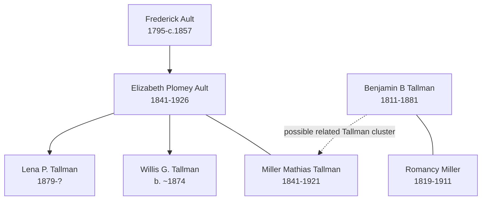

# Ault and Tallman Branch Summary

This branch is a strong visitor path because it has a clear household story: Ohio Ault records, Iowa Tallman farming households, and later Soldiers' Home and cemetery evidence. It also connects to the landing-page Tallman monument image.

## Branch Diagram

The solid family group around Elizabeth Plomey Ault and Miller Mathias Tallman is documented in census summaries. The Benjamin/Romancy connection is shown as a nearby Tallman cluster, not as a proved direct relationship to Miller Mathias Tallman.

## Start With These People

- [[People/Elizabeth Plomey Ault|Elizabeth Plomey Ault]] - Ohio-to-Iowa life progression from 1850 through 1920.
- [[People/Miller Mathias Tallman|Miller Mathias Tallman]] - Elizabeth's husband, Iowa farmer/teamster and later Soldiers' Home resident.
- [[People/Frederick Ault|Frederick Ault]] - Ohio Ault household head and father of Elizabeth Plomey Ault.
- [[People/Benjamin B Tallman|Benjamin B Tallman]] - Iowa Tallman farming patriarch with 1850-1880 household coverage.
- [[People/Romancy Miller|Romancy Miller]] - Tallman matriarch tracked across six decades of household records.

## What We Know

- [[People/Elizabeth Plomey Ault|Elizabeth Plomey Ault]] appears as a child and young woman in Ohio Ault households, then as Elizabeth Tallman in Iowa census records.
- [[People/Miller Mathias Tallman|Miller Mathias Tallman]] and Elizabeth are documented in 1880, 1900, 1910, and 1920 census summaries, including Iowa Soldiers' Home records.
- [[People/Benjamin B Tallman|Benjamin B Tallman]] and [[People/Romancy Miller|Romancy Miller]] are documented across Iowa household records from 1850 through 1880, with Romancy continuing into later widowhood records.
- Burial-site evidence supports several dates and cemetery placements in this family cluster.

## What Remains Uncertain

- The relationship between the Benjamin/Romancy Tallman household and [[People/Miller Mathias Tallman|Miller Mathias Tallman]] remains a research gap.
- Some children in the Tallman households need later-life tracing, especially Willis G. Tallman and Lena P. Tallman.
- Original census images should be reviewed to validate OCR-sensitive spellings such as Tallman, Talmon, and Tollman.

## Sources

1. [[People/Elizabeth Plomey Ault|Elizabeth Plomey Ault]]
2. [[People/Miller Mathias Tallman|Miller Mathias Tallman]]
3. [[People/Frederick Ault|Frederick Ault]]
4. [[People/Benjamin B Tallman|Benjamin B Tallman]]
5. [[People/Romancy Miller|Romancy Miller]]
6. [[References/Shared Intake 2026-04-22 Census Summary Individuals p1-p10|Shared Intake 2026-04-22 Census Summary Individuals p1-p10]]
7. [[References/Shared Intake 2026-04-22 Census Summary Individuals p41-p50|Shared Intake 2026-04-22 Census Summary Individuals p41-p50]]
8. [[References/Shared Intake 2026-04-22 Burial Sites Summary|Burial Sites Summary]]
