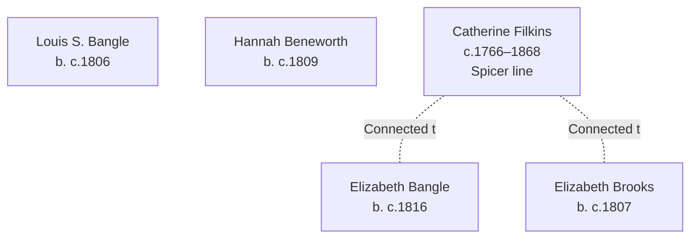

# Bangle, Beneworth, Brooks, Filkins, and Allied Families Branch Summary

## Branch Overview

**Time Period:** 19th century (1841–1871 UK census era)

**Geographic Range:** UK parishes, scattered US settlement (Ohio, Iowa)

**Primary Occupations:** Agricultural workers, household service, skilled trades

## Key Ancestor Lines

- [[People/Elizabeth Bangle|Elizabeth Bangle]] (b. c.1816)
- [[People/Louis S Bangle|Louis S. Bangle]] (b. c.1806)
- [[People/Hannah Beneworth|Hannah Beneworth]] (b. c.1809)
- [[People/Elizabeth Brooks|Elizabeth Brooks]] (b. c.1807)
- [[People/Catherine Filkins|Catherine Filkins]] (c.1766–1868)

## Family Structure

## Census Context

Documented in UK and US censuses (1841–1880) showing Atlantic migration patterns

Multiple family members appear in consecutive UK censuses (1841, 1851, 1861, 1871) showing household composition, occupational transitions, and age progression across the four decades.

## Source Documentation

This family cluster is documented in:
- [[References/Shared Intake 2026-04-22 Pedigree Timeline Spicer|Pedigree Timeline References]]
- Census InDesign summary files (2026-04-24 batch) with detailed household and occupational context
- Burial site records showing cemetery locations and dates

## Research Resources

- Visit [[People Directory|People Directory]] to find individual family members
- Check [[Search Index|Search Index]] for location, occupation, or date searches
- Review [[CHANGELOG|Changelog]] for ongoing research notes and updates

