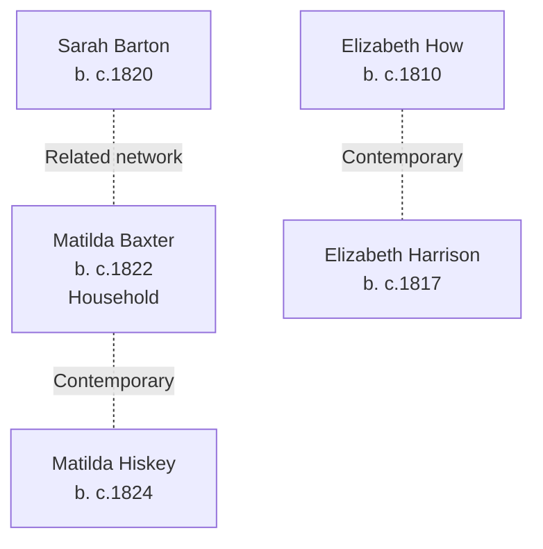

# Baxter, Hiskey, Harrison, and How Families Branch Summary

## Branch Overview

**Time Period:** 19th century (1841–1871 UK census era, some US settlement)

**Geographic Range:** UK parishes, Midlands/Southern England region; scattered Ohio settlement

**Primary Occupations:** Agricultural workers, household service, general laborers

## Key Ancestor Lines

- [[People/Matilda Baxter|Matilda Baxter]] (b. c.1822)
- [[People/Matilda Hiskey|Matilda Hiskey]] (b. c.1824)
- [[People/Elizabeth How|Elizabeth How]] (b. c.1810)
- [[People/Elizabeth Harrison|Elizabeth Harrison]] (b. c.1817)
- [[People/Sarah Barton|Sarah Barton]] (b. c.1820)

## Family Structure

## Census Context

Documented in 1841–1871 UK and 1850s US censuses showing occupational and geographic transitions

Family members appear in consecutive US censuses showing household composition, occupational context, and generational progression.

## Source Documentation

This family cluster is documented in:
- Census InDesign summary files (2026-04-24 batch) with detailed household and occupational context
- Burial site records where available
- Pedigree timeline references where connections are established

## Research Resources

- Visit [[People Directory]] to find individual family members
- Check [[Search Index]] for location, occupation, or date searches
- Review [[CHANGELOG]] for ongoing research notes and updates

