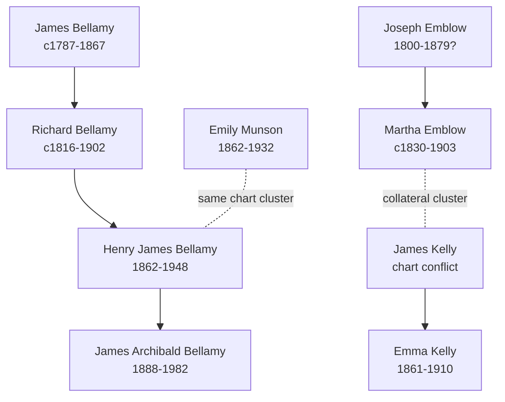

# Bellamy, Kelly, Emblow, and Munson Branch Summary

This branch is now anchored by the Bellamy pedigree timeline, but it should still be read as compiled genealogy rather than proved lineage. The chart is strongest for the later Bellamy line and for showing which collateral families belong in the same branch cluster.

## Chart-Supported Core Line

- [[People/James Bellamy|James Bellamy]] (`c1787-1867`)
- [[People/Richard Bellamy|Richard Bellamy]] (`c1816-1902`)
- [[People/Henry James Bellamy|Henry James Bellamy]] (`1862-1948`)
- [[People/James Archibald Bellamy|James Archibald Bellamy]] (`1888-1982`)

The chart also shows earlier Bellamy labels above James, but their overlap remains unresolved and should stay that way on this branch page.

## Main Collateral Cluster

- [[People/James Kelly|James Kelly]], [[People/Emma Kelly|Emma Kelly]], [[People/Joseph Emblow|Joseph Emblow]], and [[People/Martha Emblow|Martha Emblow]] belong in the same Peterborough-linked collateral zone.
- [[People/Emily Munson|Emily Munson]] belongs in the same broader branch cluster through the Munson-to-Thorogood connection.
- The chart-only `CD3`, `CD4`, `CD5`, `CD8`, `CD10`, and `CD11` markers should be treated as leads, not verified certificates.

## Family Structure

## What Remains Uncertain

- The early Bellamy overlap involving `William Bellamy 1750?-1817?`, `William Bellamy c1767-1804`, `Sarah ???`, and `Mary Brown?` is not solved here.
- `James Kelly` remains a conflict case because the chart's spouse/date treatment does not cleanly match the stronger parish and census material already in the vault.
- Several spouse placements on the chart, especially around `Rebecca Culpin` and `Mary Whitfield`, are visual-chart readings rather than sentence-style evidence.

## Sources

1. [[References/raw/processed/2026-04-22-intake/pedigree-timeline/bellamy-pedigree-timeline-index|Bellamy Pedigree Timeline Extraction Index]]
2. [[References/Shared Intake 2026-04-22 Pedigree Timeline Bellamy|Shared Intake 2026-04-22 Pedigree Timeline Bellamy]]
3. [[References/Shared Intake 2026-04-22 Census Summary Individuals p11-p20|Shared Intake 2026-04-22 Census Summary Individuals p11-p20]]
4. [[References/Shared Intake 2026-04-22 Census Summary Individuals p21-p30|Shared Intake 2026-04-22 Census Summary Individuals p21-p30]]
5. [[References/Shared Intake 2026-04-22 Census Summary Individuals p31-p40|Shared Intake 2026-04-22 Census Summary Individuals p31-p40]]
