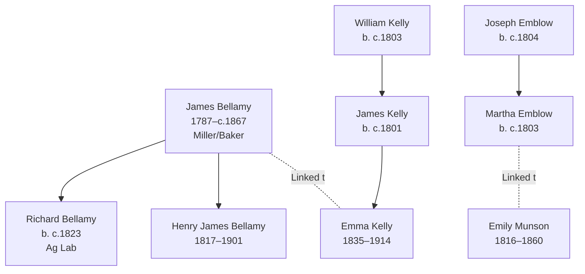

# Bellamy, Kelly, Emblow, and Munson Branch Summary

## Branch Overview

**Time Period:** 1787–1960s (spanning 1841–1871 UK censuses and 19th-century American settlement)

**Geographic Range:** Lincolnshire (Bourn) and Bedhouses; scattered US settlement (Wisconsin, Iowa, Ohio)

**Primary Occupations:** Miller, baker, farm laborer, farm hand; bedehouse worker in later life

## Key Ancestor Lines

- [[People/James Bellamy|James Bellamy]] (1787–c.1867)
- [[People/Richard Bellamy|Richard Bellamy]] (b. c.1823)
- [[People/Henry James Bellamy|Henry James Bellamy]] (1817–1901)
- [[People/William Kelly|William Kelly]] (b. c.1803)
- [[People/James Kelly|James Kelly]] (b. c.1801)
- [[People/Emma Kelly|Emma Kelly]] (1835–1914)
- [[People/Joseph Emblow|Joseph Emblow]] (b. c.1804)
- [[People/Martha Emblow|Martha Emblow]] (b. c.1803)
- [[People/Emily Munson|Emily Munson]] (1816–1860)

## Family Structure

## Census Context

Documented in 1841–1871 UK censuses (HO107, RG9 series) showing household transitions from farming to urban work

Multiple family members appear in consecutive UK censuses (1841, 1851, 1861, 1871) showing household composition, occupational transitions, and age progression across the four decades.

## Source Documentation

This family cluster is documented in:
- [[References/Shared Intake 2026-04-22 Pedigree Timeline Bellamy|Pedigree Timeline References]]
- Census InDesign summary files (2026-04-24 batch) with detailed household and occupational context
- Burial site records showing cemetery locations and dates

## Research Resources

- Visit [[People Directory]] to find individual family members
- Check [[Search Index]] for location, occupation, or date searches
- Review [[CHANGELOG]] for ongoing research notes and updates

