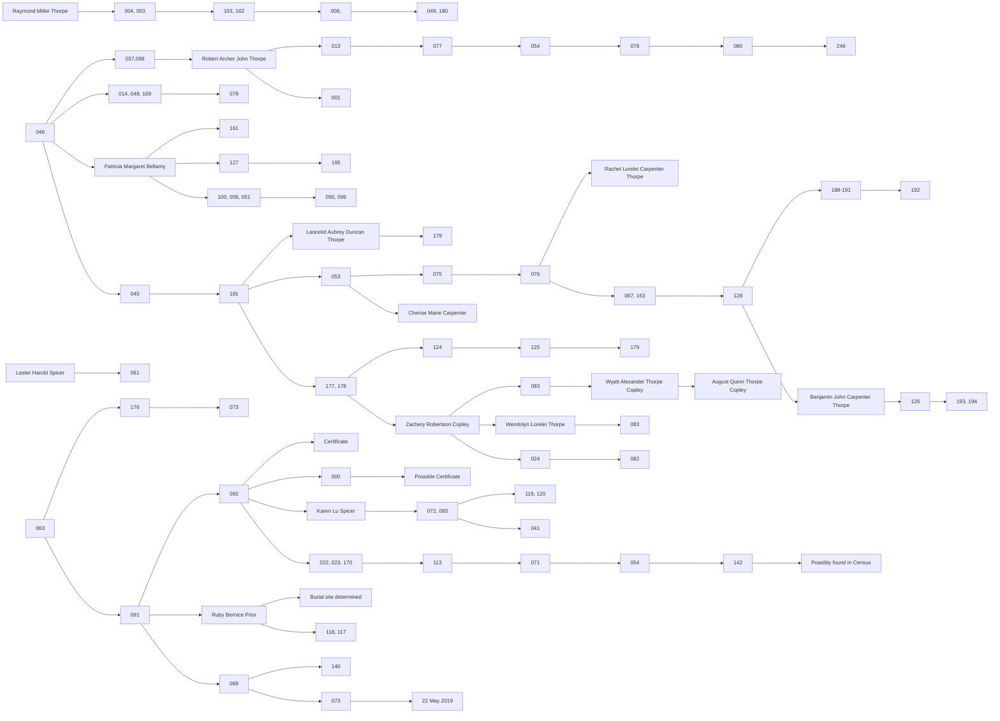

# Descendants Chart (2019 Extraction)

This diagram was programmatically extracted from the `PedigreeTimelines2019Descendants2` source file. Unlike the pedigree charts that trace backward, this chart follows Forward-Line Descent.

The hierarchy below was inferred by analyzing the spatial indentation levels in the original CorelDRAW data.

---
*Source: `References/raw/extracted/PedigreeTimelines2019Descendants2_raw.txt`*
