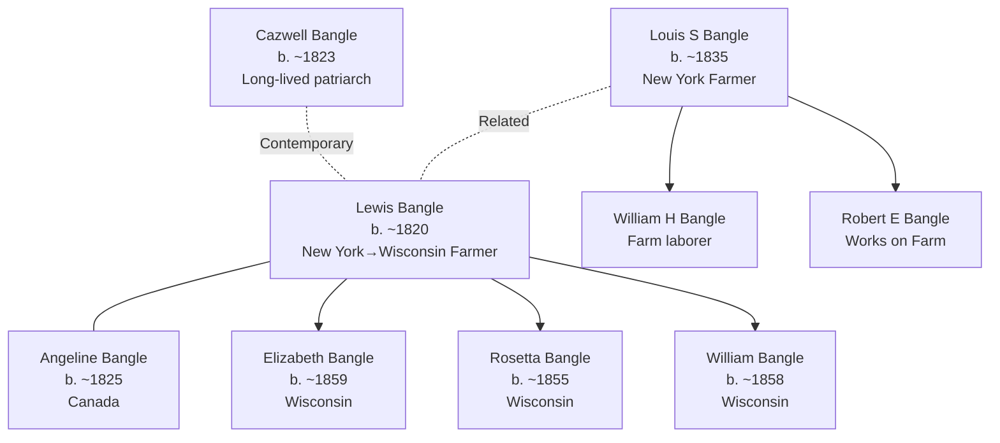

# Eau Claire County, Wisconsin — Bangle Family Settlement Center

## Overview

Eau Claire County, Wisconsin (western Wisconsin, Eau Claire River valley) served as a primary settlement location for the Bangle family during the 1860s–1900s. Documented households spanning three census periods (1860, 1870, 1880, 1900) show sustained agricultural settlement and family expansion in Otter Creek Township.

## Key Families and Individuals

### Bangle Family (Primary Settlement)
- **[[People/Lewis Bangle|Lewis Bangle]]** (b. ~1820) — Patriarch; farmer; Michigan-origin, Wisconsin settlement
- **[[People/Angeline Bangle|Angeline Bangle]]** (b. ~1825) — Wife; Canada-origin
- **[[People/Elizabeth Bangle|Elizabeth Bangle]]** (b. ~1859) — Daughter; Wisconsin-born
- **[[People/Elizabeth Maria Bangle|Elizabeth Maria Bangle]]** (b. ~1865) — Daughter/granddaughter; Wisconsin-born
- **[[People/Louis S Bangle|Louis S Bangle]]** (b. ~1835) — Related family member; farmer; New York-origin
- **[[People/Louis S Jr Bangle|Louis S Jr Bangle]]** (b. ~1867) — Son; Wisconsin-born
- **[[People/Cazwell Bangle|Cazwell Bangle]]** (b. ~1823) — Related family member; farmer

## 1860–1900 Census Snapshots

### Lewis Bangle Household — Eau Claire County, Bridge Creek Township (1860)

**Census Details:** Series M653, Roll 1407, Page 79

| Name | Relation | Age | Sex | Occupation | Birthplace |
|---|---|---|---|---|---|
| Lewis Bangle | Head | — | M | Farmer | New York |
| Angeline Bangle | Wife | — | F | — | Canada |
| Philena Bangle | Daughter | — | F | — | New York |
| Jane Ann Bangle | Daughter | — | F | — | Canada |
| Sarah Bangle | Daughter | — | F | — | Canada |
| Welthy Bangle | Daughter | — | F | — | New York |
| Rosetta Bangle | Daughter | — | F | — | Wisconsin |
| William Bangle | Son | — | M | — | Wisconsin |
| Elizabeth Bangle | Daughter | — | F | — | Wisconsin |

**Household characteristics:**
- Lewis Bangle as farmer; New York origin suggests early migration (1840s–1850s)
- Angeline as wife, Canada-origin (French-Canadian settlement pattern in Wisconsin)
- Children show mixed birthplace pattern: New York/Canada (1840s–1850s births) → Wisconsin (1850s–1860s births)
- Large household (9 members) suggests extended family or multiple-generation co-residence
- Multiple Wisconsin-born children (Rosetta, William, Elizabeth) by 1860 indicates settled residence (8+ years)

### Louis S Bangle Household — Eau Claire County, Otter Creek Township (1870)

**Census Details:** Series M593, Roll 1712, Page 313

| Name | Relation | Age | Sex | Occupation | Real Estate | Nativity | Comments |
|---|---|---|---|---|---|---|---|
| L.S. Bangle | Head | 46 | M | Farmer | — | New York | — |
| Angeline Bangle | Wife | — | F | Keeping house | — | Canada | — |
| Rosa Bangle | Daughter | — | F | At home | — | Wisconsin | — |
| William Bangle | Son | — | M | At home | — | Wisconsin | — |
| Elizabeth Bangle | Daughter | — | F | At home | — | Wisconsin | — |
| Alice Bangle | Daughter | — | F | At home | — | Wisconsin | — |
| Edward Bangle | Son | — | M | At home | — | Wisconsin | — |
| Wealthy Bangle | Daughter | — | F | At home | — | Wisconsin | — |

**Household characteristics:**
- Louis S. Bangle age 46 in 1870 (born ~1824, New York origin)
- Angeline as wife, Canada-origin (consistent with Lewis Bangle household)
- All children Wisconsin-born (1850s–1860s), indicating 15+ year Wisconsin residence
- Occupation farming maintained; "Keeping house" designation for wife
- Large household (8 members) with all children unmarried "at home"
- Final daughter Wealthy noted as "Idiotic" (period census terminology for intellectual disability)

### Louis S Bangle Household — Eau Claire County, Otter Creek Township (1880)

**Census Details:** Fam Hist Lib Film 1255425, NA Film No. T9-1425, Series T9, Roll 1425, Page 528B, Enumeration District 139

| Name | Relation | Age | Sex | Race | Occupation | Birthplace | Born |
|---|---|---|---|---|---|---|---|
| Lewis S Bangle | Self | Married | Male | White | Farmer | New York | — |
| Angeline Bangle | Wife | Married | Female | White | Keeping House | Canada | — |
| Wealthy O Bangle | Daughter | Single | Female | White | — | New York | — |
| William H Bangle | Son | Single | Male | White | Farm Laborer | New York | — |
| Robert E Bangle | Son | Single | Male | White | Works On Farm | New York | — |

**Household characteristics:**
- Lewis S. Bangle still recorded as head; now identified as farmer
- Angeline continued as wife; "Keeping House" occupation designation
- Household composition changed: Wealthy, William H., Robert E. present (others married out or relocated)
- William H. and Robert E. designated as "Farm Laborer" and "Works On Farm" (next-generation farm engagement)
- Birthplace New York for male children suggests either OCR error or unusual data entry

### Cazwell Bangle — Eau Claire County, Augusta (1900)

**Census Details:** 1900 Eau Claire County, Wisconsin; Augusta household extract

| Name | Age | Occupation | Birthplace |
|---|---|---|---|---|
| Cazwell Bangle | 76 | — | — |

**Note:** Limited data; Cazwell Bangle age 76 in 1900 (born ~1823–1824, contemporaneous with Lewis/Louis S Bangle)

**Household characteristics:**
- Single entry suggests either household head or individual record in larger household
- Augusta location different from Otter Creek (suggests possible family branching or relocation)
- Age 76 in 1900 suggests long-lived patriarch; birth ~1823–1824 consistent with other male Bangles

## Geographic Context

### Location Details
- **Eau Claire County seat:** Eau Claire, Wisconsin
- **Township context:** Bridge Creek Township (1860), Otter Creek Township (1870, 1880), Augusta (1900)
- **Eau Claire River valley:** Western Wisconsin; tributary to Chippewa River
- **Distance:** ~100 miles east of Mississippi River; ~150 miles northwest of Milwaukee

### Agricultural Suitability
- Rolling terrain; suitable for grain, livestock, dairy farming
- Eau Claire River navigation provided early settlement access (1850s–1860s)
- Forest resources provided secondary economic activity (logging)
- 1870s rail development improved market access for agricultural products

## Settlement Progression

| Period | Township | Key Person | Occupation | Notes |
|---|---|---|---|---|---|
| 1850s–1860 | Bridge Creek | Lewis Bangle | Farmer | Canada-origin wife, mixed-birthplace children |
| 1870 | Otter Creek | L.S. Bangle (age 46) | Farmer | All children Wisconsin-born; household remains large |
| 1880 | Otter Creek | Lewis S. Bangle | Farmer | Household consolidated; sons engaged in farm labor |
| 1900 | Augusta | Cazwell Bangle (age 76) | — | Long-lived patriarch; possible family branching |

**Pattern:** Stable 40-year residence in Eau Claire County (1860–1900) with township shift from Bridge Creek to Otter Creek to Augusta

## Household and Family Diagrams

## Family Connections

### Bangle Family Network
- **[[People/Lewis Bangle|Lewis Bangle]]** (b. ~1820, New York farmer) married **[[People/Angeline Bangle|Angeline Bangle]]** (Canada-origin)
- Established Eau Claire County settlement with multi-child household
- Large extended family suggests multiple siblings or generations co-residing
- 40+ year Wisconsin residence (1860–1900) indicates successful agricultural consolidation

### Generational Succession
- **Lewis Bangle** (patriarch, New York-origin farmer) → **Multiple Wisconsin-born children** (Elizabeth, Rosetta, William, Edward, etc.)
- **Louis S. Bangle** (possibly brother or related, New York-origin farmer) → **Wisconsin-born sons** (William H., Robert E., farm laborers)
- **Cazwell Bangle** (contemporary patriarch, long-lived to 1900) → **Augusta settlement** (possible family branching)
- Multi-generational farming engaged; sons transitioned from "at home" to "farm laborer" occupation designation

## Census and Economic Patterns

### Occupational Context
- **Lewis Bangle (1860):** Farmer; occupation sustained across 40-year residence
- **Louis S. Bangle (1870, 1880):** Farmer; "Keeping House" designation for wife
- **William H. and Robert E. Bangle (1880):** Farm laborer and "Works on Farm"—next-generation agricultural engagement
- **Occupation pattern:** Patriarch farming → sons transitioning to farm labor (economic role clarity)

### Household Composition
- **1860 Lewis Bangle household (9 members):** Large extended family; multiple Wisconsin-born children suggest 8+ year residence
- **1870 L.S. Bangle household (8 members):** Consolidated family; all children Wisconsin-born; "at home" status suggests unmarried co-residence
- **1880 Lewis S. Bangle household (5 members):** Smaller household; older patriarch; working-age sons engaged in farm labor
- **Pattern:** Large multi-child households (1860–1870) → consolidated adult household (1880) → dispersed by 1900

### Settlement Indicators
- Canada-origin wife (Angeline) and children born in Canada suggest early 1840s–1850s Wisconsin arrival via Canada-US border
- Mixed New York/Canada/Wisconsin birthplaces in children (1850s–1860s) show early settlement expansion
- All 1870s children Wisconsin-born indicates permanent settlement by 1850s
- 40-year continuous residence in Eau Claire County (1860–1900) represents stable, established settlement

## Research Implications

### Strengths
- **Continuous census documentation:** 4 census periods spanning 40 years (1860–1900)
- **Occupational clarity:** Farming primary occupation maintained across all households
- **Family relationship visibility:** Large household sizes show extended family co-residence
- **Generational progression:** Patriarch-led households with next-generation farm labor engagement
- **Geographic stability:** Eu Claire County residence confirms long-term settlement

### Research Gaps
- **Pre-1860 settlement:** Arrival date, initial location, property acquisition not documented
- **Marriage records:** Exact marriage dates and relationships between Lewis, Louis S., and Cazwell Bangles unclear
- **Individual relationship clarification:** Exact relationships between Lewis Bangle, Louis S. Bangle, and Cazwell Bangle (father/brother/cousins) not confirmed
- **1890 census:** Completely missing; intermediate status unknown
- **Post-1900 settlement:** No documentation after 1900; family dispersal or relocation unknown
- **Land records:** Farm location, acreage, property deeds not documented
- **Church records:** Marriages, births, burials not yet incorporated

## Next Steps for County Research

1. **Locate 1850 Eau Claire County, Wisconsin census** for early Bangle family documentation
2. **Extract Eau Claire County land patents and deeds** (1860–1900) for documented settler farms
3. **Research county histories** (Eau Claire County agricultural development, settlement narratives)
4. **Locate Otter Creek Township church records** (Baptist, Lutheran congregations) for family events (1870–1880)
5. **Clarify Bangle family relationships** using Wisconsin vital records (marriage, birth, death records)
6. **Cross-reference with neighboring counties** (Chippewa, Trempealeau) for extended family networks
7. **Trace post-1900 Bangle family settlement** (relocation, dispersal, later family locations)

## Cross-References

### Related Geographic Pages
- [[Topics/Sandusky County Ohio - Lemmon Ault Settlement|Sandusky County, Ohio — Lemmon and Ault Settlement Center]] (earlier Midwest settlement)
- [[Topics/Linn County Iowa - Spicer Risden Settlement|Linn County, Iowa — Spicer and Risden Settlement Center]] (contemporaneous Iowa settlement)
- [[Topics/American Settlement and Migration Timeline|American Settlement and Migration Timeline]] (secondary Midwest settlement context)

### Related Family Pages
- [[Topics/Bangle, Beneworth, and Allied Families Branch Summary|Bangle, Beneworth, Brooks, Filkins, and Allied Families Branch Summary]] (Bangle family cluster)

### Individual Pages
- [[People/Lewis Bangle|Lewis Bangle]] — Patriarch documentation
- [[People/Angeline Bangle|Angeline Bangle]] — Wife; Canada-origin settlement bridge
- [[People/Elizabeth Bangle|Elizabeth Bangle]] — Daughter
- [[People/Louis S Bangle|Louis S Bangle]] — Related farmer
- [[People/Elizabeth Maria Bangle|Elizabeth Maria Bangle]] — Family member

### Source References
- [[References/Shared Intake 2026-04-24 Census InDesign Summaries|Census InDesign Summaries]] (1860–1900 census details)
- `References/raw/processed/2026-04-24-census-indesign/CensusSummary-BangleLouisS.txt` (raw census extract)
- `References/raw/processed/2026-04-24-census-indesign/CensusSummary-BangleElizabeth.txt` (raw census extract)
