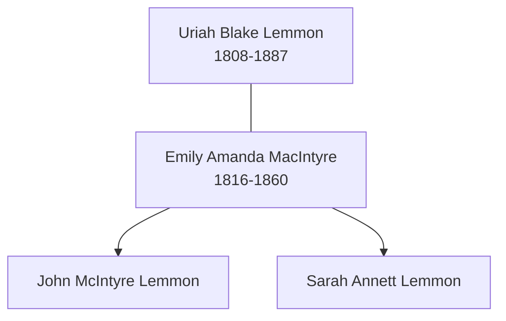

# Family Group: Lemmon and MacIntyre

This group sheet centers on the household of Uriah Blake Lemmon and Emily Amanda MacIntyre, whose family represented the transition of the Lemmon line from early pioneers to established legal and civic figures in Ohio.

## Parents

- **Husband:** [[People/Uriah Blake Lemmon|Uriah Blake Lemmon]] (1808–1887)
- **Wife:** [[People/Emily Amanda MacIntyre|Emily Amanda MacIntyre]] (1816–1860)

## Children

1. [[People/John McIntyre Lemmon|John McIntyre Lemmon]] (1839–1895) - First Mayor of Clyde, Ohio and Common Pleas Judge.
2. [[People/Sarah Annett Lemmon|Sarah Annett Lemmon]] (1841–1886) - Matriarch of the Thorpe-Lemmon bridge.
3. [[People/John McIntyre Lemmon|John M. Lemmon]] (1849)

## Household Visualization

## Household Context

The Lemmon-MacIntyre household was a significant presence in Sandusky County, Ohio, throughout the mid-19th century. Uriah Blake Lemmon's pioneering farming operation provided the foundation for his children's social rise—most notably his son John, who became a prominent judge, and his daughter Sarah, who carried the "Uriah Blake" naming tradition into the Thorpe line.

---
*For more family groups, see the [[Topics/Family Stories and Biographies|Family Stories Hub]].*
