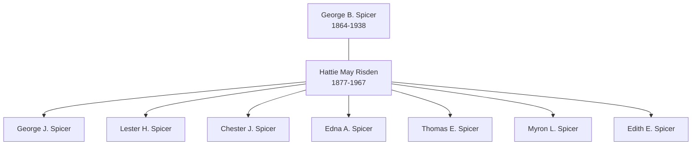

# Family Group: Spicer and Risden

This group sheet represents the alliance between the Spicer farming line and the Risden military legacy, centered on the household of George B. Spicer and Hattie May Risden.

## Parents

- **Husband:** [[People/George B Spicer|George B. Spicer]] (1864–1938)
- **Wife:** [[People/Hattie May Risden|Hattie May Risden]] (1877–1967)

## Children

1. George Jennings Spicer (1904–1977)
2. [[People/Lester Harold Spicer|Lester Harold Spicer]] (1906–1974)
3. Chester James Spicer (1908–1977)
4. Edna Angeline Spicer (1912–1993)
5. Thomas Edward Spicer (b. ~1915)
6. Myron Leland Spicer (1920–1990)
7. Edith Estelle Spicer (b. ~1921)

## Household Visualization

## Household Context

The Spicer-Risden household was established in Cedar Rapids, Iowa, in the late 1890s. George B. Spicer brought the expertise of a multi-generational farming dynasty, while Hattie May Risden provided the social link to the Civil War veteran community through her father, Watson Moses Risden.

---
*For more family groups, see the [[Topics/Family Stories and Biographies|Family Stories Hub]].*
