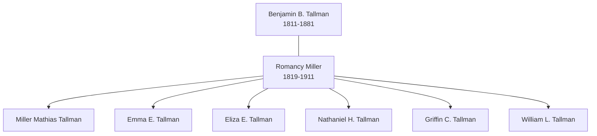

# Family Group: Tallman and Miller

This group sheet consolidates the household of Benjamin B. Tallman and Romancy Miller, whose multi-generational farming operation was a pillar of the family's Iowa settlement.

## Parents

- **Husband:** [[People/Benjamin B Tallman|Benjamin B. Tallman]] (1811–1881)
- **Wife:** [[People/Romancy Miller|Romancy Miller]] (1819–1911)

## Children

1. [[People/Miller Mathias Tallman|Miller Mathias Tallman]] (1841–1921)
2. Emma E. Tallman (b. ~1845)
3. Eliza E. Tallman (b. ~1847)
4. Nathaniel H. Tallman (b. ~1848)
5. Griffin C. Tallman (b. ~1853)
6. William L. Tallman (b. ~1858)

## Household Visualization

## Household Context

The Tallman-Miller family migrated from Ohio to Iowa in the late 1840s. They appear together in the 1850 census (Jones County) and the 1860-1870 censuses (Linn County). As the family expanded, several of the children established their own prominent Iowa farming households, most notably Miller Mathias Tallman.

---
*For more family groups, see the [[Topics/Family Stories and Biographies|Family Stories Hub]].*
