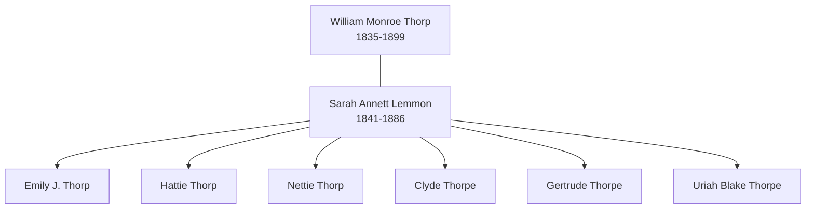

# Family Group: Thorpe and Lemmon

This group sheet represents the core Thorpe-connected household that established the family's presence in Iowa, centered on the marriage of William Monroe Thorp and Sarah Annett Lemmon.

## Parents

- **Husband:** [[People/William Monroe Thorp|William Monroe Thorp]] (1835–1899)
- **Wife:** [[People/Sarah Annett Lemmon|Sarah Annett Lemmon]] (1841–1886)

## Children

1. Emily J. Thorp (b. ~1860)
2. Hattie Thorp (b. ~1864)
3. Nettie Thorp (b. ~1869)
4. Clyde Thorpe (b. ~1873)
5. Gertrude Thorpe (b. ~1877)
6. [[People/Uriah Blake Thorpe|Uriah Blake Thorpe]] (1878–1959)

## Household Visualization

## Household Context

The Thorpe-Lemmon household was the bridge that brought the "Uriah Blake" legacy from Ohio into the Thorpe line. William Monroe Thorp and Sarah Annett Lemmon raised their family in both Ohio and Iowa, providing the link between the family's eastern origins and their modern Iowa heartland.

---
*For more family groups, see the [[Topics/Family Stories and Biographies|Family Stories Hub]].*
