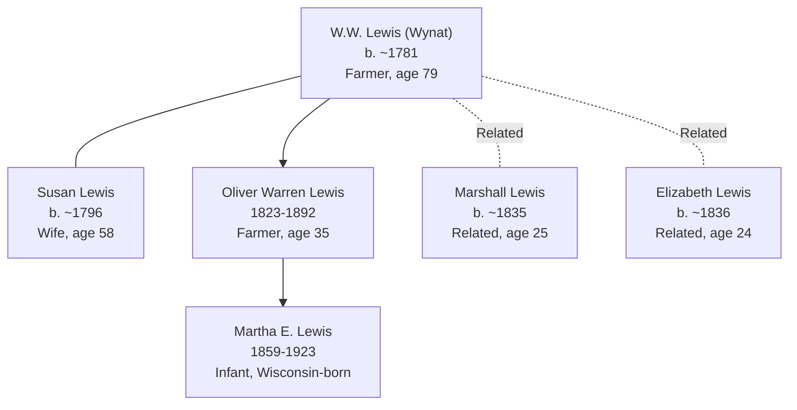

# Fond du Lac County, Wisconsin — Lewis Family Continuation

## Overview

Fond du Lac County, Wisconsin (east-central Wisconsin, Winnebago River region) served as a primary Wisconsin settlement location for the Lewis family during the 1860 census period. The county represents a documented geographic shift from Racine County (1850) and a transitional settlement point before the family's final documented migration to Mower County, Minnesota (1880). Census documentation for 1860 shows the Lewis family patriarch and multiple extended family members establishing stable agricultural settlement with documented multi-child household composition.

## Key Families and Individuals

### Lewis Family (Primary Settlement)

**Patriarch and Extended Household:**
- **[[People/Wynat Lewis|Wynat Lewis]]** (also recorded as W.W. Lewis; b. 1768–1782, age 79 in 1860) — Patriarch; farmer; Vermont origin, Wisconsin settlement, advanced age farmer
- **[[People/Susan Lewis|Susan Lewis]]** (b. ~1796, age 58–64 estimated in 1860) — Wife; documented 1850 Racine County
- **[[People/Oliver Warren Lewis|Oliver Warren Lewis]]** (1823–1892, age 35 in 1860) — Son; farmer; documented Racine County 1850, later Mower County Minnesota 1880
- **[[People/Martha Eliza Lewis|Martha Eliza Lewis]]** (1859–1923, age 7/12 infant in 1860) — Granddaughter; Wisconsin-born; documented later Minnesota→South Dakota settlement
- **[[People/Marshall Lewis|Marshall Lewis]]** (b. ~1835, age 25 in 1860) — Related; Vermont-born
- **[[People/Elizabeth Lewis|Elizabeth Lewis]]** (b. ~1836, age 24 in 1860) — Related; New York-born

## 1860 Census Snapshot

### W.W. Lewis Household — Fond du Lac County, Ripon 1st Ward

**Census Details:** Series M653, Roll 1408, Page 829

| Name | Relation | Age | Sex | Occupation | Birthplace | Property |
|---|---|---|---|---|---|---|
| W.W. Lewis | Head | 79 | M | Farmer | Massachusetts | $50 |
| Susan Lewis | Wife | 58 | F | — | New York | — |
| Oliver Lewis | Son | 35 | M | Farmer | Vermont | — |
| Marshal Lewis | — | 25 | M | — | Vermont | — |
| Elizabeth Lewis | — | 24 | F | — | New York | — |
| Martha E. Lewis | Daughter | 7/12 | F | — | Wisconsin | — |

**Household characteristics:**
- W.W. Lewis (Wynat variant) age 79 in 1860 (born ~1781; consistent with 1782 documentation from 1850 Racine County)
- **Birth location shift:** Recorded as Massachusetts in 1860 (differing from Vermont 1850 Racine County documentation); possible census variation or migration path via Massachusetts
- Susan Lewis as wife, age 58 (consistent with age 54 in 1850; 10-year interval verified)
- Oliver Lewis (son) age 35; farmer occupation documented; direct descendant documented in later Mower County Minnesota 1880 (age 57, consistent)
- Marshall Lewis age 25; Vermont-born; relationship unclear (possibly nephew or collateral relative)
- Elizabeth Lewis age 24; New York-born; relationship unclear; possible second wife or daughter-in-law
- **Martha E. Lewis (infant) age 7/12 months:** Wisconsin-born (confirms 1859 birth); granddaughter of patriarch; later documented as Martha Eliza Lewis (1859–1923) with marriage to Arthur Prior
- Property value $50 noted (minimal property valuation; may reflect partial ownership or leasehold arrangement)

**Occupational and Economic Context:**
- Patriarch W.W. Lewis and son Oliver both farmers; farming family operation continued from Racine County
- Small household (6 listed members; possibly incomplete enumeration)
- Wisconsin-born infant Martha E. indicates family establishment; children born in Wisconsin suggest multi-year residence (by 1859)
- Ripon 1st Ward: urban/village location within Fond du Lac County (differs from rural Burlington Township, Racine County)

## Geographic Context

### Location Details
- **Fond du Lac County seat:** Fond du Lac, Wisconsin
- **Ward context:** Ripon 1st Ward, Fond du Lac County (Ripon is city within Fond du Lac County)
- **Geographic position:** East-central Wisconsin; Winnebago River region
- **Distance:** ~40 miles south of Lake Michigan; ~40 miles north of Milwaukee; ~30 miles east of Lewis family later Eau Claire County settlement (documented in Phase 2O)

### Agricultural and Urban Suitability
- Fertile soil; suitable for grain, livestock, dairy farming
- Winnebago River navigation provided transportation access
- Ripon location (urban/village vs. rural township): suggests possible occupational shift toward town-based farming or mixed rural-urban settlement
- 1860 settlement: established Wisconsin agricultural frontier with town infrastructure

## Settlement Progression: Racine to Fond du Lac

### Geographic Shift Analysis (1850 Racine County → 1860 Fond du Lac County)

| Year | County | Township | Key Person | Age | Occupation | Notes |
|---|---|---|---|---|---|---|
| 1850 | Racine | Burlington | Wynat Lewis | 68 | Farmer | Vermont-born; 8-member household |
| 1860 | Fond du Lac | Ripon 1st Ward | W.W. Lewis | 79 | Farmer | Massachusetts-recorded (census variation?); 6-member household |
| 1880 | Minnesota | Mower County | Oliver Lewis | 57 | Farmer | Vermont-born; 4-member household with 2 children |

**Pattern:** Racine County (1850, rural Burlington Township) → Fond du Lac County (1860, urban Ripon Ward) → Mower County Minnesota (1880, rural township) = geographic progression with urban interlude

### Possible Relocation Drivers
- **Economic opportunity:** Urban Ripon location (1860) may suggest economic advantage or occupational transition
- **Family consolidation:** Martha E. Lewis infant (born 1859, Wisconsin) suggests family expansion during Fond du Lac period
- **Generational transition:** Patriarch age 79 in 1860; son Oliver age 35 (prime working age) possibly taking over farm operations
- **Minnesota migration preparation:** Wisconsin residence 1850–1880 (30-year span) intermediate before Minnesota final settlement

## Household and Family Diagrams

## Family Connections

### Lewis Family Three-Generation Arc
- **[[People/Wynat Lewis|Wynat Lewis]]** (patriarch, b. ~1781, age 79 in 1860, Vermont→Wisconsin farmer)
- **[[People/Oliver Warren Lewis|Oliver Warren Lewis]]** (son, 1823–1892, age 35 in 1860; Vermont→Wisconsin→Minnesota farmer)
- **[[People/Martha Eliza Lewis|Martha Eliza Lewis]]** (granddaughter, 1859–1923, born Wisconsin 1859; Wisconsin→Minnesota→South Dakota settlement)

### Extended Household Relationships
- **Marshall Lewis (age 25):** Relationship to patriarch unclear; possibly nephew, collateral relative, or unrelated boarding family member
- **Elizabeth Lewis (age 24):** Relationship unclear; possible daughter-in-law (wife of Oliver Warren Lewis?) or niece
- **Martha E. Lewis (infant):** Documented as "Daughter" in census; likely granddaughter of patriarch (daughter of Oliver Warren Lewis); later documentation confirms Martha Eliza Lewis (1859–1923)

### Intergenerational Economic Continuity
- Patriarch W.W. Lewis and son Oliver both documented farmers (dual-occupation household)
- Farming family structure persisted through generational transition (patriarch age 79, son age 35 in prime working years)
- Martha E. Lewis (granddaughter) born Wisconsin 1859; later documented Mower County Minnesota 1880 (age 20 as Martha's listed wife of Arthur Prior)

## Census and Economic Patterns

### Occupational Context
- **W.W. Lewis (patriarch, age 79):** Farmer; farming occupation maintained into advanced age (79-year-old farmer)
- **Oliver Lewis (son, age 35):** Farmer; occupational succession evident; prime working age
- **Implication:** Farming viable occupation for patriarchs into advanced age; supported by adult son labor

### Household Composition Changes (1850 Racine → 1860 Fond du Lac)
- **1850 household:** 8 members (extended family, Darling relatives); rural Burlington Township
- **1860 household:** 6 members (more nuclear, fewer extended family); urban Ripon Ward
- **Change interpretation:** Possible family dispersal, extended relatives separated, or census enumeration variation

### Economic Indicators
- **Property value (1860):** $50 recorded property value (minimal; possibly leasehold vs. freehold property)
- **Birthplace diversity:** Susan (New York 1860, Vermont 1850); Elizabeth (New York); Marshall (Vermont); Martha E. (Wisconsin)
- **Census location shift:** Rural township (1850) → Urban ward (1860); possible occupational context shift

## Research Implications

### Strengths
- **Documented geographic progression:** Racine County 1850 → Fond du Lac County 1860 → Mower County Minnesota 1880 shows clear settlement trajectory
- **Multigenerational documentation:** Patriarch Wynat, son Oliver, granddaughter Martha E. across 30-year span enables generational analysis
- **Occupational continuity:** Farming documented across all locations; occupation consistent with family identity
- **Family expansion confirmation:** Martha E. Lewis born Wisconsin 1859 confirms family establishment during Fond du Lac period

### Research Gaps
- **Racine-to-Fond du Lac relocation driver:** Reason for geographic shift unknown; occupational, economic, or family factors unclear
- **Intermediate settlement dates:** Exact arrival in Fond du Lac County unknown; 1860 first documented census
- **Birthplace discrepancy:** W.W. Lewis recorded as Massachusetts (1860) vs. Vermont (1850); explanation unknown
- **Extended family relationships:** Marshall Lewis and Elizabeth Lewis identities and relationships unclear
- **Urban-rural shift context:** Ripon Ward (urban) location differs from rural Burlington Township; implications unknown
- **Land records:** Farm location, acreage, property ownership not documented
- **Church records:** Marriages, births, burials in Fond du Lac churches not yet incorporated
- **1870 census:** No documentation; intermediate status between 1860 Fond du Lac and 1880 Mower County unknown

## Next Steps for County Research

1. **Locate 1870 Fond du Lac County Census** for Lewis family (confirm continued residence or relocation)
2. **Extract Fond du Lac County land patents and deeds** (1850–1880) for Lewis family farm documentation
3. **Research county histories** (Fond du Lac County agricultural and urban settlement development)
4. **Locate Ripon city/Fond du Lac church records** (Baptist, Methodist congregations) for Lewis family events (1850–1870)
5. **Clarify Marshall Lewis and Elizabeth Lewis identities** using Wisconsin vital records
6. **Verify W.W. Lewis birthplace** (Massachusetts vs. Vermont discrepancy) using genealogical records
7. **Investigate 1850–1860 intermediate settlement** (possible intermediate Wisconsin county residence)
8. **Cross-reference with Winnebago County records** (adjacent county; possible extended family settlement)

## Cross-References

### Related Geographic Pages
- [[Topics/Racine County Wisconsin - Lewis Family Settlement|Racine County, Wisconsin — Lewis Family Settlement Entry Point]] (prior Wisconsin settlement, 1850)
- [[Topics/Mower County Minnesota - Lewis Prior Palmer Settlement|Mower County, Minnesota — Lewis, Prior, and Palmer Settlement Center]] (subsequent Minnesota settlement, 1880–1900)
- [[Topics/Eau Claire County Wisconsin - Bangle Family Settlement|Eau Claire County, Wisconsin — Bangle Family Settlement Center]] (contemporaneous Wisconsin settlement, 1860–1900; nearby county)
- [[Topics/American Settlement and Migration Timeline|American Settlement and Migration Timeline]] (Vermont→Wisconsin→Minnesota migration wave context)

### Related Family Pages
- [[Topics/Palmer Prior Lewis Branch Summary|Palmer, Prior, and Lewis Branch Summary]] (primary family cluster)

### Individual Pages
- [[People/Wynat Lewis|Wynat Lewis]] — Patriarch; Wisconsin settlement patriarch
- [[People/Susan Lewis|Susan Lewis]] — Wife; long-lived spouse
- [[People/Oliver Warren Lewis|Oliver Warren Lewis]] — Son; documented Racine County 1850, Fond du Lac County 1860, Mower County Minnesota 1880
- [[People/Martha Eliza Lewis|Martha Eliza Lewis]] — Granddaughter; Wisconsin-born 1859; documented later Minnesota→South Dakota settlement

### Source References
- [[References/Shared Intake 2026-04-24 Census InDesign Summaries|Census InDesign Summaries]] (1860 census details)
- [[References/Shared Intake 2026-04-22 Pedigree Timeline Prior|Prior Pedigree Timeline]] (Lewis family lineage context)
- [[References/Book Outprints Collection|Book Outprints Collection]] (burial/property documentation)
