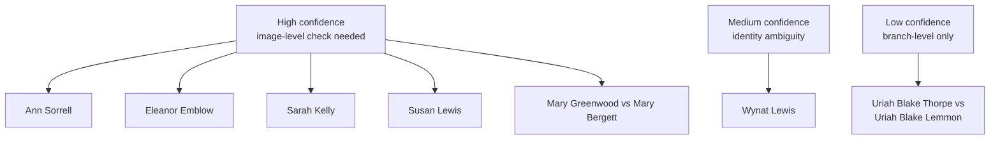

# Identity Reconciliation Matrix

This page ranks the unresolved identity questions that can still be improved with the source material already present in the vault.

## Reconciliation Diagram

The diagram is a visual index of the current queue. It does not imply any merge beyond what is written in the table below.

## Ranking Key

- **High**: Strong source-text support already exists; image-level confirmation is the main missing step.
- **Medium**: The source text is useful but still leaves a meaningful ambiguity or competing interpretation.
- **Low**: The current source set supports only a tentative note, not even a cautious merge candidate.

## Matrix

| Item | Current Evidence Strength | What the Vault Already Supports | Next Best Step |
|------|---------------------------|----------------------------------|-----------------|
| [[People/Ann Sorrell|Ann Sorrell]] | High | Page-level census-summary anchors for 1841, 1851, 1861, and 1871; cross-reference mapping to `UNKNOWN, Ann`. | Verify the underlying census images, especially the 1861 and 1871 entries without piece/folio/page data. |
| [[People/Eleanor Emblow|Eleanor Emblow]] | High | Page-level census-summary anchors for 1841, 1861, and 1871; cross-reference mapping to `UNKNOWN, Eleanor`. | Verify the census images for the Peterborough household sequence and settle preferred name spelling. |
| [[People/Sarah Kelly|Sarah Kelly]] | High | Page-level census-summary anchors for 1841, 1851, and 1861; cross-reference mapping to `UNKNOWN, Sarah`. | Verify the 1851 and 1861 images, then decide whether `Barton?` is a real clue or a transcription artifact. |
| [[People/Susan Lewis|Susan Lewis]] | High | Page-level census-summary anchor for 1850 Wisconsin household; cross-reference mapping to `UNKNOWN, Susan`. | Verify the 1850 household image and look for later records that confirm death or continuation. |
| [[People/Mary Greenwood|Mary Greenwood]] | High | The extract labels the page `GREENWOOD, Mary` but the mortality row names `Mary BERGETT`; the age and death timing do not match [[People/Mary Burgett|Mary Burgett]]. | Keep the mortality-record page separate from Mary Burgett and preserve `GREENWOOD` only as compiler metadata if needed. |
| [[People/Wynat Lewis|Wynat Lewis]] | Medium | Census-summary extract has `Wynat (William?) Lewis`; pedigree timeline gives `Wynant Williamson Lewis c1781-after 1860`. | Verify the 1850 and 1860 household images and decide whether `Wynat`, `Wynant`, or `William` is the best canonical form. |
| [[People/Uriah Blake Thorpe|Uriah Blake Thorpe]] vs [[People/Uriah Blake Lemmon|Uriah Blake Lemmon]] | Low-Medium | Pedigree timeline groups the Lemmon/Blake/Thorpe cluster on one compiled branch chart. | Treat as branch-level evidence only until a direct record ties the Thorpe and Lemmon lines together. |

## Related Summary

- [[Topics/Lemmon Blake Thorpe Branch Summary|Lemmon Blake Thorpe Branch Summary]]

## Working Note

Use this matrix to choose the next session’s target:

1. If the goal is to reduce uncertainty fastest, start with the four High items.
2. If the goal is to reduce false merges fastest, work on Mary Greenwood and Mary Burgett together.
3. If the goal is to refine naming and canonical form, work on Wynat Lewis.
