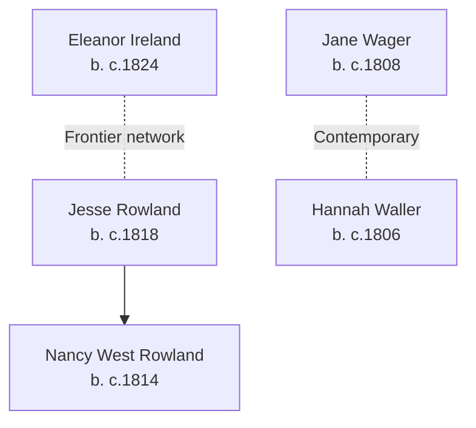

# Ireland, Rowland, Willson, Wager, and Waller Families Branch Summary

## Branch Overview

**Time Period:** 19th century (scattered documentation 1820–1880)

**Geographic Range:** Scattered US settlement across Ohio, Indiana, Iowa; limited UK documentation

**Primary Occupations:** Farm labor, household service, general laborers

## Key Ancestor Lines

- [[People/Ireland Eleanor|Eleanor Ireland]] (b. c.1824)
- [[People/Jesse Rowland|Jesse Rowland]] (b. c.1818)
- [[People/Rowland Nancy W|Nancy West Rowland]] (b. c.1814)
- [[People/Jane Wager|Jane Wager]] (b. c.1808)
- [[People/Waller Hannah|Hannah Waller]] (b. c.1806)

## Family Structure

## Census Context

Documented in 1850s–1860s US censuses (Ohio, Indiana, Iowa) showing frontier settlement patterns and family clustering in agricultural areas

Family members appear in consecutive US censuses showing household composition, occupational context, and generational progression.

## Source Documentation

This family cluster is documented in:
- Census InDesign summary files (2026-04-24 batch) with detailed household and occupational context
- Burial site records where available
- Pedigree timeline references where connections are established

## Research Resources

- Visit [[People Directory]] to find individual family members
- Check [[Search Index]] for location, occupation, or date searches
- Review [[CHANGELOG]] for ongoing research notes and updates

