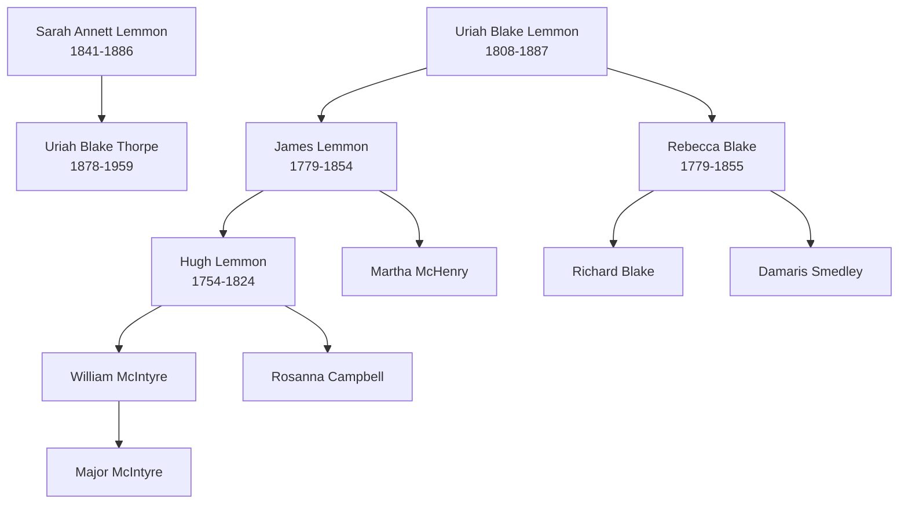

# Lemmon Blake Thorpe Branch Summary

This page summarizes the branch-level evidence currently available in the vault for the Lemmon, Blake, and Thorpe cluster.

## Branch Diagram

This diagram is a branch-level sketch only. It reflects the compiled pedigree timeline, not a standalone proof of each relationship.

## What the Timeline Shows

The Thorpe pedigree timeline places the following people on the same compiled branch chart:

- [[People/Uriah Blake Thorpe|Uriah Blake Thorpe]] `1878-1959`
- [[People/Uriah Blake Lemmon|Uriah Blake Lemmon]] `1808-1887`
- [[People/James Lemmon|James Lemmon]] `1779-1854`
- [[People/Rebecca Blake|Rebecca Blake]] `1779-1855`
- [[People/Sarah Annett Lemmon|Sarah Annett Lemmon]] `1841-1886`

The same compiled chart also shows related ancestors including:

- [[People/Hugh Lemmon|Hugh Lemmon]] `1754-1824`
- [[People/Martha McHenry|Martha McHenry]]
- [[People/Richard Blake|Richard Blake]]
- [[People/Damaris Smedley|Damaris Smedley]]
- [[People/William McIntyre|William McIntyre]]
- [[People/Major McIntyre|Major McIntyre]]
- [[People/Rosanna Campbell|Rosanna Campbell]]

## What This Supports

- The Thorpe and Lemmon families are part of a shared compiled branch context in the pedigree timeline.
- The Blake surname appears as part of the Lemmon ancestral line rather than as a separate unrelated cluster.
- [[People/Sarah Annett Lemmon|Sarah Annett Lemmon]] provides a visible bridge from Lemmon naming into later Thorpe household naming.

## What This Does Not Prove

- It does not prove that [[People/Uriah Blake Thorpe|Uriah Blake Thorpe]] and [[People/Uriah Blake Lemmon|Uriah Blake Lemmon]] are the same person.
- It does not prove direct parent-child placement between the Thorpe and Lemmon-named individuals.
- It does not replace image-level census or vital-record confirmation.

## Practical Use

Use this page when you need a concise explanation of why the Thorpe and Lemmon pages are linked in the vault without overstating the evidence.

## Sources

1. `References/raw/extracted/PedigreeTimelines2025Thorpe.txt`
2. `References/raw/extracted/PedigreeTimelines2025_raw.txt`
3. [[People/Uriah Blake Thorpe|Uriah Blake Thorpe]]
4. [[People/Uriah Blake Lemmon|Uriah Blake Lemmon]]
5. [[People/James Lemmon|James Lemmon]]
6. [[People/Rebecca Blake|Rebecca Blake]]
7. [[People/Sarah Annett Lemmon|Sarah Annett Lemmon]]
