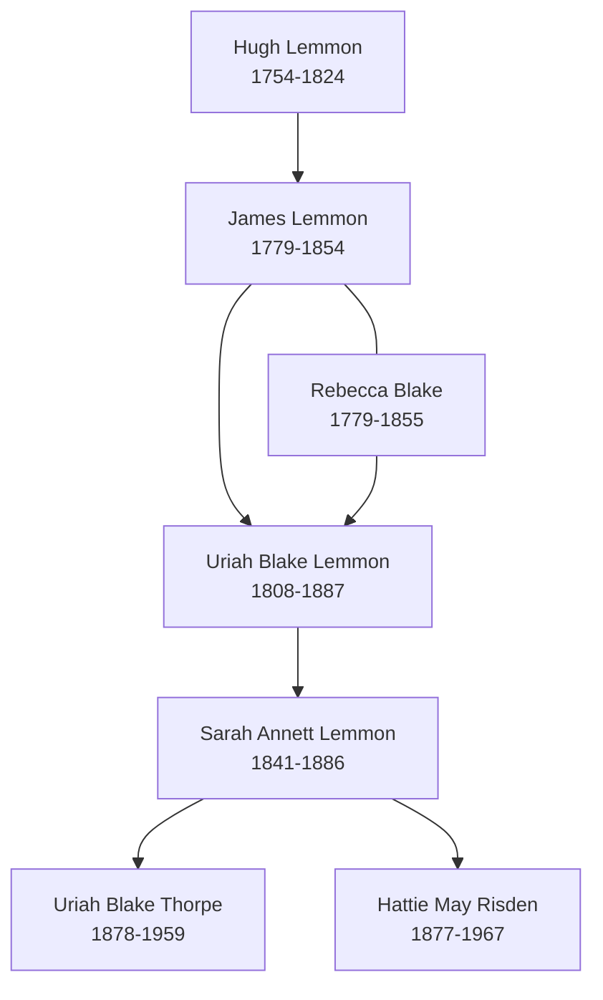

# Lemmon, Blake, and Thorpe Branch Summary

This is the core Thorpe-connected branch hub. It explains why the Lemmon, Blake, and Thorpe pages are linked in the vault while keeping the evidence boundaries clear: the compiled pedigree timeline places these families in the same branch context, but individual relationships still need record-level confirmation in places.

## Branch Diagram

This diagram is a visitor guide, not a standalone proof. It summarizes relationships and branch placement already discussed in the linked pages and in the extracted Thorpe pedigree timeline.

## Start With These People

- [[People/Uriah Blake Thorpe|Uriah Blake Thorpe]] - later Iowa Thorpe identity, verified as separate from Uriah Blake Lemmon.
- [[People/Uriah Blake Lemmon|Uriah Blake Lemmon]] - earlier Ohio Lemmon identity in the same compiled branch context.
- [[People/James Lemmon|James Lemmon]] and [[People/Rebecca Blake|Rebecca Blake]] - the Lemmon/Blake couple anchoring the older branch layer.
- [[People/Sarah Annett Lemmon|Sarah Annett Lemmon]] - visible bridge from Lemmon naming into later Thorpe household naming.
- [[People/Hattie May Risden|Hattie May Risden]] - descendant-line profile that connects the Lemmon/Thorpe context into the Spicer-Risden family story.

## What We Know

- The extracted Thorpe pedigree timeline places [[People/Uriah Blake Thorpe|Uriah Blake Thorpe]], [[People/Uriah Blake Lemmon|Uriah Blake Lemmon]], [[People/James Lemmon|James Lemmon]], [[People/Rebecca Blake|Rebecca Blake]], and [[People/Sarah Annett Lemmon|Sarah Annett Lemmon]] in a shared branch context.
- The Thorpe pedigree timeline also gives the direct Thorpe chain as [[People/John Thorp|John Thorp]] -> [[People/William Monroe Thorp|William Monroe Thorp]] -> [[People/Uriah Blake Thorpe|Uriah Blake Thorpe]] -> [[People/Raymond Miller Thorpe|Raymond Miller Thorpe]], with [[People/Jane Wager|Jane Wager]] and [[People/Sarah Annett Lemmon|Sarah Annett Lemmon]] as adjacent upper-branch labels.
- [[People/Uriah Blake Thorpe|Uriah Blake Thorpe]] and [[People/Uriah Blake Lemmon|Uriah Blake Lemmon]] are verified as separate people: they differ by about 70 years in birth date and have different death and burial contexts.
- The Blake surname is part of the Lemmon ancestral context through [[People/Rebecca Blake|Rebecca Blake]], not a reason to merge the two Uriah Blake identities.
- [[People/Sarah Annett Lemmon|Sarah Annett Lemmon]] is the most useful bridge page for understanding how this branch connects forward into the later Thorpe/Risden/Spicer cluster.

## What Remains Uncertain

- Some early-generation placements still come from the compiled pedigree timeline and need image-level or record-level verification.
- The exact relationship path between all Lemmon, Blake, Thorpe, and Risden pages should remain source-limited until additional vital records or image-verified census records are reviewed.
- Several older names visible in the timeline, including Hugh Lemmon and related allied-family names, do not yet have full person pages in the vault.

## Sources

1. [[Topics/Thorpe Pedigree Timelines|Thorpe Pedigree Timelines]]
2. `References/raw/extracted/PedigreeTimelines2025Thorpe.txt`
3. [[People/Uriah Blake Thorpe|Uriah Blake Thorpe]]
4. [[People/Uriah Blake Lemmon|Uriah Blake Lemmon]]
5. [[People/James Lemmon|James Lemmon]]
6. [[People/Rebecca Blake|Rebecca Blake]]
7. [[People/Sarah Annett Lemmon|Sarah Annett Lemmon]]
8. [[People/Hattie May Risden|Hattie May Risden]]
9. [[thorpe-pedigree-timeline-index|Thorpe Pedigree Timeline Extraction Index]]
