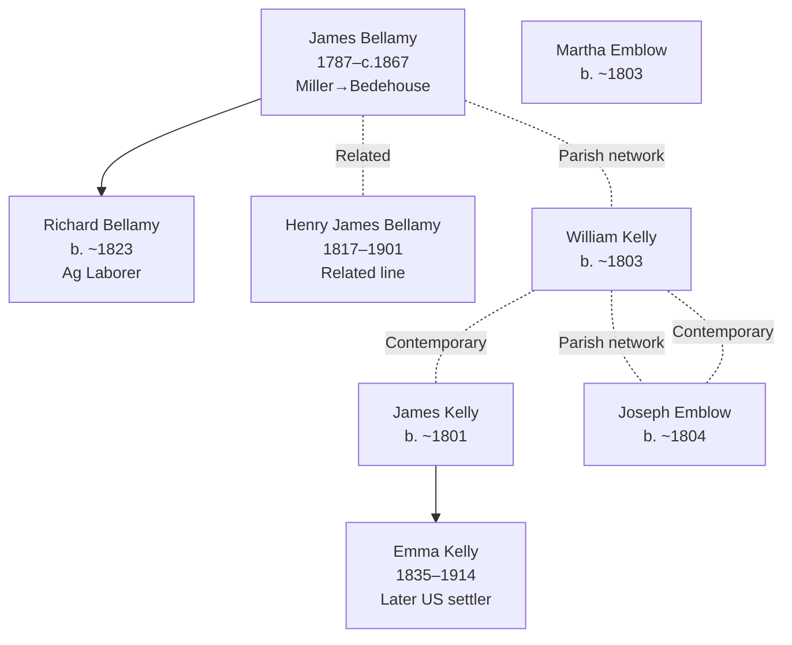

# Lincolnshire, Bourn — Bellamy, Kelly, and Emblow Settlement Center

## Overview

Bourn, a parish village in Lincolnshire (East Midlands, England), served as the primary documented settlement center for the Bellamy, Kelly, Emblow, and related families during the 1841–1871 census era. Multiple generations are documented in consecutive UK censuses showing household composition, occupational transitions, and economic changes during the mid-19th century English rural economy.

## Key Families and Individuals

### Bellamy Family (Primary Settlement)
- **[[People/James Bellamy|James Bellamy]]** (1787–c.1867) — Patriarch; miller (1841), later Bedehouse resident (1851–1861)
- **[[People/Richard Bellamy|Richard Bellamy]]** (b. c.1823) — Son; agricultural laborer; Bourn documented
- **[[People/Henry James Bellamy|Henry James Bellamy]]** (1817–1901) — Related; Bellamy line continuation
- **[[People/James Archibald Bellamy|James Archibald Bellamy]]** — Related; Bellamy documentation

### Kelly Family (Related Settlement)
- **[[People/William Kelly|William Kelly]]** (b. c.1803) — Contemporary; Bourn parish
- **[[People/James Kelly|James Kelly]]** (b. c.1801) — Related; agricultural/mixed occupation
- **[[People/Emma Kelly|Emma Kelly]]** (1835–1914) — Daughter; later US settlement

### Emblow Family (Allied Settlement)
- **[[People/Joseph Emblow|Joseph Emblow]]** (b. c.1804) — Bourn documented; occupation unknown
- **[[People/Martha Emblow|Martha Emblow]]** (b. c.1803) — Related; household member

## 1841–1871 Census Snapshots

### 1841 Lincolnshire Census — Bourn, Castle Yard

**Census Details:** Class HO107, Piece 615, Book 21, Enumeration District 1, Folio 24, Page 40

| Name | Age | Sex | Occupation | Born in County | Notes |
|---|---|---|---|---|---|
| James Bellamy | 50 | M | Miller | Y | Head of household |
| Richard Bellamy | 20 | M | Ag Lab | Y | Son |

**Household characteristics:**
- James Bellamy age 50 (born c.1791; consistent with documented 1787 date)
- Richard age 20 (born c.1821)
- Miller is skilled occupation; implies relative prosperity
- "Born in County" designation confirms Lincolnshire origin

### 1851 Lincolnshire Census — Bourn, South Street (Bede Houses)

**Census Details:** Class HO107, Piece 2095, Folio page 35, Entry 137

| Name | Relation | Age | Sex | Occupation | Where Born |
|---|---|---|---|---|---|
| James Bellamy | Head | 63 | M | Bede House Man (formerly miller, baker) | Lincoln, Bourn |

**Household characteristics:**
- James Bellamy age 63 (born c.1788; consistent with 1787 documented)
- **Major occupational transition:** Miller/Baker → Bede House Man (almshouse resident)
- **Economic implication:** Health decline or poverty in later life; moved to institutional care
- **Bede Houses:** Charitable almshouse system for aged laborers; indicates lost economic independence

### 1861 Lincolnshire Census — Bourn, South Street

**Census Details:** Class RG9, Piece 2317, Folio 81, Page 34

| Name | Relation | Age | Sex | Occupation | Where Born |
|---|---|---|---|---|---|
| James Bellamy | Head | 73 | M | Bedehouse Man (formerly baker) | Lincoln, Bourn |

**Household characteristics:**
- James Bellamy age 73 (consistent with 1787–1788 birth)
- Continued Bede House residence (10-year span)
- Occupational history clarified: Baker (not miller; possibly combined role)
- Long-term institutional care at advanced age

## Geographic Context

### Location Details
- **Parish:** Bourn, Lincolnshire
- **Region:** East Midlands, Lincolnshire; English Midlands rural area
- **County seat:** Lincoln (approximately 20 miles south)
- **Landscape:** Agricultural fenland; grain cultivation primary

### Economic Context
- **1841–1871 era:** Rural English agricultural economy
- **Milling:** Bellamy's miller occupation reflects grain-based economy
- **Decline period:** 1841–1871 marks rural-to-urban shift; miller decline coincides with industrial bread production
- **Bede House system:** Almshouse infrastructure reflects poor relief for aged laborers; indicates economic hardship in aging rural population

## Settlement and Occupational Progression

### Occupational Transitions (James Bellamy)
| Year | Age | Occupation | Status | Location |
|---|---|---|---|---|
| 1841 | 50–54 | Miller | Skilled; household head | Bourn, Castle Yard |
| 1851 | 63–67 | Baker; Bede House Man | Institutional care; lost independence | Bourn, South Street |
| 1861 | 73–77 | Bedehouse Man | Continued institutional care | Bourn, South Street |
| c.1867 | 80–84 | — | Death (documented c.1867) | — |

**Pattern:** Skilled tradesman (miller 1841) → occupational and economic decline → institutional care (1851 onward) → death (c.1867)

### Family Network Continuity
- **Richard Bellamy (1823):** Ag Lab in 1841; younger generation maintaining parish connection
- **Henry James Bellamy (1817):** Related line; continued Bourn/Lincolnshire presence
- **Kelly and Emblow families:** Contemporaries in same parish; likely social network

## Household and Family Diagrams

## Family Connections

### Bellamy-Kelly-Emblow Network
- **[[People/James Bellamy|James Bellamy]]**, **[[People/James Kelly|James Kelly]]**, **[[People/Joseph Emblow|Joseph Emblow]]** all documented in Bourn 1841–1871
- Likely extended family or community network
- Several emigrated to US (Kelly, Emblow lines)

### US Emigration from Bourn
- **[[People/Emma Kelly|Emma Kelly]]** (1835–1914) — Bourn-born; later US settlement documented
- Represents broader pattern of English rural-to-US migration (1850s–1870s)
- [[Topics/Bellamy Branch Summary|Bellamy, Kelly, Emblow, and Munson families]] continued in US

## Census and Economic Patterns

### Occupational Context
- **Miller (1841):** Skilled tradesman; milling primary grain processing occupation in rural Lincolnshire
- **Agricultural laborer (Richard Bellamy):** Complementary farm labor; supports grain economy
- **Bedehouse Man (1851–1861):** Institutional care designation; indicates poverty and loss of economic independence

### Economic Decline Narrative
- **1841:** James Bellamy skilled tradesman; presumed modest prosperity
- **1851:** Transition to Bede House (almshouse) indicates health decline, economic loss, or inability to maintain independent household
- **1861:** Continued institutional care; long-term aging-in-place situation
- **Implication:** English rural economy decline; artisan (miller) unable to maintain economic independence in aging

### Community Structure
- **Bourn 1841:** Mixed skilled trades (miller) and agricultural labor (Ag Lab, farm workers)
- **Parish size implied:** Multiple surnames (Bellamy, Kelly, Emblow) across 1841–1871 suggests moderate-sized village
- **Social structure:** Skilled trades at top; agricultural laborers forming majority of workforce

## Research Implications

### Strengths
- **Consecutive census documentation:** 1841, 1851, 1861 (3 consecutive censuses) provides rare 20-year continuity
- **Occupational clarity:** Explicit "Miller," "Ag Lab," "Bedehouse Man" designations enable economic analysis
- **Institutional transition:** Bede House documentation rare; provides insight into poor relief system
- **Age consistency:** James Bellamy born 1787 or 1788 (consistent across 1841–1861)

### Research Gaps
- **Pre-1841 documentation:** No parish registers, baptisms, marriages yet incorporated
- **1871 census:** No follow-up documentation after 1861; James Bellamy death date "c.1867" imprecise
- **Land records:** Property ownership, farm/mill details not documented
- **Bede House administration:** Institutional records not explored
- **Family relationships:** Exact relationships between Bellamy, Kelly, Emblow families unclear
- **US emigration dates:** Kelly and Emblow US arrival dates not precisely documented

## Next Steps for Parish Research

1. **Locate Bourn parish registers** (baptisms, marriages, burials 1787–1870) to establish exact dates and relationships
2. **Extract 1871 Bourn census** to determine James Bellamy's status/death and Richard Bellamy's later settlement
3. **Research Bourn Bede House records** (institutional records, resident lists) if available
4. **Investigate milling operations** in Bourn parish (mill locations, ownership, decline in 1850s–1870s)
5. **Cross-reference with neighboring parishes** (South Kesteven, East Kesteven) for related Bellamy/Kelly/Emblow families
6. **Locate Kelly and Emblow emigration records** (ship manifests, US naturalization) for 1850s–1870s

## Cross-References

### Related Geographic Pages
- [[Topics/UK Parish and Regional Context|UK Parish and Regional Context]] (Lincolnshire focus)
- [[Topics/Occupational Context and Economic Patterns|Occupational Context and Economic Patterns]] (miller/laborer analysis)

### Related Family Pages
- [[Topics/Bellamy Branch Summary|Bellamy, Kelly, Emblow, and Munson Branch Summary]] (primary family cluster)
- [[People/James Bellamy|James Bellamy]] — Patriarch documentation
- [[People/Richard Bellamy|Richard Bellamy]] — Son; Ag Lab

### Individual Pages
- [[People/James Bellamy|James Bellamy]] (1787–c.1867) — Patriarch; miller transition
- [[People/Richard Bellamy|Richard Bellamy]] (b. c.1823) — Son; agricultural laborer
- [[People/Henry James Bellamy|Henry James Bellamy]] (1817–1901) — Related Bellamy line
- [[People/Emma Kelly|Emma Kelly]] (1835–1914) — Kelly family; US emigrant
- [[People/Joseph Emblow|Joseph Emblow]] (b. c.1804) — Emblow family connection
- [[People/Martha Emblow|Martha Emblow]] (b. c.1803) — Emblow family member

### Source References
- [[References/Shared Intake 2026-04-24 Census InDesign Summaries|Census InDesign Summaries]] (1841–1861 census details)
- [[References/Shared Intake 2026-04-22 Pedigree Timeline Bellamy|Bellamy Pedigree Timeline]] (lineage context)
- [[References/Book Outprints Collection|Book Outprints Collection]] (burial site records if available)
