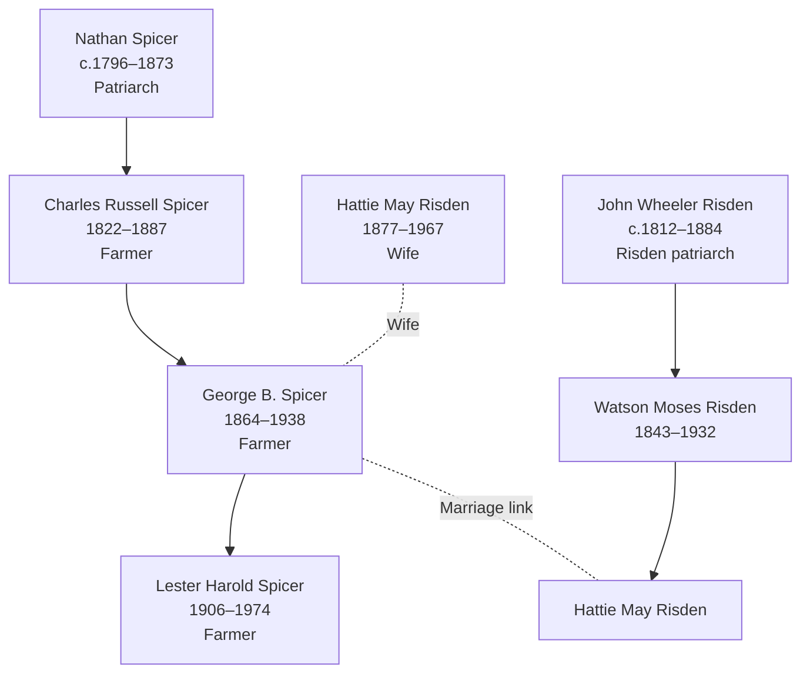

# Linn County, Iowa — Spicer and Risden Settlement Center

## Overview

Linn County, Iowa (eastern Iowa, Cedar River valley) became the primary settlement hub for the Spicer and Risden families during the 1870s–1900. Multiple generations established prosperous agricultural roots here, with documented multi-township residence and family consolidation.

## Key Families and Individuals

### Spicer Family (Primary Settlement)
- **[[People/George B Spicer|George B. Spicer]]** (1864–1938) — Patriarch; farmer; primary Linn County settler
- **[[People/Hattie May Risden|Hattie May Risden]]** (1877–1967) — George B.'s wife; Risden family connection
- **[[People/Lester Harold Spicer|Lester Harold Spicer]]** (1906–1974) — Son; continued family farming
- **[[People/Charles Russell Spicer|Charles Russell Spicer]]** (1822–1887) — Father; multi-state settlement (Iowa County → Linn County transition)
- **[[People/Nathan Spicer|Nathan Spicer]]** (c.1796–1873) — Grandfather; patriarch of Spicer line

### Risden Family (Collateral/Marriage Connection)
- **[[People/Hattie May Risden|Hattie May Risden]]** (1877–1967) — Married George B. Spicer; Risden connection to Spicer settlement
- **[[People/John Wheeler Risden|John Wheeler Risden]]** (c.1812–1884) — Hattie May's ancestor; related settlement patterns
- **[[People/Watson Moses Risden|Watson Moses Risden]]** (1843–1932) — Hattie May's father; Cedar Rapids area connection; Civil War veteran and Iowa Grand Army of the Republic Department Commander

## 1870–1900 Census Snapshots

### George B. Spicer Household — Linn County, Clinton Township (1880)

**Census Details:** Series T623, Roll 443, Page 62B

| Name | Relation | Age | Sex | Occupation | Birthplace |
|---|---|---|---|---|---|
| George B. Spicer | Head | 16 | M | Farm labor | Iowa |
| Hattie Spicer | Wife | — | F | — | Ohio |
| Mary Spicer | Mother | — | F | — | Pennsylvania |
| Clara Spicer | Sister | — | F | — | Iowa |
| Roy Forney | Boarder | — | M | Farm labor | New York |

**Note:** Young George (1864 born) documented age 16 in 1880 (consistent)

### George B. Spicer Household — Linn County, Benton County area (1900)

**Census Details:** Series T625, Roll 477, Page 4B & 5A, ED 4

| Name | Relation | Age | Sex | Occupation | Birthplace |
|---|---|---|---|---|---|
| George Spicer | Head | — | M | Farmer | Iowa |
| Hattie Spicer | Wife | — | F | — | Iowa |
| Charles S. Spicer | Son | — | M | Farm labor | Iowa |
| George J. Spicer | Son | — | M | Farm labor | Iowa |
| Lester H. Spicer | Son | — | M | — | Iowa |
| Chester J. Spicer | Son | — | M | — | Iowa |
| Edna Spicer | Daughter | — | F | — | Iowa |
| Myron L. Spicer | Son | — | M | — | Iowa |

**Household characteristics:**
- Mature farming operation; multiple sons engaged in farm labor
- All children born Iowa (settled family)
- Extended household (5+ working-age sons)
- Gender division: Sons → farm labor; daughter → household

### Linn County, Cedar Rapids residence (early 1900s)

**Census Details:** Series T626, Roll 664, Page 11A, ED 8

| Name | Relation | Age | Sex | Occupation | Birthplace |
|---|---|---|---|---|---|
| Hattie Spicer | Head | — | F | — | Iowa |
| Myron L. Spicer | Son | — | M | Farmer | Iowa |

**Note:** Hattie May Spicer documented as household head in later years; widowed status implied

## Geographic Context

### Location Details
- **Linn County seat:** Cedar Rapids, Iowa
- **Township context:** Clinton Township, Benton Township, Cedar Rapids city
- **Cedar River valley:** Eastern Iowa; premier agricultural region
- **Distance:** ~120 miles east of Des Moines; ~30 miles west of Mississippi River

### Agricultural Suitability
- Exceptionally fertile soil; corn belt center
- Cedar River navigation supported early settlement (1830s–1840s)
- 1870s agricultural expansion attracted family settlement
- Manufacturing development (mills, foundries) provided occupational diversity

## Settlement Progression

| Decade | Location | Family Status | Occupation | Census Series |
|---|---|---|---|---|
| 1850s | Iowa County | [[People/Charles Russell Spicer|Charles Russell Spicer]] | Farmer, Chair maker | M432 |
| 1870s | Clinton Township | [[People/George B Spicer|George B. Spicer]] early farming | Farm labor | T623 |
| 1880s | Clinton Township | George B. established; children | Farmer, farm labor | T624 |
| 1900s | Cedar Rapids/Benton | George B. mature farm; Hattie May widow | Farmer | T625 |

## Household and Family Diagrams

## Family Connections

### Spicer-Risden Marriage Alliance
- **[[People/George B Spicer|George B. Spicer]]** (1864) married **[[People/Hattie May Risden|Hattie May Risden]]** (1877)
- Unified two agricultural families in Linn County settlement
- Multi-township farming operations; increased land holdings implied

### Intergenerational Continuity
- **[[People/Nathan Spicer|Nathan Spicer]]** (patriarch c.1796) → **[[People/Charles Russell Spicer|Charles Russell Spicer]]** (farmer, Iowa County 1850s) → **[[People/George B Spicer|George B. Spicer]]** (Linn County 1880s–1900s) → **[[People/Lester Harold Spicer|Lester Harold Spicer]]** (farmer, 1906–1974)
- 80-year farming continuity across 4 generations

### Risden Connection
- [[People/John Wheeler Risden|John Wheeler Risden]] line continued through [[People/Hattie May Risden|Hattie May]]'s marriage to [[People/George B Spicer|George B. Spicer]]
- [[Topics/Spicer Risden Branch Summary|Spicer-Risden]] documented as unified cluster
- Grand Army records say [[People/Watson Moses Risden|Watson Moses Risden]] moved directly to Iowa after Civil War service and lived in Cedar Rapids for more than fifty-five years, adding military and civic context to the Risden settlement line.

## Census and Economic Patterns

### Occupational Continuity
- **1850s Charles Russell Spicer:** Farmer in Iowa; Chair maker transition (1860)
- **1880 George B. Spicer:** Farm laborer (young, 16 years old); implied continuation of family farming
- **1900 George B. Spicer:** Established farmer; multiple sons engaged in farm labor; economic success indicated

### Economic Indicators
- **Household size:** Extended family (mother, sisters, brothers) on 1880 census suggests shared farm
- **Children occupation:** Sons listed as "farm labor" (next generation participation)
- **Stability:** Same family documented 1880–1900 in Linn County area indicates long-term settlement

## Research Implications

### Strengths
- **Clear multi-generational documentation:** 1870–1900 (3+ decades)
- **Marriage consolidation visible:** Spicer + Risden families unified in Linn County
- **Occupational succession:** Grandfather (Nathan) → father (Charles Russell) → son (George B.) → grandson (Lester) all farmers
- **Multiple census snapshots:** 1880, 1900, early 1900s show progression

### Research Gaps
- **Land patents and deeds:** Farm locations, acreage, ownership not yet documented
- **Church records:** Marriages, births, burials in Linn County churches not yet incorporated
- **Occupational transition:** Charles Russell chair maker (1860) → farming (1870s) transition needs clarification
- **Risden family origin:** [[People/Watson Moses Risden|Watson Moses Risden]] now has a Grand Army source for Watertown, New York birth and postwar Cedar Rapids settlement, but the line still needs primary-source confirmation.

## Next Steps for County Research

1. **Locate 1870 Linn County census** for George B. Spicer family (fill 1870 gap)
2. **Extract Linn County land patents and deeds** (1870–1900) for Spicer family farms
3. **Research county histories** (Linn County agricultural development, settlement narratives)
4. **Locate Cedar Rapids church records** (St. Paul's, other congregations) for family events (1880–1950)
5. **Cross-reference with Clinton Township records** (1870–1900) for property tax, local records

## Cross-References

### Related Geographic Pages
- [[Topics/Sandusky County Ohio - Lemmon Ault Settlement|Sandusky County, Ohio — Lemmon Ault Settlement]] (earlier Ohio settlement context)
- [[Topics/American Settlement and Migration Timeline|American Settlement and Migration Timeline]] (Iowa settlement wave)

### Related Family Pages
- [[Topics/Spicer Risden Branch Summary|Spicer Risden Branch Summary]] (primary family cluster)

### Individual Pages
- [[People/George B Spicer|George B. Spicer]] — Patriarch documentation
- [[People/Hattie May Risden|Hattie May Risden]] — Wife; Risden connection
- [[People/Lester Harold Spicer|Lester Harold Spicer]] — Son; continued farming
- [[People/Charles Russell Spicer|Charles Russell Spicer]] — Father; Iowa settlement pioneer

### Source References
- [[References/Shared Intake 2026-04-24 Census InDesign Summaries|Census InDesign Summaries]] (1880–1900 census details)
- [[References/Shared Intake 2026-04-22 Pedigree Timeline Spicer|Spicer Pedigree Timeline]] (lineage context)
- [[References/Book Outprints — Grand Army Records Watson Moses Risden|Grand Army Records — Watson Moses Risden]] (military and civic-service context)
