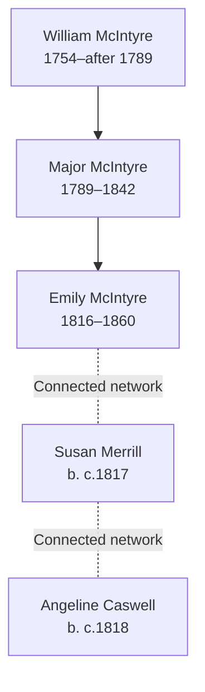

# McIntyre, Merrill, Caswell, and Critton Families Branch Summary

## Branch Overview

**Time Period:** 1754–1860 (spanning UK and early American settlement)

**Geographic Range:** UK (primarily Scotland/North implied by McIntyre surname); US settlement in Ohio and Wisconsin

**Primary Occupations:** Mixed occupations including skilled trades; household service

## Key Ancestor Lines

- [[People/Major McIntyre|Major McIntyre]] (1789–1842)
- [[People/Mc Intyre Emily|Emily McIntyre]] (1816–1860)
- [[People/Susan Merrill|Susan Merrill]] (b. c.1817)
- [[People/Angeline Caswell|Angeline Caswell]] (b. c.1818)
- [[People/Amy Critton|Amy Critton]] (b. c.1820)

## Family Structure

## Census Context

Documented in 1850s–1860s US censuses showing Mid-Atlantic and Midwest settlement; McIntyre line shows British origin with American generation

Family members appear in consecutive US censuses showing household composition, occupational context, and generational progression.

## Source Documentation

This family cluster is documented in:
- Census InDesign summary files (2026-04-24 batch) with detailed household and occupational context
- Burial site records where available
- Pedigree timeline references where connections are established

## Research Resources

- Visit [[People Directory]] to find individual family members
- Check [[Search Index]] for location, occupation, or date searches
- Review [[CHANGELOG]] for ongoing research notes and updates

