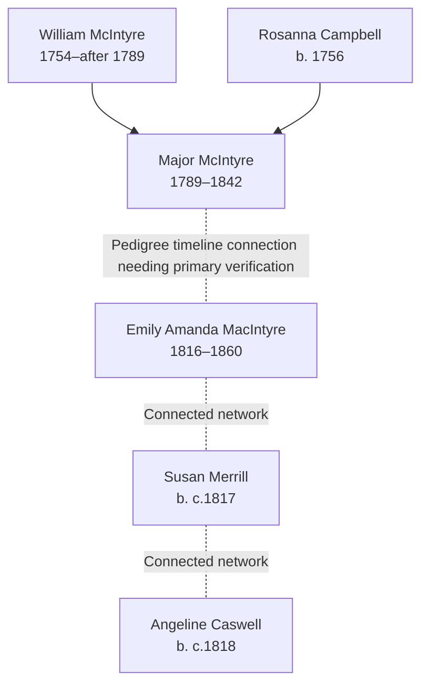

# McIntyre, Merrill, Caswell, and Critton Families Branch Summary

## Branch Overview

**Time Period:** c.1678–1860 (spanning Ireland, colonial Massachusetts, and early American settlement)

**Geographic Range:** County Tyrone, Ireland; Massachusetts; Ohio; Wisconsin

**Primary Occupations:** Military service, farming or rural household context, skilled trades, household service

## Key Ancestor Lines

- [[People/William McIntyre|William McIntyre]] (1754–after 1789)
- [[People/Rosanna Campbell|Rosanna Campbell]] (b. 1756)
- [[People/Major McIntyre|Major McIntyre]] (1789–1842)
- [[People/Emily Amanda MacIntyre|Emily Amanda MacIntyre]] (1816–1860)
- [[People/Susan Merrill|Susan Merrill]] (b. c.1817)
- [[People/Angeline Caswell|Angeline Caswell]] (b. c.1818)
- [[People/Amy Critton|Amy Critton]] (b. c.1820)

## Family Structure

## Census Context

Documented in 1850s–1860s US censuses showing Mid-Atlantic and Midwest settlement; the MacIntyre book outprint adds a compiled-origin trail from County Tyrone, Ireland, to Massachusetts before the Ohio branch.

Family members appear in consecutive US censuses showing household composition, occupational context, and generational progression.

## Book-Outprint Context

The [[References/Book Outprints — MacIntyre|MacIntyre book outprint]] provides the strongest current evidence for the [[People/William McIntyre|William McIntyre]] and [[People/Rosanna Campbell|Rosanna Campbell]] to [[People/Major McIntyre|Major McIntyre]] link. Page 164 lists Major as a child of William and Rosanna, born 3 May 1789, which aligns with the age on Major's 1842 Tew Cemetery inscription.

The same extracted pages extend the compiled line back to John McIntyre of Kilmoore, County Tyrone, Ireland, who was in Massachusetts before 1719. That older chain should be treated as compiled-source-supported rather than primary-record-verified.

## Source Documentation

This family cluster is documented in:
- Census InDesign summary files (2026-04-24 batch) with detailed household and occupational context
- Burial site records where available
- [[References/Book Outprints — MacIntyre|MacIntyre book outprint]] pages 161-165
- Pedigree timeline references where connections are established

## Research Resources

- Visit [[People Directory]] to find individual family members
- Check [[Search Index]] for location, occupation, or date searches
- Review [[CHANGELOG]] for ongoing research notes and updates
