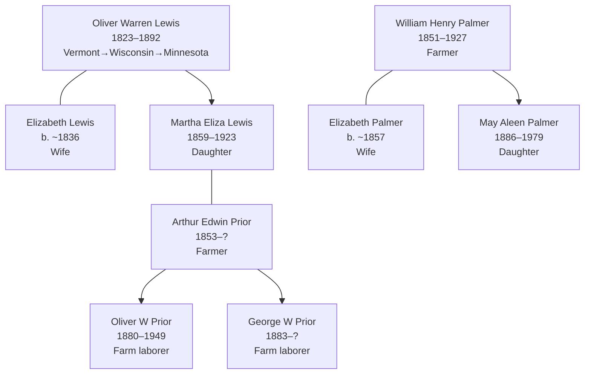

# Mower County, Minnesota — Lewis, Prior, and Palmer Settlement Center

## Overview

Mower County, Minnesota (southeastern Minnesota, Des Moines River valley) served as a primary Midwest settlement hub for the Lewis, Prior, and Palmer families during the 1880s–1900s. Multiple documented households show strong agricultural settlement with documented family intermarriage and multi-generational presence.

## Key Families and Individuals

### Lewis Family (Primary Settlement)
- **[[People/Oliver Warren Lewis|Oliver Warren Lewis]]** (1823–1892) — Patriarch; farmer; Vermont origin, Wisconsin transition, Minnesota settlement
- **[[People/Elizabeth Lewis|Elizabeth Lewis]]** (b. ~1836) — Wife; New York origin
- **[[People/Martha Eliza Lewis|Martha Eliza Lewis]]** (1859–1923) — Daughter; married Arthur Prior; bridge to Prior settlement
- **[[People/George Lewis|George Lewis]]** (b. ~1864) — Son; farm laborer; Minnesota-born
- **[[People/William Lewis|William Lewis]]** (b. ~1871) — Son; Minnesota-born

### Prior Family (Marriage Connection)
- **[[People/Arthur Edwin Prior|Arthur Edwin Prior]]** (1853–?) — Farmer/laborer; married Martha Eliza Lewis; head of household
- **[[People/Oliver Warren Prior|Oliver Warren Prior]]** (1880–1949) — Son; farm laborer; Minnesota-born
- **[[People/George W Prior|George W Prior]]** (1883–?) — Son; farm laborer; Minnesota-born
- **[[People/Lewis H Prior|Lewis H Prior]]** (1888–?) — Son; Minnesota-born
- **[[People/Viva P Prior|Viva P Prior]]** (1895–?) — Daughter; Minnesota-born
- **[[People/Lora P Prior|Lora P Prior]]** (1897–?) — Daughter; Missouri-born (temporary relocation)

### Palmer Family (Secondary Settlement)
- **[[People/William Henry Palmer|William Henry Palmer]]** (1851–1927) — Farmer; Pennsylvania origin, Frankford Township settlement
- **[[People/Elizabeth Palmer|Elizabeth Palmer]]** (b. ~1857) — Wife; Wisconsin-born
- **[[People/May Aleen Palmer|May Aleen Palmer]]** (1886–1979) — Daughter; Minnesota-born; later Iowa settlement

## 1880–1900 Census Snapshots

### Oliver Warren Lewis Household — Mower County, Grand Meadow Township (1880)

**Census Details:** Fam Hist Lib Film 1254626; Series T9, Grand Meadow Township

| Name | Relation | Age | Sex | Occupation | Birthplace |
|---|---|---|---|---|---|
| Oliver Lewis | Head | 57 | M | Farmer | Vermont |
| Elizabeth Lewis | Wife | 44 | F | Keeping house | New York |
| George Lewis | Son | 16 | M | Working on farm | Wisconsin |
| William Lewis | Son | 9 | M | At school | Minnesota |

**Household characteristics:**
- Oliver age 57 (born ~1823; consistent with Vermont 1850 records)
- Elizabeth as wife in 1880 (differs from Susan in earlier censuses—possible remarriage)
- Children show Wisconsin→Minnesota movement pattern
- Farming household with 2 school/farm-labor age sons

### Arthur Prior / Martha Lewis Household — Mower County, Grand Meadows Township (1900)

**Census Details:** Series T623, Roll 777, Page 180A

| Name | Relation | Age | Sex | Occupation | Birthplace | Born |
|---|---|---|---|---|---|---|
| Arthur Prior | Head | 46 | M | Farmer | Michigan | Jul 1853 |
| Martha Prior | Wife | 40 | F | — | Wisconsin | Dec 1859 |
| Oliver W Prior | Son | 20 | M | Farm laborer | Minnesota | Mar 1880 |
| George W Prior | Son | 16 | M | Farm laborer | Minnesota | Aug 1883 |
| Lewis H Prior | Son | 11 | M | At school | Minnesota | Aug 1888 |
| Viva P Prior | Daughter | 4 | F | — | Minnesota | Nov 1895 |
| Lora P Prior | Daughter | 2 | F | — | Missouri | Aug 1897 |

**Household characteristics:**
- Arthur Prior age 46 in 1900 (born July 1853, Michigan origin)
- Martha Prior is Martha Eliza Lewis (1859–1923), daughter of Oliver Warren Lewis
- Extended household with 5 children spanning 1880–1897
- Sons Oliver W. and George W. documented as farm laborers
- Lora born in Missouri suggests temporary migration (1897), likely economic necessity
- All other children Minnesota-born, indicating settled family (15+ years)

### William Henry Palmer Household — Mower County, Frankford Township (1900)

**Census Details:** Series T623, Roll 777; Frankford Township

| Name | Relation | Age | Sex | Occupation | Birthplace | Born |
|---|---|---|---|---|---|---|
| William Palmer | Head | 49 | M | Farmer | Pennsylvania | Jan 1851 |
| Elizabeth Palmer | Wife | 42 | F | — | Wisconsin | Sep 1857 |
| Vern Palmer | Son | 18 | M | Farm laborer | Wisconsin | Oct 1882 |
| Louis Palmer | Daughter | 16 | F | — | Wisconsin | Oct 1884 |

**Household characteristics:**
- William age 49 in 1900 (born Jan 1851, Pennsylvania origin)
- Elizabeth as wife, Wisconsin-born (indicating Wisconsin settlement ~1850s–1880s before Minnesota move)
- Children Wisconsin-born (1880s), indicating 15+ year Wisconsin residence before Minnesota settlement
- Farming operation with one son engaged in farm labor
- Smaller household (4 members) compared to Prior household

## Geographic Context

### Location Details
- **Mower County seat:** Austin, Minnesota
- **Township context:** Grand Meadow Township (Lewis, Prior), Frankford Township (Palmer)
- **Des Moines River valley:** Southeastern Minnesota; premier agricultural region
- **Distance:** ~120 miles south of Minneapolis/St. Paul; ~50 miles west of Mississippi River

### Agricultural Suitability
- Rolling prairie; excellent grain and livestock farming
- Des Moines River navigation supported early settlement (1860s–1870s)
- 1870s agricultural expansion attracted family settlement
- Railroad development (1870s–1880s) provided market access

## Settlement Progression

| Decade | County, Township | Key Families | Occupation | Census Series |
|---|---|---|---|---|---|
| 1850 | Wisconsin, Racine | Lewis (Wynat/Oliver) | Farmer | M432 |
| 1860 | Wisconsin, Fond du Lac | Lewis (W.W./Oliver) | Farmer | M653 |
| 1870s | Minnesota, Mower | Lewis entry (implied) | Farmer | — |
| 1880 | Minnesota, Grand Meadow | Lewis (Oliver), children | Farmer, farm labor | T9 |
| 1890s | Minnesota, Mower | Lewis/Prior/Palmer (implied) | Farmer, laborer | — |
| 1900 | Minnesota, Grand Meadows/Frankford | Prior (Martha Lewis), Palmer | Farmer, farm labor | T623 |

**Documentation pattern:** Wisconsin settlement (1850–1860) → Minnesota transition (1870s–1880s) → consolidation (1900)

## Household and Family Diagrams

## Family Connections

### Lewis-Prior Marriage Alliance
- **[[People/Martha Eliza Lewis|Martha Eliza Lewis]]** (1859–1923, daughter of Oliver Warren Lewis) married **[[People/Arthur Edwin Prior|Arthur Edwin Prior]]** (1853–?)
- Unified Lewis and Prior families in Mower County settlement
- Bridge family connecting Vermont-origin Lewis patriarch to Minnesota agricultural community
- Children Oliver W. Prior (b. 1880) and George W. Prior (b. 1883) represent second-generation Minnesota settlement

### Multi-Generation Lewis Continuity
- **[[People/Oliver Warren Lewis|Oliver Warren Lewis]]** (1823–1892, patriarch, Vermont farmer) → documented Wisconsin 1850–1860 → Minnesota 1880
- **[[People/Martha Eliza Lewis|Martha Eliza Lewis]]** (1859–1923, daughter, Wisconsin-born) → married Arthur Prior → continued Mower County farming
- **[[People/Oliver Warren Prior|Oliver Warren Prior]]** (1880–1949, grandson, Minnesota-born) → continued farm work → later Iowa settlement (Cedar Rapids)
- Three-generation farming continuity across Vermont-Wisconsin-Minnesota-Iowa pathway

### Palmer Settlement Connection
- **[[People/William Henry Palmer|William Henry Palmer]]** (1851–1927, Pennsylvania-origin farmer) documented in Mower County Frankford Township 1900
- Wife Elizabeth Wisconsin-born, indicating ~1850s Wisconsin settlement before Minnesota move
- **[[People/May Aleen Palmer|May Aleen Palmer]]** (1886–1979, daughter, Minnesota-born) → later Iowa settlement (Cedar Rapids household with Oliver W Prior)
- Palmer line represents independent agricultural settlement, later converging with Prior/Lewis line in Iowa

## Census and Economic Patterns

### Occupational Context
- **Oliver Warren Lewis (1880, age 57):** Established farmer; maintained occupation through advanced age
- **Arthur Prior (1900, age 46):** Farmer; multi-child household dependent on farming income
- **William Henry Palmer (1900, age 49):** Farmer; similar occupation and household structure to Prior
- **Sons' occupations:** Farm laborer designation indicates next-generation engagement in agricultural work (not independence)

### Household Composition
- **1880 Lewis household (4 members):** Patriarch, wife, 2 sons; small, nuclear family structure
- **1900 Prior household (7 members):** Patriarch, wife, 5 children spanning ages 2–20; extended family structure
- **1900 Palmer household (4 members):** Patriarch, wife, 2 children; intermediate household size

### Settlement Pattern Indicators
- All three households farming primary occupation
- Multi-child households suggest stable, long-term settlement (15+ years by 1900)
- Wisconsin-to-Minnesota migration evident in birthplace patterns (Wisconsin-born parents/children in Wisconsin; Minnesota-born after 1880)
- Lora Prior born in Missouri (1897) as anomaly—possibly economic hardship migration, later return to Minnesota

## Research Implications

### Strengths
- **Multi-family documentation:** Lewis, Prior, Palmer households in same county across 1880–1900; shows settlement network
- **Occupational clarity:** All farmers or farm laborers; economic role unambiguous
- **Generational progression:** Three generations visible (Oliver Lewis → Martha Lewis → Oliver W Prior)
- **Geographic movement pattern:** Clear Wisconsin→Minnesota migration arc documented across censuses

### Research Gaps
- **Pre-1880 Mower County documentation:** No census or records documenting exact arrival date or initial settlement
- **1870 census:** Gap between 1860 Wisconsin and 1880 Minnesota documentation; intermediary settlement location unknown
- **1910+ census continuity:** No documented census for these families after 1900 in Mower County (likely migration to Iowa or other states)
- **Land records:** Farm location, acreage, property deeds not documented
- **Church records:** Marriages, births, burials in Mower County churches not yet incorporated
- **Economic indicators:** Property value, livestock, other indicators not extracted from census

## Next Steps for County Research

1. **Locate 1870 Mower County census** for Lewis/Prior/Palmer families (confirm settlement dates and early households)
2. **Extract Mower County land patents and deeds** (1870–1900) for documented settler farms
3. **Research county histories** (Mower County histories, agricultural development narratives)
4. **Locate Austin/Grand Meadow church records** (Methodist, Lutheran congregations) for family events (1880–1900)
5. **Cross-reference with neighboring counties** (Freeborn, Steele, Waseca) for extended family networks
6. **Trace Oliver Warren Prior (1880–1949)** after 1900 census to confirm Iowa settlement and later life

## Prior Timeline Cross-Check

- [[References/Shared Intake 2026-04-22 Pedigree Timeline Prior|The Prior pedigree timeline]] confirms that this county page sits at the intersection of the Lewis, Prior, and Palmer chart lines.
- The chart directly links [[People/Martha Eliza Lewis|Martha Eliza Lewis]] to [[People/Arthur Edwin Prior|Arthur Edwin Prior]] and carries the line forward to [[People/Oliver Warren Prior|Oliver Warren Prior]] and [[People/May Aleen Palmer|May Aleen Palmer]].
- The same chart also surfaces two unresolved discrepancies already relevant here: Arthur's `1853` chart birth year and Elizabeth Quackenbush's `c1841` chart birth year.

## Cross-References

### Related Geographic Pages
- [[Topics/Lincolnshire Bourn - Bellamy Kelly Settlement|Lincolnshire, Bourn — Bellamy, Kelly, and Emblow Settlement Center]] (UK parish origin context)
- [[Topics/Linn County Iowa - Spicer Risden Settlement|Linn County, Iowa — Spicer and Risden Settlement Center]] (related Iowa settlement)
- [[Topics/American Settlement and Migration Timeline|American Settlement and Migration Timeline]] (migration wave context)

### Related Family Pages
- [[Topics/Palmer Prior Lewis Branch Summary|Palmer, Prior, and Lewis Branch Summary]] (primary family cluster)

### Individual Pages
- [[People/Oliver Warren Lewis|Oliver Warren Lewis]] — Patriarch documentation
- [[People/Martha Eliza Lewis|Martha Eliza Lewis]] — Daughter; Prior marriage bridge
- [[People/Arthur Edwin Prior|Arthur Edwin Prior]] — Prior patriarch
- [[People/Oliver Warren Prior|Oliver Warren Prior]] — Son; Minnesota-born, later Iowa settlement
- [[People/William Henry Palmer|William Henry Palmer]] — Palmer patriarch
- [[People/May Aleen Palmer|May Aleen Palmer]] — Daughter; Palmer-Prior connection

### Source References
- [[References/Shared Intake 2026-04-24 Census InDesign Summaries|Census InDesign Summaries]] (household census details)
- [[References/Shared Intake 2026-04-22 Pedigree Timeline Prior|Prior Pedigree Timeline]] (lineage context)
- [[References/raw/processed/2026-04-22-intake/Pedigree Timeline/PRIOR_PEDIGREE_TIMELINE_INDEX|Prior Pedigree Timeline Extraction Index]] (chart review notes)
- [[References/Shared Intake 2026-04-22 Burial Sites Summary|Burial Sites Summary]] (settlement confirmation)
