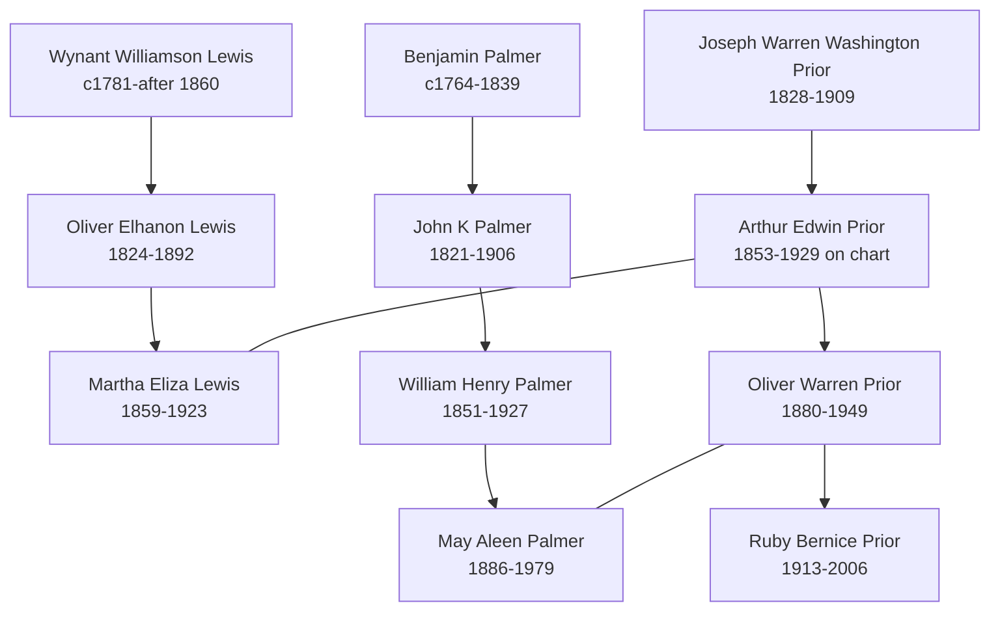

# Palmer, Prior, and Lewis Branch Summary

The Prior pedigree timeline now gives this branch a clear compiled direct chain. It is strongest for navigation from the Prior line into the Lewis and Palmer collateral lines and for surfacing open date conflicts.

## Branch Diagram

## What We Know

- The chart clearly supports the direct Prior line from [[People/Joseph Warren Prior|Joseph Warren Prior]] to [[People/Ruby Bernice Prior|Ruby Bernice Prior]].
- [[People/Martha Eliza Lewis|Martha Eliza Lewis]] and [[People/May Aleen Palmer|May Aleen Palmer]] are clearly the spouse lines attached to the direct Prior chain.
- The same chart supports Lewis collateral placement through `Wynant Williamson Lewis` and `Oliver Elhanon Lewis`.
- The Palmer collateral line is also clear and reaches [[People/William Henry Palmer|William Henry Palmer]] and [[People/May Aleen Palmer|May Aleen Palmer]].

## What Remains Uncertain

- [[People/Arthur Edwin Prior|Arthur Edwin Prior]] still has an unresolved `1851` versus `1853` birth-year conflict.
- `Oliver Elhanon Lewis` on the chart should remain a compiled-chart name form until reconciled with the existing Lewis pages.
- [[People/Elizabeth A Quackenbush|Elizabeth A Quackenbush]] remains a discrepancy case because the chart reads `c1841-1909`.
- The chart's alphanumeric IDs are search leads only and are not verified database identifiers in this vault.

## Sources

1. [[References/raw/processed/2026-04-22-intake/pedigree-timeline/prior-pedigree-timeline-index|Prior Pedigree Timeline Extraction Index]]
2. [[References/Shared Intake 2026-04-22 Pedigree Timeline Prior|Shared Intake 2026-04-22 Pedigree Timeline Prior]]
3. [[References/Shared Intake 2026-04-22 Burial Sites Summary|Burial Sites Summary]]
4. [[People/Arthur Edwin Prior|Arthur Edwin Prior]]
5. [[People/Martha Eliza Lewis|Martha Eliza Lewis]]
6. [[People/Oliver Warren Prior|Oliver Warren Prior]]
7. [[People/William Henry Palmer|William Henry Palmer]]
8. [[People/May Aleen Palmer|May Aleen Palmer]]
9. [[People/Ruby Bernice Prior|Ruby Bernice Prior]]
