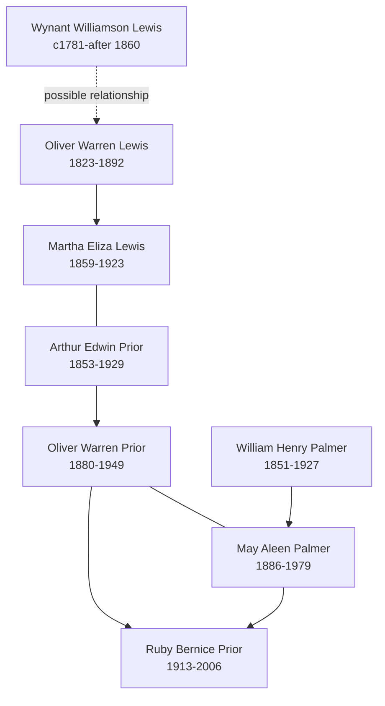

# Palmer, Prior, and Lewis Branch Summary

This branch follows connected Wisconsin, Minnesota, South Dakota, and Iowa households. It is useful for visitors because it shows family movement over time: Lewis farming households, Palmer migration into Minnesota, and Prior households that later connect back to the Spicer line.

## Branch Diagram

This diagram summarizes the strongest navigation path through the branch. The dotted Lewis connection is useful for orientation but should remain provisional until original images or vital records confirm it.

## Start With These People

- [[People/Wynat Lewis|Wynant Williamson Lewis]] - early Lewis household head whose name variants have been reconciled.
- [[People/Oliver Warren Lewis|Oliver Warren Lewis]] - Lewis farmer tracked from Wisconsin to Minnesota.
- [[People/Martha Eliza Lewis|Martha Eliza Lewis]] - Lewis-to-Prior bridge profile with census records from 1860 through 1920.
- [[People/Arthur Edwin Prior|Arthur Edwin Prior]] and [[People/Oliver Warren Prior|Oliver Warren Prior]] - Prior branch profiles tied to the pedigree timeline and burial records.
- [[People/William Henry Palmer|William Henry Palmer]] and [[People/May Aleen Palmer|May Aleen Palmer]] - Palmer line into the Prior household.
- [[People/Ruby Bernice Prior|Ruby Bernice Prior]] - later-generation Prior profile connected to [[People/Lester Harold Spicer|Lester Harold Spicer]].

## What We Know

- [[People/Wynat Lewis|Wynat Lewis]] has been reconciled as Wynant Williamson Lewis, with 1850-1860 Wisconsin household continuity and pedigree-timeline support.
- [[People/Oliver Warren Lewis|Oliver Warren Lewis]] and [[People/Martha Eliza Lewis|Martha Eliza Lewis]] show a Lewis branch moving from Vermont/Wisconsin context into Minnesota.
- [[People/Martha Eliza Lewis|Martha Eliza Lewis]] and [[People/Arthur Edwin Prior|Arthur Edwin Prior]] anchor a Prior household that appears in Minnesota, South Dakota, and Minnesota again across 1900-1920.
- [[People/May Aleen Palmer|May Aleen Palmer]] documents the Palmer-to-Prior marriage path and a large Cedar Rapids household in 1920-1930.

## What Remains Uncertain

- [[People/Arthur Edwin Prior|Arthur Edwin Prior]] still has a birth-year conflict between census-summary evidence and burial/timeline evidence.
- Several Prior and Palmer household extracts contain OCR ambiguity in child names, occupations, or repeated rows.
- The exact relationship between [[People/Wynat Lewis|Wynat Lewis]] and [[People/Oliver Warren Lewis|Oliver Warren Lewis]] should remain source-limited until original census images or vital records confirm it.

## Sources

1. [[People/Wynat Lewis|Wynat Lewis]]
2. [[People/Oliver Warren Lewis|Oliver Warren Lewis]]
3. [[People/Martha Eliza Lewis|Martha Eliza Lewis]]
4. [[People/Arthur Edwin Prior|Arthur Edwin Prior]]
5. [[People/Oliver Warren Prior|Oliver Warren Prior]]
6. [[People/William Henry Palmer|William Henry Palmer]]
7. [[People/May Aleen Palmer|May Aleen Palmer]]
8. [[People/Ruby Bernice Prior|Ruby Bernice Prior]]
9. [[References/Shared Intake 2026-04-22 Pedigree Timeline Prior|Shared Intake 2026-04-22 Pedigree Timeline Prior]]
10. [[References/Shared Intake 2026-04-22 Burial Sites Summary|Burial Sites Summary]]
