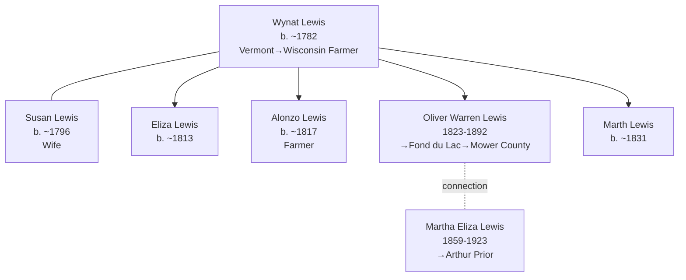

# Racine County, Wisconsin — Lewis Family Settlement Entry Point

## Overview

Racine County, Wisconsin (southeastern Wisconsin, Lake Michigan region) served as a documented entry point for the Lewis family's Wisconsin settlement during the 1850 census period. Though documentation is limited to a single 1850 census snapshot, Racine County represents the earliest documented Lewis family settlement in Wisconsin, preceding the documented Fond du Lac County residence (1860) and Minnesota settlement (1880–1900). The county exemplifies a transitional settlement node in the broader Vermont→Wisconsin→Minnesota Lewis family migration arc.

## Key Families and Individuals

### Lewis Family (Primary Settlement)

**Patriarch and Extended Household:**
- **[[People/Wynat Lewis|Wynat Lewis]]** (also recorded as W.W. Lewis; b. 1768–1790, age 68 in 1850) — Patriarch; farmer; Vermont origin, Wisconsin settler
- **[[People/Susan Lewis|Susan Lewis]]** (b. ~1796, age 54 in 1850) — Wife; Vermont origin
- **[[People/Oliver Warren Lewis|Oliver Warren Lewis]]** (1823–1892, age 25 in 1850) — Son; farmer; documented later Minnesota settlement
- **[[People/Martha Eliza Lewis|Martha Eliza Lewis]]** (1859–1923) — Granddaughter (age not present in 1850; born Wisconsin 1859 in later census documentation)
- **[[People/Eliza Lewis|Eliza Lewis]]** (b. ~1813, age 37 in 1850) — Daughter; Vermont-born
- **[[People/Alonzo Lewis|Alonzo Lewis]]** (b. ~1817, age 33 in 1850) — Son; farmer; Vermont-born
- **[[People/Marth Lewis|Marth Lewis]]** (b. ~1831, age 19 in 1850) — Daughter; Vermont-born
- **[[People/Erastus Darling|Erastus Darling]]** (b. ~1835, age 15 in 1850) — Related; Vermont-born
- **[[People/Sarah Darling|Sarah Darling]]** (b. ~1838, age 12 in 1850) — Related; Vermont-born

## 1850 Census Snapshot

### Wynat Lewis Household — Racine County, Town of Burlington

**Census Details:** Series M432, Roll 1004, Page 150

| Name | Relation | Age | Sex | Occupation | Birthplace |
|---|---|---|---|---|---|
| Wynat Lewis | Head | 68 | M | Farmer | Vermont |
| Susan Lewis | Wife | 54 | F | — | Vermont |
| Eliza Lewis | Daughter | 37 | F | — | Vermont |
| Alonzo Lewis | Son | 33 | M | Farmer | Vermont |
| Oliver Lewis | Son | 25 | M | Farmer | Vermont |
| Marth Lewis | Daughter | 19 | F | — | Vermont |
| Erastus Darling | Related | 15 | M | — | Vermont |
| Sarah Darling | Related | 12 | F | — | Vermont |

**Household characteristics:**
- Wynat Lewis age 68 in 1850 (born ~1782; noted in documentation as b. 1768–1790, suggesting birth uncertainty)
- Susan Lewis as wife, age 54; married ~1800 (50-year marriage span)
- Multiple Vermont-born children (Eliza age 37, Alonzo age 33, Marth age 19) all born Vermont; latest child Marth born ~1831
- Oliver Warren Lewis (age 25) documented as son and farmer; later prominence in Wisconsin/Minnesota settlement
- Extended household includes Darling family members (possibly in-laws or relatives); ages suggest young adults/teenagers
- All household members Vermont-born; no Wisconsin-born children documented in 1850, suggesting recent arrival or no children born in Wisconsin
- Farming primary occupation (Wynat and Alonzo both listed as farmers)

**Occupational and Economic Context:**
- Patriarch Wynat and son Alonzo both farmers; suggests family farming operation
- Household size: 8 members; extended family co-residence indicates shared agricultural labor
- Skilled farming family; no laborers or servants documented
- Burlington Township: agricultural settlement area of Racine County

## Geographic Context

### Location Details
- **Racine County seat:** Racine, Wisconsin (on Lake Michigan)
- **Township context:** Town of Burlington, Racine County
- **Geographic position:** Southeastern Wisconsin; Lake Michigan coastal region
- **Distance:** ~40 miles south of Milwaukee; ~30 miles north of Illinois border; Lake Michigan access

### Agricultural Suitability and Settlement Context
- Fertile soil; suitable for grain, livestock, dairy farming
- Lake Michigan navigation provided transportation access; Erie Canal connection enabled eastern trade
- 1850 settlement: early Wisconsin agricultural frontier
- Burlington Township: agricultural region with documented family farm settlement

## Settlement Progression and Migration Context

### Vermont-to-Wisconsin Migration Arc

| Period | Location | Key Person | Occupation | Status |
|---|---|---|---|---|---|
| 1782–1800 | Vermont | Wynat Lewis (b. ~1782) | Unknown | Birth location; Vermont origin |
| 1800–1850 | Vermont/Unknown | Wynat Lewis + family | Farmer (implied) | 50-year Vermont or intermediate residence |
| 1850 | Racine County, WI | Wynat Lewis, age 68 | Farmer | Documented Wisconsin settlement; 8-member household |
| 1860 | Fond du Lac County, WI | Oliver Warren Lewis (age 35) | Farmer | Continued Wisconsin settlement, new location |
| 1880 | Mower County, MN | Oliver Warren Lewis (age 57) | Farmer | Minnesota settlement; documented 20-year residence |

**Pattern:** Vermont (1782–1850, 68 years) → Wisconsin Racine County (1850, documented entry) → Fond du Lac County (1860) → Mower County Minnesota (1880–1900)

## Household and Family Diagrams

## Family Connections

### Lewis Family Patriarchal Structure
- **[[People/Wynat Lewis|Wynat Lewis]]** (patriarch, b. ~1782, Vermont farmer) established Wisconsin settlement at advanced age (68 in 1850)
- **[[People/Susan Lewis|Susan Lewis]]** (wife, b. ~1796) long-lived spouse; 50-year marriage documented (married ~1800)
- Multiple Vermont-born children (Eliza, Alonzo, Oliver, Marth) all transferred to Wisconsin
- Extended household suggests family labor coordination; multiple adult males (Wynat, Alonzo, Oliver) engaged in farming

### Oliver Warren Lewis Bridge Role
- **[[People/Oliver Warren Lewis|Oliver Warren Lewis]]** (1823–1892) documented as son in Racine County household (1850, age 25)
- Later documented in Fond du Lac County (1860, age 35) and Mower County Minnesota (1880, age 57)
- Primary documented ancestor connecting Racine County entry point to subsequent Wisconsin and Minnesota settlement
- Farming occupation documented across all locations; agricultural continuity patriarch→son→grandson pattern

### Intergenerational Lewis Continuity
- Wynat Lewis (patriarch, Vermont→Wisconsin) → Oliver Warren Lewis (son, Wisconsin→Minnesota) → Martha Eliza Lewis (granddaughter, Wisconsin→Minnesota→South Dakota)
- Three-generation farming family spanning Vermont (1782–1850) → Wisconsin (1850–1880) → Minnesota (1880–1900) → South Dakota (1910)

## Census and Economic Patterns

### Occupational Context
- **Wynat Lewis (age 68, 1850):** Farmer; skilled occupation maintained into advanced age
- **Alonzo Lewis (age 33):** Farmer; son continuing family farming tradition
- **Oliver Warren Lewis (age 25):** Farmer; young adult engaged in family farming operation
- **Occupational consistency:** All males documented farmers; no occupational diversity noted

### Household Composition
- **Household size (8 members):** Extended family or multi-generational co-residence
- **Gender composition:** 5 female, 3 male members listed (unusual for farming household; typical farms more male-dominant)
- **Age distribution:** Patriarch age 68 to children/grandchildren age 12; multi-generational structure
- **Economic implication:** Large household enabled family labor; farming viable with extended family cooperation

### Settlement Indicators
- **All Vermont-born household members:** No Wisconsin-born individuals in 1850 household; suggests recent arrival or no children born in Wisconsin yet
- **Farming primary occupation:** Economic viability of Wisconsin agricultural settlement indicated
- **Stable family structure:** Married couple with adult children; suggests migration as family unit, not individual labor migration

## Research Implications

### Strengths
- **Entry point documentation:** Racine County provides earliest documented Lewis Wisconsin settlement (1850)
- **Occupational clarity:** Farming occupations explicitly documented for multiple household males
- **Family continuity:** Patriarch Wynat with multiple adult sons enables occupational succession analysis
- **Migration arc context:** Racine County represents first node in Vermont→Wisconsin→Minnesota progression

### Research Gaps
- **Pre-1850 Wisconsin residence:** Exact arrival date in Wisconsin unknown; 1850 first documented census
- **1840 census:** No documentation for Lewis family in Wisconsin (1840 census gap); Vermont residence assumed but unconfirmed
- **Intermediate locations:** Migration from Vermont to Racine County path unclear; intermediate stops unknown
- **1860 census Racine County:** No follow-up documentation; Lewis family transition to Fond du Lac County (1860) trajectory unclear
- **Land records:** Farm location, acreage, property ownership in Racine County not documented
- **Church records:** Marriages, births, burials in Racine County churches not yet incorporated
- **Extended family members:** Darling family connection (Erastus, Sarah) unclear; relationship to Lewis family unknown

## Next Steps for County Research

1. **Locate 1840 US Census** for Lewis family (Vermont residency confirmation or Wisconsin earlier settlement)
2. **Extract Racine County land patents and deeds** (1840–1860) for Lewis family farm documentation
3. **Research county histories** (Racine County agricultural settlement, Burlington Township development)
4. **Locate Burlington Township church records** (Baptist, Methodist congregations) for family events (1850–1860)
5. **Clarify Darling family relationship** (Erastus, Sarah) using Wisconsin vital records
6. **Cross-reference with neighboring counties** (Kenosha, Milwaukee) for extended Lewis family networks
7. **Trace Fond du Lac County transition** (1860) to determine relocation driver and intermediate settlement

## Cross-References

### Related Geographic Pages
- [[Topics/Fond du Lac County Wisconsin - Lewis Family Continuation|Fond du Lac County, Wisconsin — Lewis Family Continuation]] (subsequent Wisconsin settlement, 1860)
- [[Topics/Mower County Minnesota - Lewis Prior Palmer Settlement|Mower County, Minnesota — Lewis, Prior, and Palmer Settlement Center]] (final Minnesota settlement, 1880–1900)
- [[Topics/American Settlement and Migration Timeline|American Settlement and Migration Timeline]] (Vermont→Wisconsin→Minnesota migration wave context)

### Related Family Pages
- [[Topics/Palmer Prior Lewis Branch Summary|Palmer, Prior, and Lewis Branch Summary]] (primary family cluster)

### Individual Pages
- [[People/Wynat Lewis|Wynat Lewis]] — Patriarch; Wisconsin settlement founder
- [[People/Susan Lewis|Susan Lewis]] — Wife; long-lived spouse
- [[People/Oliver Warren Lewis|Oliver Warren Lewis]] — Son; documented later Wisconsin/Minnesota settlement
- [[People/Martha Eliza Lewis|Martha Eliza Lewis]] — Granddaughter; Wisconsin→Minnesota→South Dakota arc

### Source References
- [[References/Shared Intake 2026-04-24 Census InDesign Summaries|Census InDesign Summaries]] (1850 census details)
- [[References/Shared Intake 2026-04-22 Pedigree Timeline Prior|Prior Pedigree Timeline]] (Lewis family lineage context)
- [[References/Book Outprints Collection|Book Outprints Collection]] (burial/property documentation)
