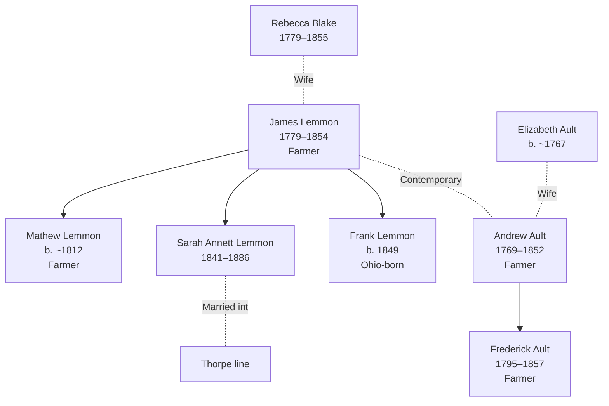

# Sandusky County, Ohio — Lemmon and Ault Settlement Center

## Overview

Sandusky County, Ohio (northwest Ohio, Lake Erie region) served as a primary settlement hub for the Lemmon and Ault families during the 1800s. Multiple generations established agricultural roots here, with documented residence spanning 1800–1900.

## Key Families and Individuals

### Lemmon Family (Primary Settlement)
- **[[People/James Lemmon|James Lemmon]]** (1779–1854, age 71 in 1850) — Patriarch; farmer; settled Sandusky County by 1850
- **[[People/Rebecca Blake|Rebecca Blake]]** (1779–1855) — James Lemmon's wife; age 71 in 1850
- **[[People/Uriah Blake Lemmon|Uriah Blake Lemmon]]** (1808–1887) — Son; farmer; continued Sandusky County settlement
- **[[People/John McIntyre Lemmon|John McIntyre Lemmon]]** (1839–1895) — Uriah and Emily's son; Civil War veteran, Clyde lawyer, first mayor of Clyde, and common pleas judge
- **[[People/Sarah Annett Lemmon|Sarah Annett Lemmon]]** (1841–1886) — Daughter; married into Thorpe line
- **Mathew/Matthew Lemmon** — Son (age 38 in 1850 census)
- **Frank Lemmon** — Son (age 1 in 1850 census; born Ohio)

### Ault Family (Secondary Settlement)
- **[[People/Andrew Ault|Andrew Ault]]** (1769–1852, age 82 in 1850) — Patriarch; farmer
- **[[People/Elizabeth Ault|Elizabeth Ault]]** (b. ~1767, age 83 in 1850) — Wife
- **[[People/Frederick Ault|Frederick Ault]]** (1795–c.1857) — Son; farmer/tradesman; contemporary with Lemmon family

## 1850 Census Snapshot

### Lemmon Household — Sandusky County, Townsend Township

**Census Details:** Series M432, Roll 726, Page 476, R/F 1173/1198

| Name | Relation | Age | Sex | Occupation | Birthplace |
|---|---|---|---|---|---|
| James Lemmon | Head | 71 | M | Farmer | Pennsylvania |
| Rebecca Lemmon | Wife | 71 | F | — | Pennsylvania |
| Mathew Lemmon | Son | 38 | M | Farmer | New York |
| Sarah Lemmon | Daughter | 21 | F | — | New York |
| Frank Lemmon | Son | 1 | M | — | Ohio |
| David Lemmon | Related | 21 | M | Farmer | New York |
| Nathan Harkins | Boarder | 12 | M | — | New York |

**Household characteristics:**
- Head and wife both age 71 (married ~1800)
- Children span 3 decades (1810–1850) suggesting births across 40-year period
- Mix of Ohio-born (Frank) and NY-born (older children) shows 20-year settlement timeline
- Extended family (David, boarder Nathan) indicates social networks

### Ault Household — Sandusky County, Island Creek Township

**Census Details:** Series M432, Roll 699, Page 523

| Name | Relation | Age | Sex | Occupation | Birthplace |
|---|---|---|---|---|---|
| Andrew Ault | Head | 82 | M | Farmer | New York |
| Elizabeth Ault | Wife | 83 | F | — | New York |
| Amy Palmer | Related | 17 | F | — | Ohio |

**Household characteristics:**
- Advanced age of both (early 80s); married couple likely since 1800
- Amy Palmer connection suggests intergenerational family ties
- Farming primary occupation maintained into advanced age

## Geographic Context

### Location Details
- **Sandusky County seat:** Fremont, Ohio
- **Township context:** Townsend Township (Lemmon), Island Creek Township (Ault)
- **Lake Erie region:** Northwestern Ohio; agricultural/frontier settlement area
- **Distance:** ~50 miles southwest of Lake Erie; ~120 miles north of Columbus

### Agricultural Suitability
- Fertile soil; suitable for grain, livestock farming
- Drainage infrastructure developed 1840s–1860s enabling agricultural expansion
- Secondary settlement zone behind Ohio River valley initial settlement

## Census Documentation

| Year | Series | Lemmon Family | Ault Family | Notes |
|---|---|---|---|---|
| 1850 | M432 | Townsend Township | Island Creek Township | Both households documented; farming primary |
| 1860 | M653 | Unknown (check) | Unknown (check) | Gap in current documentation |
| 1870 | T623 | Unknown (check) | Unknown (check) | Possible later settlement or migration |

**Documentation gaps:** 1860, 1870 Sandusky County census details for these families not yet fully extracted

## Household Diagrams

## Family Connections

### Lemmon-Blake-Thorpe Cluster
- [[People/James Lemmon|James Lemmon]] married [[People/Rebecca Blake|Rebecca Blake]], establishing Ohio settlement
- [[People/Sarah Annett Lemmon|Sarah Annett Lemmon]] (daughter) married into [[Topics/Lemmon Blake Thorpe Branch Summary|Lemmon-Blake-Thorpe]] line
- [[People/Uriah Blake Lemmon|Uriah Blake Lemmon]] (son) continued Sandusky County farming
- [[People/John McIntyre Lemmon|John McIntyre Lemmon]] documents the next generation's movement from farm household into law, Civil War service, and public office in Clyde.

### Ault-Tallman Connection
- [[People/Andrew Ault|Andrew Ault]] patriarch documented in Sandusky County (1850)
- Related to broader [[Topics/Ault Tallman Branch Summary|Ault-Tallman]] cluster (see Jefferson County, Ohio link)
- Frederick Ault farming contemporary with Lemmon family

## Research Implications

### Strengths
- **Multi-generational documentation:** Lemmon family 50-year span (1800–1850+) via settlement timeline
- **Dual occupation confirmation:** Both Lemmon and Ault families farming; economic success indicated
- **Family network visibility:** Extended family (David Lemmon, Nathan Harkins boarder) show community integration

### Research Gaps
- **Pre-1850 documentation:** No church records, land deeds, or local records yet incorporated
- **1860–1880 continuity:** Census details for these families in later decades not yet extracted
- **Ault relationship:** Andrew Ault's connection to Frederick Ault (father/brother/other) needs clarification
- **Farm details:** Acreage, land patents, property descriptions not yet documented

## Next Steps for County Research

1. **Locate 1860, 1870 Sandusky County census records** for Lemmon and Ault families
2. **Extract Sandusky County land patents and deeds** (1800–1850) to establish farm locations and acreage
3. **Research county histories** (Sandusky County histories, township records) for settlement narratives
4. **Locate Townsend Township church records** (1800–1850) for baptisms, marriages, burials
5. **Cross-reference with neighboring counties** (Seneca, Ottawa, Lucas) for migration patterns

## Cross-References

### Related Geographic Pages
- [[Topics/Jefferson County Ohio - Ault Family Settlement|Jefferson County, Ohio — Ault Family Settlement]] (related Ault cluster)
- [[Topics/UK Parish and Regional Context|UK Parish and Regional Context]] (origin context)
- [[Topics/American Settlement and Migration Timeline|American Settlement and Migration Timeline]] (settlement pattern context)

### Related Family Pages
- [[Topics/Lemmon Blake Thorpe Branch Summary|Lemmon Blake Thorpe Branch Summary]] (primary family cluster)
- [[Topics/Ault Tallman Branch Summary|Ault Tallman Branch Summary]] (Ault connections)

### Individual Pages
- [[People/James Lemmon|James Lemmon]] — Patriarch documentation
- [[People/Rebecca Blake|Rebecca Blake]] — Wife; Blake family connection
- [[People/Uriah Blake Lemmon|Uriah Blake Lemmon]] — Son; continued settlement
- [[People/John McIntyre Lemmon|John McIntyre Lemmon]] — Lawyer, Civil War veteran, and Clyde civic figure
- [[People/Andrew Ault|Andrew Ault]] — Ault patriarch

### Source References
- [[References/Shared Intake 2026-04-24 Census InDesign Summaries|Census InDesign Summaries]] (1850 census details)
- [[References/Shared Intake 2026-04-22 Pedigree Timeline Thorpe|Thorpe Pedigree Timeline]] (settlement context)
- [[References/Book Outprints — Sandusky-Beers Lemmon John M|Sandusky-Beers — John McIntyre Lemmon]] (county biography and Lemmon relationship evidence)
