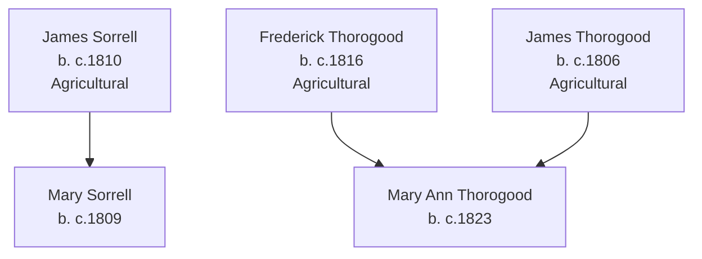

# Sorrell, Thorogood, and Related Families Branch Summary

## Branch Overview

**Time Period:** 1747–1880s (spanning 1841–1871 UK censuses)

**Geographic Range:** UK parishes (Somerset/Devon region implied by surnames); some US settlement

**Primary Occupations:** Agricultural workers, farm laborers, general laborers

## Key Ancestor Lines

- [[People/James Sorrell|James Sorrell]] (b. c.1810)
- [[People/Mary Sorrell|Mary Sorrell]] (b. c.1809)
- [[People/Frederick Thorogood|Frederick Thorogood]] (b. c.1816)
- [[People/Mary Ann Thorogood|Mary Ann Thorogood]] (b. c.1823)
- [[People/James Thorogood|James Thorogood]] (b. c.1806)

## Family Structure

## Census Context

Documented in 1841–1871 UK censuses showing rural agricultural communities

Multiple family members appear in consecutive UK censuses (1841, 1851, 1861, 1871) showing household composition, occupational transitions, and age progression across the four decades.

## Source Documentation

This family cluster is documented in:
- [[References/Shared Intake 2026-04-22 Pedigree Timeline Bellamy|Pedigree Timeline References]]
- Census InDesign summary files (2026-04-24 batch) with detailed household and occupational context
- Burial site records showing cemetery locations and dates

## Research Resources

- Visit [[People Directory]] to find individual family members
- Check [[Search Index]] for location, occupation, or date searches
- Review [[CHANGELOG]] for ongoing research notes and updates

