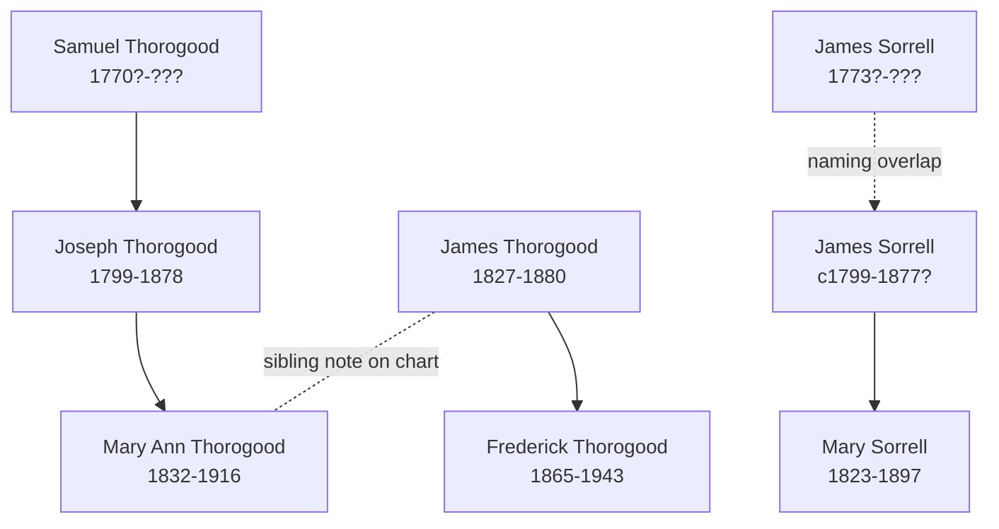

# Sorrell, Thorogood, and Related Families Branch Summary

The Bellamy pedigree timeline is the main compiled source pulling the Sorrell and Thorogood names into one branch cluster. It is most useful here for branch placement, sibling notes, and naming-overlap warnings.

## Chart-Supported Lines

- [[People/Mary Ann Thorogood|Mary Ann Thorogood]] sits on the chart as the child of [[People/Joseph Thorogood|Joseph Thorogood]] in the Samuel Thorogood line.
- [[People/Frederick Thorogood|Frederick Thorogood]] sits on a separate James Thorogood line that later links into the Emily Munson branch.
- [[People/Mary Sorrell|Mary Sorrell]] sits in the Sorrell line under a later James Sorrell.

## Important Chart Note

The chart explicitly says that [[People/James Thorogood|James Thorogood]] and [[People/Mary Ann Thorogood|Mary Ann Thorogood]] were brother and sister. That is useful navigation context and should stay visible until stronger local records refine the exact family structure.

## Family Structure

## What Remains Uncertain

- The Sorrell chart segment contains two `James Sorrell` labels and should remain recorded as a father/son naming overlap rather than a solved merge.
- Spouse placements around `Ann Bevis` and `Hannah Beneworth` are chart-layout readings.
- This branch remains secondary-source-heavy and still benefits from parish, civil, and census corroboration.

## Sources

1. [[bellamy-pedigree-timeline-index|Bellamy Pedigree Timeline Extraction Index]]
2. [[References/Shared Intake 2026-04-22 Pedigree Timeline Bellamy|Shared Intake 2026-04-22 Pedigree Timeline Bellamy]]
3. [[References/Shared Intake 2026-04-22 Census Summary Individuals p61-p96|Shared Intake 2026-04-22 Census Summary Individuals p61-p96]]
4. [[References/Book Outprints — Great Baddow Oral History|Great Baddow Oral History]]
