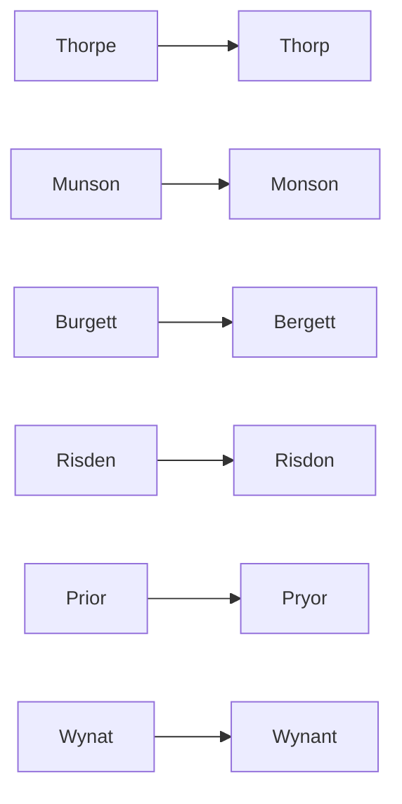

# Spelling and Identity Reconciliations

This page documents known name spelling variants and identity-merge intentions discovered across the [[References/raw/inbox/2026-04-22-intake/|2026-04-22 Intake]] files.

For a ranked view of the unresolved work, see [[Topics/Identity Reconciliation Matrix|Identity Reconciliation Matrix]].
For a compact branch summary of the Lemmon/Blake/Torpe cluster, see [[Topics/Lemmon Blake Thorpe Branch Summary|Lemmon Blake Thorpe Branch Summary]].

## Variant Map

The chart groups spelling families only. It should not be read as a merge decision on its own.

## High-Confidence Spelling Variants

| Canonical Surnames | Observed Variants | Context and Examples |
|-------------------|-------------------|----------------------|
| **Thorpe**        | Thorp, Thorp (M.) | John Thorp (1791-1860) and William Monroe Thorp (1835-1899) are direct-line ancestors often recorded without the terminal 'e'. |
| **Munson**        | Monson, Munson (Jr.) | Arther Monson (1841 Great Holland) vs Arthur Munson (1851 Great Holland). |
| **Whitfield**     | Witfield          | John and Mary Whitfield (born c. 1819) indexed in UK census citations. |
| **Burgett**       | Bergett           | William Bergett (1850 Brush Run Township, Iowa) and Mary Bergett (mortality schedule). |
| **Risden**        | Risdon            | John Wheeler Risden (1812-1892) recorded as RISDON in 1860 Lyons Township, Iowa. |
| **Prior**         | Pryor             | Alzina Morgan linked to a Pryor household in 1860 Penfield, Ohio. |

## Resolved Identity Merges

- **Hattie May Risden**
  - Merged from `Hattie Risden` profile to match indexed full name.
  - Linked to George B. Spicer.
- **George B. Spicer**
  - Renamed from `George Spicer` profile to match indexed full name.
  - Linked to Hattie May Risden.

## Pending Reconciliations

- **UNKNOWN placeholder identities mapped by census cross references**
  - `UNKNOWN, Ann` is cross-referenced from `SORREL, Ann` and appears in extraction household entries as `Ann SORREL/SORRELL`.
  - `UNKNOWN, Eleanor` is cross-referenced from `EMBLOW, Eleanor/Elenor/Ellen` and appears in extraction household entries as spouse of [[People/Joseph Emblow|Joseph Emblow]].
  - `UNKNOWN, Sarah (Barton?)` is cross-referenced from `KELLEY, Sarah` and `KELLY, Sarah` and appears in extraction household entries as `Sarah KELLY` in Peterborough almshouse records.
  - `UNKNOWN, Susan` is cross-referenced from `LEWIS, Susan` and appears in extraction household entries as `Susan LEWIS` in the Wynat Lewis household.
  - Canonical profiles have now been created for tracking and future merge finalization:
    - [[People/Ann Sorrell|Ann Sorrell]]
    - [[People/Eleanor Emblow|Eleanor Emblow]]
    - [[People/Sarah Kelly|Sarah Kelly]]
    - [[People/Susan Lewis|Susan Lewis]]
  - The canonical pages now include page-level anchors from `References/raw/extracted/CensusSummaryIndividual.txt`, but image-level verification is still pending for the entries with missing piece/folio/page fields.
  - Transitional alias pages retained for traceability:
    - [[People/Ann Unknown|Ann Unknown]]
    - [[People/Eleanor Unknown|Eleanor Unknown]]
    - [[People/Sarah Unknown|Sarah Unknown]]
    - [[People/Susan Unknown|Susan Unknown]]

- **Mary Greenwood vs Mary Bergett**
  - The 1850 mortality schedule entry for `Mary Bergett` (died March 1850, age 38) is tracked on [[People/Mary Greenwood|Mary Greenwood]] using the compiler's `GREENWOOD, Mary (c. 1812 - Mar 1850)` heading.
  - This is a separate identity from [[People/Mary Burgett|Mary Burgett]] (1835-1918); do not merge them.
  - Preserve `GREENWOOD` as compiler metadata if a cleaner canonical title is needed later.
- **Uriah Blake Thorpe vs Uriah Blake Lemmon**
  - The Thorpe pedigree timeline places [[People/Uriah Blake Thorpe|Uriah Blake Thorpe]] (1878-1959), [[People/Uriah Blake Lemmon|Uriah Blake Lemmon]] (1808-1887), [[People/James Lemmon|James Lemmon]] (1779-1854), [[People/Rebecca Blake|Rebecca Blake]] (1779-1855), and [[People/Sarah Annett Lemmon|Sarah Annett Lemmon]] (1841-1886) on the same compiled branch chart. That supports a branch-level connection, but not a direct identity merge between the two Uriahs.
- **Wynat vs William Lewis**
  - The census-summary index lists `LEWIS, Wynat (William?)`, but the pedigree timeline names the person `Wynant Williamson Lewis c1781-after 1860`. The best-supported in-repo full form is therefore `Wynant Williamson Lewis`, while `William` remains an unconfirmed expansion of the OCR/compiler shorthand. Reconcile [[People/Wynat Lewis|Wynat Lewis]] once primary image records are reviewed.
  - A Welsh etymology is not supported by the current source set. Treat `Wynat` as an uncertain spelling form until a primary record or family paper supports a different reading.

## Action Plan for Batch Ingestion

1. Use canonical forms for page titles but preserve exact spelling from source in the profile body.
2. Cross-link all variant-spelled sources to the canonical person page.
3. Update [[People Directory]] and [[Search Index]] to point to canonical pages with "See also" or alias notes if necessary.
